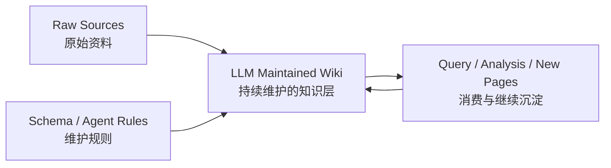
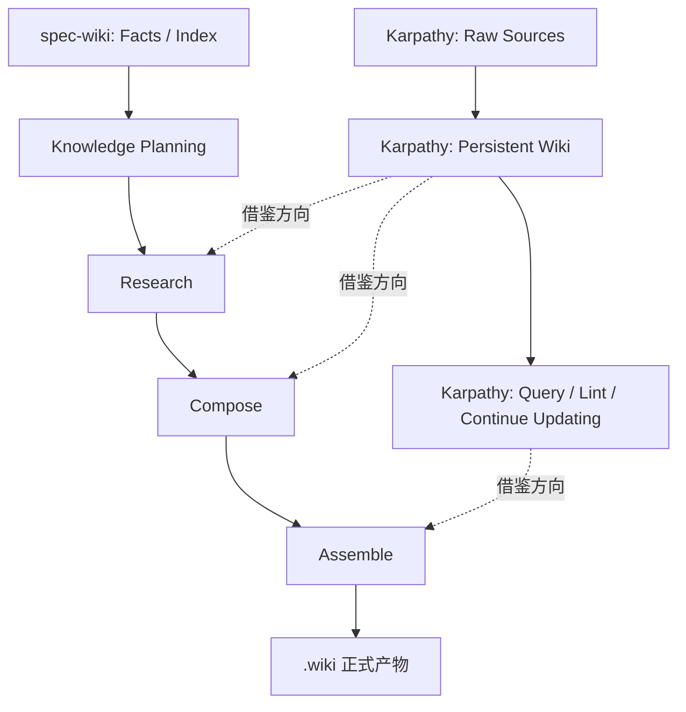

# Karpathy《LLM Wiki》摘要与对 spec-wiki 的借鉴分析

## 背景
本文分析的原文是 karpathy 于 2026-04-04 发布的 gist：

- 来源：<https://gist.github.com/karpathy/442a6bf555914893e9891c11519de94f>
- 标题：`LLM Wiki`

这篇文章讨论的不是“如何做一次更好的 RAG 检索”，而是另一种长期知识管理模式：让 LLM 持续维护一个可增长、可修订、可交叉链接的 wiki，把知识沉淀成长期资产，而不是每次问答都重新从原始资料里临时拼答案。

## 文章摘要

### 一句话总结
Karpathy 的核心主张是：

> 与其让 LLM 每次 query 时都重新从原始资料里检索和拼接，不如让 LLM 把知识持续编译进一个持久化 wiki，并在新资料到来时增量更新它。

### 文章中的三层结构
文章把系统抽象成三层：

1. `Raw sources`
   - 原始资料集合，保持只读。
   - 可以是文章、论文、图片、数据文件等。
   - 它是真实来源，但不是日常消费层。

2. `The wiki`
   - 由 LLM 维护的一组 Markdown 页面。
   - 用来保存摘要、实体页、概念页、综述、比较和交叉引用。
   - 用户主要阅读它，LLM 主要维护它。

3. `The schema`
   - 约束 LLM 如何组织 wiki、如何 ingest、如何 query、如何维护一致性的规则文件。
   - 在 karpathy 的语境里，这个 schema 可以放进 `AGENTS.md`、`CLAUDE.md` 之类的代理指令文件里。



### 文章中的三类操作

1. `Ingest`
   - 新资料进入后，LLM 阅读、提炼、更新摘要页、实体页、概念页、索引和日志。
   - 一份资料可能会触发多个页面联动更新。

2. `Query`
   - 用户不是直接对原始资料发问，而是优先对 wiki 发问。
   - LLM 先找相关页面，再组合答案，并把高价值答案继续回写为新页面。

3. `Lint`
   - 周期性巡检 wiki。
   - 找冲突、陈旧结论、孤儿页面、漏掉的重要概念、缺少链接的数据空洞。

### 为什么这篇文章有吸引力
这篇文章最打动人的点，不是某个具体目录结构，而是它把 LLM 的角色从“即时回答器”改成了“持续维护知识库的编辑器”。

它认为：

- 人负责找资料、提问题、做判断；
- LLM 负责摘要、交叉引用、归档、同步更新和脏活累活；
- 这样知识会随着时间复利，而不是被困在聊天历史里。

## 与 spec-wiki 当前设计的映射

Karpathy 的文章和当前仓库并不等价，但它的方向与 `DESIGN-3.0.md`、`DESIGN-RUNTIME.md` 的大方向明显同向。

### 对齐点

1. 都反对“每次 query 重新发明知识”
   - `LLM Wiki` 反对纯 query-time RAG。
   - `spec-wiki` 也明确不想停留在 page factory 或临时问答层，而是要形成可持续更新的知识运行时。

2. 都强调“中间知识层”
   - `LLM Wiki` 的中间层是 wiki。
   - `spec-wiki` 的中间层更正式，拆成 `facts / derived knowledge / declared knowledge / pages`。

3. 都把维护过程看成持续工作流
   - 文章中有 `ingest / query / lint`。
   - 当前设计中有 `Facts -> Knowledge Planning -> Research -> Compose -> Assemble`，并配套 `init / update / sync / rebuild / status / query` 生命周期。

4. 都把规则文件视为关键组成
   - 文章里叫 `schema`。
   - 当前仓库里对应的是 `AGENTS.md`、设计文档、UniSpec、注释规范和后续可能收束出的正式 workflow contract。

### 不同点

1. `LLM Wiki` 是 page-first 倾向
   - 它默认 wiki 页面就是主要知识容器。
   - 当前仓库要求 `KnowledgeUnit` 才是一等抽象，页面只是投影结果。

2. `LLM Wiki` 缺少明确的 facts/index 底座
   - 它更适合文章、论文、个人资料这类知识库。
   - 当前仓库面对的是代码仓库，必须先有 `file / symbol / edge / graph facts`。

3. `LLM Wiki` 没有严格拆分 declared 与 derived knowledge
   - 它更偏“一个持续修订的知识整体”。
   - 当前仓库要求把团队声明规则、代码推导知识、页面投影、运行时缓存明确分层。

4. `LLM Wiki` 对审计与状态治理要求较弱
   - 它强调 LLM 自动维护。
   - 当前仓库强调可审计、可恢复、可同步、可追踪状态流转。



## 可借鉴的点

### 1. “知识复利”应该成为核心叙事
这篇文章最值得借的是产品叙事：

- 新资料进入系统后，不应只是“以后能搜到”
- 而应变成“系统知识已经被改写和增强”

这和当前设计的 `knowledge runtime + auditable long-term memory` 高度一致。后续文档、README、demo、对外说明都可以更明确地使用这条叙事线。

### 2. `ingest` 后联动多个知识单元，而不是只更新单页
文章强调“一份资料会影响十多个页面”。迁移到当前设计，应该理解为：

- 一个输入变更，可能影响多个 `KnowledgeUnit`
- 多个 `KnowledgeUnit` 再影响多个 page projection
- 不应把更新思路收缩为“重写某一页 markdown”

这对当前 `update / sync / rebuild` 的心智模型很有帮助。

### 3. 增加正式的“lint / health-check”知识维护动作
文章中的 `lint` 很值得借鉴，可以转译为 runtime 里的知识健康检查能力，例如：

- 找互相矛盾的知识记录
- 找已被新证据覆盖但未刷新结论的知识单元
- 找孤立页面或孤立知识单元
- 找缺少 inbound/outbound 关系的重要节点
- 找存在证据但未形成稳定 KnowledgeUnit 的高价值主题

这不一定要立刻变成公开命令，但很适合进入后续 roadmap。

### 4. 强化“高价值 query 结果可回灌知识层”
文章提到：一次好的 query 结果不该死在聊天历史里，而应回写进 wiki。

对当前设计，这个思路可进一步严格化：

- 不是把聊天答案直接存成 page
- 而是把其中可复用的结论沉淀为 `declared` 或 `derived` knowledge
- 再决定是否投影成页面或 query cache

这是很有价值的后续方向。

### 5. 维护规则文件本身也是一等对象
文章对 `schema` 的强调是对的。当前仓库已经有这个雏形，但还可以更进一步：

- 把“如何 ingest / update / compose / cite / lint”收束成更清晰的可执行合同
- 让代理规则、设计文档、UniSpec 和 runtime contract 的边界更清楚
- 减少“知道很多原则，但 agent 不知道按什么顺序落实”的落差

## 不建议直接照搬的点

### 1. 不能回到 page-first
文章把 wiki 页作为中心资产，这对个人知识库很自然，但对代码仓库 core 不够稳。

当前仓库不能把它直接翻译成：

- “先产一堆 markdown 页”
- “query 时先读 index.md 和 pages”

因为这会削弱 `facts -> knowledge -> projection` 的主链。

### 2. 不能让 LLM 完全拥有知识层真相
文章里有明显的“LLM owns the wiki”倾向。当前仓库不能完全照搬，因为：

- `declared knowledge` 需要可审计来源
- 团队规范、决策、约束不能无痕自动漂移
- runtime 必须区分“推导得到的知识”和“团队正式声明的知识”

### 3. 不能用单个 `index.md` 取代结构化元数据
文章认为中等规模下读 `index.md` 就够了，这对 Obsidian 场景成立，但对本项目不够。

当前仓库仍应坚持：

- 结构化 metadata 是正式入口之一
- query route 先命中 symbol / graph / knowledge record
- page index 可以存在，但不能成为唯一导航内核

## 当前结论
如果只看一句话，这篇文章最值得借的不是它的文件组织，而是它的产品心智：

> Repo Wiki 不是“把代码仓库做成可搜索文档集合”，而是“让系统持续维护一个会增量演化、会复利积累的知识层”。

但当前仓库必须把这条思路放进自己的边界里实现：

- 以 `KnowledgeUnit` 为核心，而不是以 page 为核心
- 以 `facts / index` 为底座，而不是直接从原始资料跳到 wiki 页
- 以 `declared / derived / page projection / cache` 分层，而不是混成一个 markdown 桶
- 以可审计 runtime 为目标，而不是仅做 Obsidian 工作流自动化

## 可直接放进你内容里的补充表述

如果你想把这篇文章作为外部参考写进自己的设计说明，建议用下面这种口径，而不要写成“我们的系统基本就是 LLM Wiki”。

### 建议表述

可以这样写：

`Karpathy 的 LLM Wiki 与 spec-wiki 在理念上高度同向，二者都强调把知识从一次性问答结果，转变为可持续沉淀、持续维护、能够随时间复利的长期资产。`

但紧接着要补一句：

`不过 spec-wiki 并不是 page-first 的 LLM Wiki 实现，而是面向代码仓库场景、以 facts/index 为底座、以 KnowledgeUnit 为核心抽象、并显式区分 declared knowledge / derived knowledge / page projection / runtime cache 的工程化知识运行时。`

### 不建议的表述

不建议写成：

- `spec-wiki 基本就是 LLM Wiki`
- `既然 karpathy 也是这么想的，我们的主设计已经被证明`
- `可以按 wiki/page 作为核心抽象继续推进`

这些表述会把“理念同向”误写成“系统同构”，会弱化当前 3.0 的核心边界。

### 最稳的落点

最稳的结论是：

```text
Karpathy 提供的是产品哲学与知识工作流灵感，
spec-wiki 要完成的是代码仓库场景下的正式知识运行时实现。
```

## 可直接贴进 DESIGN-3.0.md 的正式措辞

### 版本一

Karpathy 的 `LLM Wiki` 可作为本项目的理念侧参考：二者都反对把知识系统退化为一次性 query 结果的临时拼接，而强调通过持续 ingest、增量修订与长期维护，让知识沉淀为能够随时间复利的正式资产。这个参考主要帮助说明“为什么需要长期知识层”，不直接决定当前系统的对象模型、包边界或 `.wiki/` 结构。

但 `spec-wiki` 并不是 page-first 的 `LLM Wiki` 变体。当前系统仍以 `facts / index` 为底座，以 `KnowledgeUnit` 为一等抽象，沿 `Facts -> Knowledge Planning -> Research -> Compose -> Assemble` 主链生成正式知识产物，并显式区分 `declared knowledge`、`derived knowledge`、`page projection` 与 `runtime cache`。因此，Karpathy 的文章只能作为产品哲学与知识工作流灵感参考，不能作为 core 架构模板或页面语义设计依据。

### 版本二

本项目承认 `LLM Wiki` 所代表的长期知识沉淀思路具有参考价值：系统目标不应只是提升单次问答命中率，而应建立一个可持续更新、可复用、可随新证据演化的知识层。就这一点而言，`LLM Wiki` 与 `spec-wiki` 在方向上是同向的。

不过，这种同向仅存在于理念层，不意味着二者在系统建模上同构。`spec-wiki` 面向的是代码仓库知识运行时，必须坚持 `facts/index -> KnowledgeUnit -> projection` 的工程主线，不能把 wiki page 重新抬升为知识主本体，也不能用弱审计的 markdown 维护模式替代结构化知识分层与 runtime 状态治理。

## 可执行建议

短期可吸收：

1. 在对外文档里强化“知识复利 / 持续维护”叙事。
2. 在 roadmap 中单列“knowledge lint / health-check”能力。
3. 把“高价值 query 结果如何回灌知识层”明确成一个设计议题。

中期再评估：

1. 是否需要显式的 knowledge evolution log。
2. 是否需要对 `.wiki/.knowledge/**` 增加更强的 cross-reference 完整性检查。
3. 是否需要为 `update / sync` 引入更明确的“受影响 KnowledgeUnit 集合”可视化。
