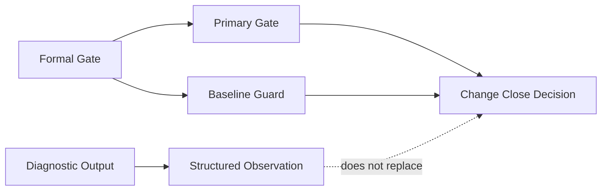
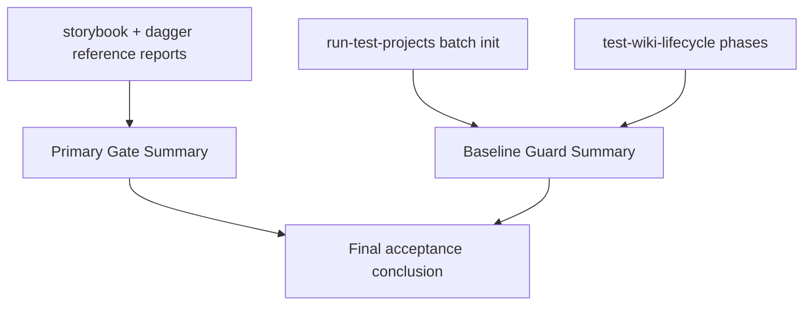

# Knowledge Quality Gates Acceptance

## 1. Gate Boundary

当前 `quality gates + acceptance harness` 只收口这四类 formal gate：

- `artifact_validity`
- `restore_validity`
- `query_route_contract`
- `status_recommended_action_stability`

非目标：

- 不把性能优化塞进 gate
- 不把 provider 稳定性攻坚塞进 gate
- 不把 19 项目“全部高质量达标”伪装成当前承诺
- 不引入 dashboard 或平台化治理系统

## 2. Harness Roles

- `primary gate`
  - 命令：`node scripts/collect-reference-project-reports.mjs storybook dagger`
  - 角色：读取 `storybook + dagger` 的 reference fidelity 报告，给出 primary gate 结论
  - 边界：reference fidelity 只是 gate input，不替代 formal gates
- `baseline guard`
  - 命令：`node scripts/run-test-projects.mjs`
  - 角色：批量项目集 `init` 回归
- `baseline guard`
  - 命令：`node scripts/test-wiki-lifecycle.mjs`
  - 角色：生命周期链路回归

## 3. Failure Mapping

| Failure source | Gate | Result |
| --- | --- | --- |
| artifact schema / snapshot drift | `artifact_validity` | `blocker` |
| restore / rebuild / cold recovery drift | `restore_validity` | `blocker` |
| query mode / trust / provenance drift | `query_route_contract` | `blocker` |
| status / recommended_action drift | `status_recommended_action_stability` | `blocker` |
| runtime incomplete / blocker observation without formal gate breach | diagnostic channel | `diagnostic` |
| fidelity trend / warm stability observation | primary gate input | `diagnostic` unless it causes primary gate fail |

## 4. Capability Matrix

| Capability | model/schema | artifact/recovery | workflow | sample | optional baseline/reference |
| --- | --- | --- | --- | --- | --- |
| declared lifecycle completeness | declared records / health signals | declared snapshot writeback | `sync/status/update` | `storybook/dagger` | batch init + lifecycle |
| derived research contract | research summary / page digest | research artifact restore | `init/update/page_render` | `storybook/dagger` | batch init + lifecycle |
| projection / readiness / recovery | projection digest / readiness | cold restore / rebuild | `status/query/rebuild` | `storybook/dagger` | batch init + lifecycle |
| governance conflict artifacts | conflict records / governance health | conflict persistence / cleanup | `sync/status/update` | `storybook/dagger` | batch init + lifecycle |
| query route completeness | query mode / query trust | route survives restore | `query/status` | `storybook/dagger` | batch init + lifecycle + reference |
| answer assembly contract | answer envelope / supporting refs | answer substrate survives restore | `query transport/runtime` | `storybook/dagger` | batch init + lifecycle + reference |
| knowledge quality gates | gate summary / decision semantics | restore + artifact gate | `run-test-projects/test-wiki-lifecycle` | `storybook/dagger` | reference reporting |

## 5. Reuse Rule

后续 child change 进入收口时，至少要复用这套顺序：

1. 先看 formal gate 是否成立。
2. 再看 `storybook + dagger` primary gate。
3. 最后看 batch init 与 lifecycle baseline guard。

如果只有 diagnostic 输出，而 formal gate 与 primary gate 没失败，就不能把 change 直接压成 blocker。
