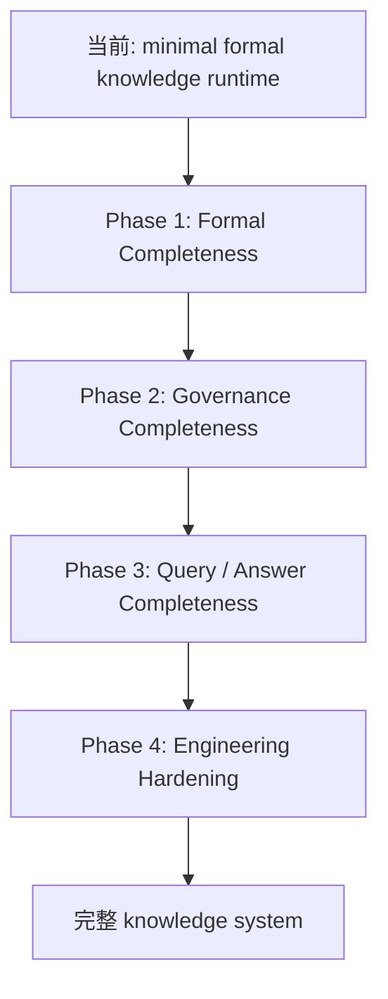
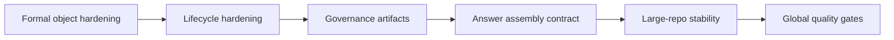

# Knowledge System 完整性路线图

## 背景

当前仓库已经收稳 `minimal formal knowledge runtime`，但这不等价于“形式完整、工程完善的 knowledge system”。

如果后续要把 `spec-wiki` 往“完整知识系统”推进，需要先把目标定义清楚，否则很容易出现两种误判：

- 把“已有 formal object”误写成“系统已经完善”
- 把“继续补能力”重新做成 page-first 或样本特化逻辑

因此，这份文档只回答三件事：

1. 什么叫“形式完整”
2. 什么叫“工程完善”
3. 应该按什么顺序迭代

## 目标定义

```text
┌─ 第一层：形式完整 ───────────────────────────────┐
│ 每个知识对象是谁、怎么产生、怎么失效、怎么恢复，都有正式合同 │
└───────────────────────────────────────────────┘
                      ↓
┌─ 第二层：工程完善 ───────────────────────────────┐
│ 这些正式合同在真实仓库、真实协作、真实长流程里稳定可用        │
└───────────────────────────────────────────────┘
```

这里的关键词不是“生成更多页面”，而是：

- truth source 清晰
- lifecycle 清晰
- query / sync / update / rebuild 语义清晰
- 冲突与治理可承接

## 完整系统的最小判定

一个“形式完整、工程上也算完善”的 knowledge system，至少要同时满足下面 8 组条件。

### 1. 真相分层完整

必须稳定区分：

- `facts / index`
- `declared knowledge`
- `derived knowledge`
- `projection`
- `cache`

并明确每层回答什么问题、谁可编辑、谁只能生成、谁可删除恢复。

### 2. 对象模型完整

至少要有一组正式对象，而不是只有 `KnowledgeUnit`：

- `KnowledgeUnit`
- `DeclaredRecord`
- `ResearchSummary`
- `ProjectionDigest`
- `HealthSignal`
- `ConflictRecord`
- `SupersedeRecord`
- `GovernanceDecision`

### 3. 生命周期完整

至少要把下面这些状态和传播关系正式化：

- `facts_changed`
- `declared_changed`
- `research_stale`
- `compose_stale`
- `projection_stale`
- `cache_stale`
- `blocked`
- `rebuild_recommended`

### 4. 阶段合同完整

每个阶段都必须回答：

- 输入是什么
- 输出是什么
- 最小必填字段是什么
- degraded / blocked 条件是什么
- 下游依赖什么字段

### 5. authoring / writeback 合同完整

必须明确：

- 哪些编辑可回写 declared
- 哪些编辑只影响 metadata
- 哪些编辑是 illegal drift
- 删除 / 废弃 / 替代怎么表达

### 6. query / answer assembly 合同完整

必须明确：

- query 优先命中哪一层
- provenance 怎么返回
- answer assembly 消费哪些 formal object
- degraded 状态下如何回答

### 7. 诊断与治理完整

不能只停留在 health summary，至少要能承接：

- declared 与 derived 冲突
- knowledge 过期
- provenance 缺失
- 替代关系
- 人工裁决与恢复动作

### 8. 恢复与审计完整

必须保证：

- `.wiki` 可恢复
- cache 可重建
- snapshot 可审计
- 多次 `sync / update / rebuild` 后语义不漂移

## 当前状态映射

### 已经成立

- `KnowledgeUnit / DeclaredRecord / ResearchSummary / ProjectionDigest / HealthSignal` 的最小合同已初步成立
- `status / query / sync / update / rebuild` 的最小运行时语义已成立
- `declared -> derived -> projection` 的最小失效链已可被 runtime 消费

### 尚未成立

- 完整 declared authoring 体系
- 完整 conflict / supersede / governance 对象
- 完整 answer assembly contract
- provider-backed 大仓库 full compose 稳定性
- 全局质量评价与治理闭环

## 总体演进图



## Phase 1：Formal Completeness

目标：先把对象和生命周期补完整，不先追求“大而全智能能力”。

### 需要完成

1. declared object 扩展
   - 支持 `replaced_by / supersedes / deprecated` 等关系
   - 支持更明确的 scope object，而不是只有字符串 scope

2. research contract 扩展
   - 明确 `summary_status`
   - 明确 source / citation / evidence 的必填规则
   - 明确 blocked / degraded 条件

3. projection contract 扩展
   - `ProjectionDigest` 明确 readiness、render reason、projection provenance
   - 页面写盘只是 digest 的结果，不再反向承担主真相

4. lifecycle state machine 固化
   - 将 `declared_changed -> research_stale -> projection_stale` 等链路完全写进正式对象与 workflow

### 完成标准

- 每个 formal object 都有稳定 schema
- 每条主链状态传播都能在 artifact 中被恢复
- 不再靠 runtime cache 暗示核心语义

## Phase 2：Governance Completeness

目标：让系统不只会“生成知识”，还会“治理知识”。

### 需要完成

1. conflict record
   - 表达 declared 与 derived 冲突
   - 表达 declared 与现实代码不一致

2. supersede / deprecate 机制
   - 旧规则怎么被替换
   - query 如何优先命中新规则

3. governance decision artifact
   - 人工裁决结果进入正式层
   - 保留审计链

4. status / query / sync 的治理语义
   - 不只返回 `update / rebuild`
   - 还能返回 `review / resolve_conflict / accept_override`

### 完成标准

- 知识冲突不再只表现为警告
- 系统能承接替代、废弃、裁决三类长期治理动作

## Phase 3：Query / Answer Completeness

目标：让 query 和 answer assembly 真正建立在 formal knowledge 上，而不是继续依赖 page fallback。

### 需要完成

1. answer assembly contract
   - 明确 answer 消费的 formal inputs
   - 明确如何拼 provenance

2. route policy 强化
   - symbol / graph / declared / derived / page 的优先级与降级策略完全固定

3. degraded answer policy
   - 没有完整 compose 时是否允许回答
   - 允许回答时必须暴露哪些置信与 provenance

4. host-facing output contract
   - 面向 Agent 的知识回答格式稳定，不让宿主继续自己拼状态机

### 完成标准

- answer assembly 不再是隐式实现细节
- page fallback 成为补充层，而不是隐藏主链缺口

## Phase 4：Engineering Hardening

目标：把“形式完整”推进成“真实可用”。

### 需要完成

1. 样本仓库稳定性
   - `storybook / dagger` 不再长期停在 `runtime_incomplete`
   - provider-backed 长尾仓库有稳定完成率

2. 全量项目广覆盖
   - `19` 项目定期跑批
   - 不允许样本专用逻辑渗入 core

3. 长流程稳定性
   - `init -> status -> sync -> update -> query -> rebuild` 长流程稳定
   - 多轮反复执行后语义不漂移

4. 质量指标
   - query 命中率
   - provenance 完整率
   - stale 恢复成功率
   - sync 分类准确率
   - rebuild 恢复率

### 完成标准

- “完整知识系统”不再只是 schema 意义成立
- 在真实大仓库和多仓库样本上也稳定可用

## 建议的迭代顺序



建议顺序：

1. 先补 formal object 与 lifecycle
2. 再补治理对象
3. 再补 query / answer assembly contract
4. 最后做大样本和全量工程硬化

不建议反过来先追求：

- 更多 page 类型
- 更花哨的 LLM orchestration
- 更复杂的 UI 展示

## 当前最值得做的下一步

如果只选最关键的 4 个方向，建议是：

1. declared authoring / supersede / deprecate contract
2. conflict / governance artifact
3. answer assembly formal contract
4. `storybook / dagger` provider-backed 长流程稳定性

## 非目标

这份路线图不等于：

- 重新回到 page-first
- 引入样本仓库特化 planner
- 先做大而全治理平台
- 先做多 repo 编排平台
- 先做复杂宿主 UI

## 一句话总结

```text
完整 knowledge system 不是“有 knowledge object 就算完成”，
而是 facts、declared、derived、projection、governance、query、recovery
都具备正式合同，并且在真实仓库上稳定可用。
```
