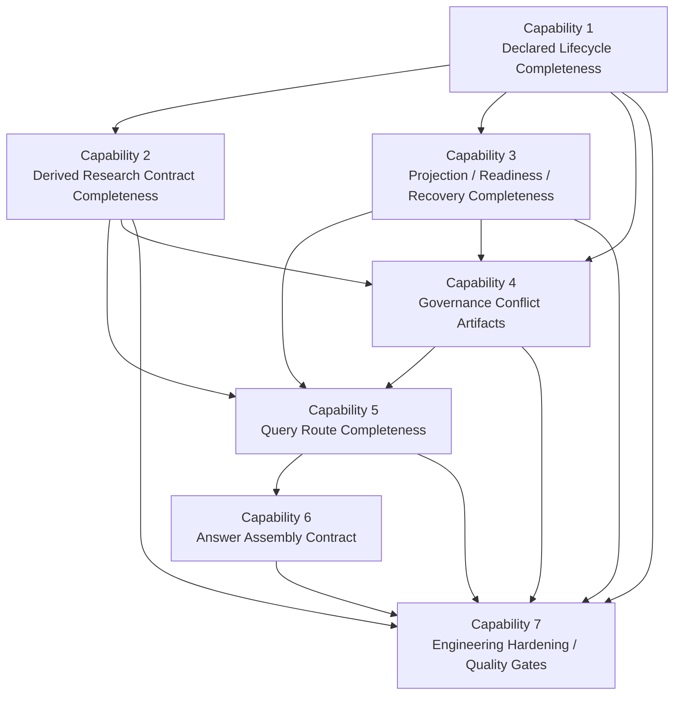
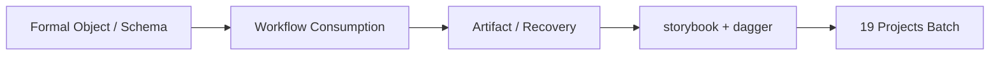

# Knowledge System 完整性路线图

## 背景

当前仓库已经收稳 `minimal formal knowledge runtime`，但这不等价于“形式完整、工程完善的 knowledge system”。

如果后续要把 `spec-wiki` 往“完整知识系统”推进，需要先把目标定义清楚，否则很容易出现两种误判：

- 把“已有 formal object”误写成“系统已经完善”
- 把“继续补能力”重新做成 page-first 或样本特化逻辑

因此，这份文档只回答三件事：

1. 什么叫“形式完整”
2. 什么叫“工程完善”
3. 应该按什么顺序迭代

## 目标定义

```text
┌─ 第一层：形式完整 ───────────────────────────────┐
│ 每个知识对象是谁、怎么产生、怎么失效、怎么恢复，都有正式合同 │
└───────────────────────────────────────────────┘
                      ↓
┌─ 第二层：工程完善 ───────────────────────────────┐
│ 这些正式合同在真实仓库、真实协作、真实长流程里稳定可用        │
└───────────────────────────────────────────────┘
```

这里的关键词不是“生成更多页面”，而是：

- truth source 清晰
- lifecycle 清晰
- query / sync / update / rebuild 语义清晰
- 冲突与治理可承接

## 当前 authoritative program

当前 authoritative 路线图不再用“8 组条件 + 4 phase”做主框架，而是直接使用 `iteration-12-9` umbrella 已冻结的 7 个 capability。原因很简单：

- capability 更适合作为 OpenSpec child change 的实施颗粒度
- capability 能直接绑定 formal object、truth source、workflow 与 artifact layer
- capability 比“phase 愿景”更容易验收和归档

因此，这份文档以下内容都以 7 capability program 为准。

这份 `.docs` 文档只承担阅读镜像角色；program-level authoritative source 仍然是 `openspec/changes/iteration-12-9-knowledge-system-completeness/**`。

## 当前状态映射

### 已经成立

- `KnowledgeUnit / DeclaredRecord / ResearchSummary / ProjectionDigest / HealthSignal` 的最小合同已初步成立
- `status / query / sync / update / rebuild` 的最小运行时语义已成立
- `declared -> derived -> projection` 的最小失效链已可被 runtime 消费

### 尚未成立

- 完整 declared authoring 体系
- 完整 conflict / supersede / governance 对象
- 完整 answer assembly contract
- provider-backed 大仓库 full compose 稳定性
- 全局质量评价与治理闭环

## Capability Program



## Capability Freeze

### 7 个 capability

| Capability | Formal Object / Contract | Owner Crate | Child Change |
| --- | --- | --- | --- |
| Declared Lifecycle Completeness | declared lifecycle、page-scoped snapshot diff、declared writeback legality | `wiki-model` + `wiki-runtime` | `iteration-12-9-1-declared-lifecycle-completeness` |
| Derived Research Contract Completeness | `KnowledgeResearchSummary` status / reason / validation | `wiki-knowledge` + `wiki-runtime` | `iteration-12-9-2-derived-research-status-contract` |
| Projection / Readiness / Recovery Completeness | projection digest、readiness、restore / rebuild contract | `wiki-runtime` + `wiki-model` | `iteration-12-9-3-formalize-projection-readiness-contract` |
| Governance Conflict Artifacts | conflict artifact、conflict health、review-required formal object | `wiki-model` + `wiki-runtime` | `iteration-12-9-4-formalize-declared-conflict-artifacts` |
| Query Route Completeness | query route、provenance、query trust、page fallback 边界 | `wiki-runtime` + `wiki-index` | `iteration-12-9-5-formalize-knowledge-query-routing-contract` |
| Answer Assembly Contract | `AnswerEnvelope`、supporting refs、degraded answer policy | `wiki-runtime` + `wiki-knowledge` | `iteration-12-9-6-formalize-answer-assembly-contract` |
| Engineering Hardening / Quality Gates | primary gate / baseline guard、gate summary、quality gates | `wiki-runtime` + scripts | `iteration-12-9-7-formalize-quality-gates-and-acceptance-contract` |

### 非目标冻结

- 不回到 page-first
- 不把治理平台空话写成 capability
- 不做多 repo 编排
- 不做宿主 UI 扩张
- 不把 engineering hardening 和 formal contract change 混成一个实施包

## Spec Impact Matrix

| Capability | Existing Specs Modified | New Specs Required |
| --- | --- | --- |
| Declared Lifecycle Completeness | `declared-knowledge-lifecycle`、`knowledge-runtime-artifacts`、`knowledge-runtime-health-signals`、`knowledge-first-update`、`repo-wiki-workflow` | 无 |
| Derived Research Contract Completeness | `research-driven-page-composition`、`knowledge-runtime-artifacts`、`knowledge-runtime-health-signals` | `derived-research-status-contract` |
| Projection / Readiness / Recovery Completeness | `research-driven-page-composition`、`knowledge-runtime-artifacts`、`knowledge-runtime-health-signals`、`knowledge-first-update` | `projection-readiness-contract` |
| Governance Conflict Artifacts | `knowledge-runtime-artifacts`、`knowledge-runtime-health-signals`、`knowledge-first-update` | `declared-conflict-artifacts` |
| Query Route Completeness | `repo-wiki-workflow` | `knowledge-query-routing` |
| Answer Assembly Contract | `research-driven-page-composition` | `answer-assembly-contract`、`degraded-answer-policy`、`host-knowledge-answer-surface` |
| Engineering Hardening / Quality Gates | `workflow-verification`、`reference-fidelity-reporting` | `knowledge-quality-gates` |

## Acceptance Matrix



| Capability | Formal Object / Schema | Workflow Consumption | Artifact / Recovery | `storybook + dagger` | `19` Projects Batch | Required Now / Later Stage |
| --- | --- | --- | --- | --- | --- | --- |
| Declared Lifecycle Completeness | declared schema、page snapshot diff | `sync/status/update` | declared snapshot prune、stale propagation | 验证 declared authoring 不退化为样本特化 | batch init 只做 baseline 观察 | `formal/schema + workflow + artifact/recovery` required now；`storybook + dagger` required now；`19 projects` later-stage baseline |
| Derived Research Contract Completeness | `summary_status`、reason contract | `KnowledgeUnit`、`status`、health | roundtrip / restore validation | 观察 derived status 在样本仓库中稳定 | batch init + lifecycle 维持 baseline | `formal/schema + workflow + artifact/recovery` required now；`storybook + dagger` required now；`19 projects` later-stage baseline |
| Projection / Readiness / Recovery Completeness | readiness、projection digest、recovery manifest | `status/query/update/rebuild` | cold restore、cache rebuild、metadata consistency | 验证 restore / rebuild / readiness | lifecycle phases 覆盖恢复链 | `formal/schema + workflow + artifact/recovery` required now；`storybook + dagger` required now；`19 projects` later-stage baseline |
| Governance Conflict Artifacts | conflict artifact、review-required state | `sync/status/update` | conflict persist / cleanup | 样本仓库验证 conflict 进入 formal artifact | baseline guard 只做补充观察 | `formal/schema + workflow + artifact/recovery` required now；`storybook + dagger` required now；`19 projects` deferred until governance path stabilizes |
| Query Route Completeness | query mode / trust / provenance | `query`、transport、host query surface | restore 后 route 不漂移 | 样本仓库验证 route 不回退 page-first | lifecycle + batch init 保持 query baseline | `formal/schema + workflow + artifact/recovery` required now；`storybook + dagger` required now；`19 projects` inherited from baseline guard / later-stage quality gate |
| Answer Assembly Contract | `AnswerEnvelope`、supporting refs | query transport / host answer surface | answer substrate 在 restore 后仍可消费 | 样本仓库验证 formal inputs 主导 | batch/lifecycle 只保 route baseline | `formal/schema + workflow + artifact/recovery` required now；`storybook + dagger` required now；`19 projects` inherited from baseline guard / later-stage quality gate |
| Engineering Hardening / Quality Gates | gate summary、formal gates、matrix | scripts / reports / closeout consumption | report snapshot、summary reuse | `collect-reference-project-reports.mjs storybook dagger` 是 primary gate | `run-test-projects.mjs` + `test-wiki-lifecycle.mjs` 是 baseline guard | primary gate + baseline guard required now；`19 projects` becomes current gate only in this capability |

## 当前最值得做的 program-level动作

如果只看收口顺序，当前最关键的是：

1. 先把 7 个 child changes 全部实现并保持与 umbrella 矩阵一致
2. 再按 primary gate / baseline guard 收 release evidence
3. 最后归档 umbrella，而不是反过来先追逐新的 page 语义或 UI 形态

## 非目标

这份路线图不等于：

- 重新回到 page-first
- 引入样本仓库特化 planner
- 先做大而全治理平台
- 先做多 repo 编排平台
- 先做复杂宿主 UI

## 一句话总结

```text
完整 knowledge system 不是“有 knowledge object 就算完成”，
而是 facts、declared、derived、projection、governance、query、recovery
都具备正式合同，并且在真实仓库上稳定可用。
```
