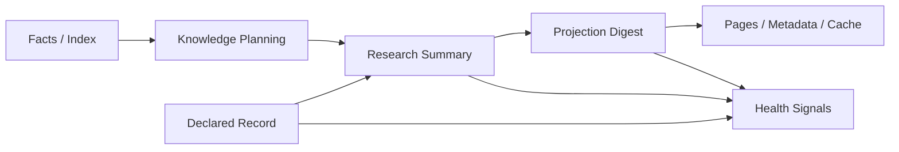

# v0.2.0 Knowledge Runtime 缺口现状

## 背景

`spec-wiki v0.2.0` 当前已经不是 `facts-only` 过渡态，而是一个可落盘、可恢复、可诊断的 `minimal formal knowledge runtime`。

但这仍然不等价于“已经实现了完善的 knowledge system”。

当前更准确的判断是：

```text
┌─ 当前定位 ─────────────────────────────────────────────┐
│ 已收稳 minimal formal knowledge runtime contract      │
│ 但完整 knowledge system 仍未完成，也没有被正式承诺     │
└───────────────────────────────────────────────────────┘
```

这份文档的目标不是继续放大愿景，而是把 `2026-04-14` 之后的真实边界写清楚：哪些最小合同已经成立，哪些仍然只是后续能力。

## 当前主线



当前已经有正式对象承接这条主线，但它仍是“最小正式合同”，不是“大而全知识平台”。

## 已经收稳的最小合同

### 1. Workflow surface 已成立

- `init / update / status / query / sync / rebuild` 已形成正式 workflow surface。
- `.wiki/.knowledge/**`、`.wiki/pages/**`、`wiki.metadata.json`、`.wiki/.cache/**` 已进入公开 runtime contract。
- `query` 已保持 `index -> knowledge -> page fallback` 路由口径。

### 2. `KnowledgeUnit` 最小合同已落地

当前 `KnowledgeUnit` 已具备最小正式字段：

- `identity`
- `status`
- `declared_record_refs`
- `derived_research_ref`
- `projection_refs`
- `source_refs`
- `citation_refs`
- `updated_at`
- `invalidation_reason`

这意味着 unit 已不再只是 planner 内部对象。

### 3. declared / research / projection 的最小 formal artifact 已落地

当前已经有以下正式对象：

- `declared records`
- `knowledge research summaries`
- `page digests`
- `runtime gates`
- `health signals`

其中 research summary 现在至少带：

- `unit_id`
- `source_refs`
- `citation_refs`
- `summary_status`

projection 侧则由 `PageDigest` 承接最小 formal digest。

### 4. `sync` 已收成受约束 writeback contract

当前 `sync` 已稳定区分：

- `declared_writeback`
- `metadata_only`
- `illegal_drift`

并固定优先级：

`illegal_drift > declared_writeback > metadata_only`

### 5. health / readiness 已分层

当前 `status` 已不再把 runtime readiness 与 knowledge health 压成一层：

- 允许 `ready but degraded`
- 允许 `query` 在有命中时表现为 `stale_but_queryable`
- health summary 与 recommended action 已成为正式输出

### 6. declared/health 驱动的 update scope 已接通

当前 `AffectedKnowledgeScope` 已不再只是 schema 占位，已能正式暴露：

- `stale_unit_ids`
- `declared_record_ids`
- `stale_projection_ids`
- `health_signal_targets`

并且 `update` 不再只看源码 dirty set；即使没有源码脏文件，只要存在 declared/health 驱动的 stale scope，也会刷新 derived / projection。

## 仍然不能夸大的部分

以下能力仍然不能被写成“已完成”：

- 完整 knowledge system
- 自由文本 declared authoring 平台
- 完整 research / compose / answer assembly pipeline
- provider-backed 大仓库样本的稳定 full compose 验收
- 完整知识治理、冲突治理与质量平台

## 当前剩余缺口

下面这些仍然是真缺口，但已经不是“v0.2.0 根本没有 knowledge runtime”的级别，而是“最小合同之外的后续能力”。

### 1. declared authoring 仍然是最小受约束形态

当前只支持显式结构化 declared block writeback。

仍未支持：

- 自由文本 declared 提炼
- 更复杂的 authoring 面
- record 之间的替代链、冲突链、治理链

### 2. research / compose 仍然只是最小正式化，不是完整 pipeline

当前已经有 research summary 与 projection digest formal object。

但仍未完成：

- 更强的 answer assembly formalization
- 多轮 research orchestration 的完整治理
- 更细的 summary quality / provenance policy
- provider-backed 长尾场景下的一致性收口

### 3. 大样本仓库的验收仍停留在 diagnostic acceptance

`storybook` 与 `dagger` 在短超时验收里已经证明：

- 当前 contract 没有退化成样本特化逻辑

但还不能据此宣称：

- 两个样本已经稳定完成 full compose
- provider-backed research 在长尾仓库中已经完全收稳

### 4. knowledge governance 仍是后续能力

当前 health signals 只解决最小诊断闭环。

仍未进入：

- 评分体系
- 大盘化治理
- 自动冲突裁决
- 多 repo 知识治理

## 当前最准确的结论

如果只用一句话总结：

```text
v0.2.0 现在已经有 minimal formal knowledge runtime，
并且 declared / research / projection / health 的最小正式合同已经成立；
但它仍然不是完整 knowledge system，也没有承诺 provider-backed 大规模样本的 full compose 稳定性。
```

## 后续迭代建议

下一轮如果继续推进，不应该写成“补完 knowledge system”，而应该从下面四类缺口继续收：

1. 扩大 declared authoring contract，而不是回到自由正文真相。
2. 把 research / compose / answer assembly 从最小正式化推进到更稳定的 pipeline contract。
3. 针对 `storybook / dagger` 一类 provider-backed 大仓库补长期样本验证，而不是只看短超时 diagnostic acceptance。
4. 在最小 health signals 之上，逐步补知识治理与冲突治理。
