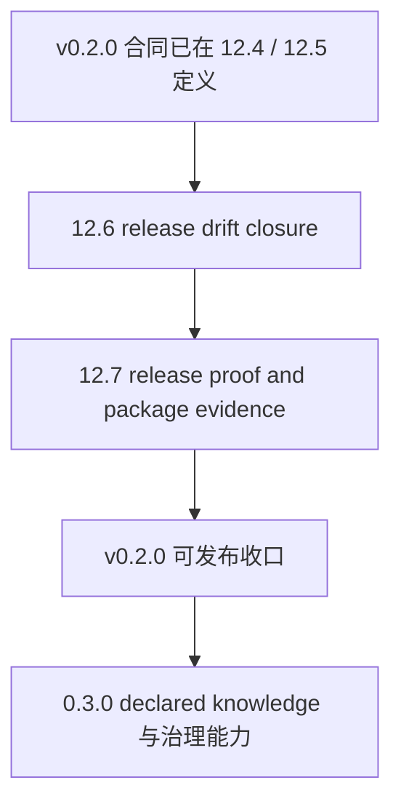

# v0.2.0 Release Gap Closure

## 背景
当前仓库已经通过 `iteration-12-4-query-route-and-v0-2-release-gate` 与 `iteration-12-5-sync-rebuild-public-surface` 把 `v0.2.0` 的公开合同推进到 `knowledge runtime first-class release`，并把 `sync / rebuild` 提升为正式 public surface。

但当前“真相源”仍存在明显漂移，导致仓库虽然已经接近 `v0.2.0` 能力边界，却还不能直接当成口径一致的正式发布版：

- OpenSpec 主 spec 已按 `v0.2.0` 与 6 个公开动作描述
- 英文 `README.md` 已按 `v0.2.0` 叙述
- 中文 `README-CN.md`、`RELEASE-v0.1.0.md`、`dist/spec-wiki/README.md` 仍停留在 `v0.1.0 index-only`
- `packages/spec-wiki/package.json` 版本仍是 `0.1.1`
- staged `dist/` 产物还不是从当前源码真相重新收口出的统一发布面

因此，下一阶段不应重新定义 `v0.2.0` 合同，而应收口为已有合同的 `gap closure`。

## 当前漂移矩阵
| 维度 | 当前状态 | 目标状态 | 主要缺口 |
| --- | --- | --- | --- |
| OpenSpec workflow contract | 已是 `v0.2.0`、6 个公开动作 | 保持为唯一正式合同 | requirement 标题与正文仍有少量表述漂移 |
| TypeScript 源码 public surface | 已公开 `init/status/update/query/sync/rebuild` | 与 docs / dist / package 完全一致 | 需要与发布说明、staging 产物对齐 |
| 英文 README | 已偏向 `v0.2.0 knowledge runtime` | 与 CLI/help/主包版本完全一致 | 还未体现完整 release drift matrix |
| 中文 README | 仍是 `v0.1.0 index-only` | 升级为 `v0.2.0` | 版本、runtime、公开动作全部落后 |
| Release Note | 仍是 `RELEASE-v0.1.0.md` | 增补或替换为 `v0.2.0` 说明 | 当前仍宣传 4 动作与 index-only |
| dist README / staging contract | 仍是 `v0.1.0` | 与源码当前真相一致 | staged 说明与源码、spec 撕裂 |
| package version / publish evidence | `packages/spec-wiki` 仍是 `0.1.1` | 明确切到 `0.2.0` 或显式保留 preview 口径 | 版本叙事未定、缺 dry-run 证据 |
| release verification evidence | 有 `storybook` primary gate、`chi + zustand` smoke、packages test | 成为可复用 release gate | 证据分散，尚未收口为统一发布清单 |

## 0.2.0 必须补齐
以下项属于 `v0.2.0` 的 release blocker，必须在本轮 gap closure 内收齐：

1. README、release note、dist README、CLI/help、spec、package version 必须引用同一套发布口径。
2. 当前版本必须明确是 `v0.2.0 minimal formal knowledge runtime`，而不是继续停留在 `v0.1.0 index-only`。
3. public workflow surface 必须统一为 `init / status / update / query / sync / rebuild`。
4. staged package 必须证明是从当前源码真相构建出的产物，而不是旧 release 文案残留。
5. 发布证据必须显式继承当前 gate：
   - `storybook` primary gate
   - `chi + zustand` smoke
   - `packages/spec-wiki` 测试
   - `COMMENTING.md` 合规检查
6. 发布前必须给出 staged package smoke 或等价 `publish` 证据，例如 `npm publish --dry-run`、staged README/help/manifests 对齐。

## 不属于 0.2.0 的项
以下项不应混入本轮 OpenSpec change：

- 完整 `declared knowledge` authoring/runtime
- 完整 knowledge 治理与冲突消解
- `0.3.0` 级别的 declared + derived unified query
- 纯运营收尾动作，例如公告文案、外部渠道同步、长期 runbook 扩展

这些内容可以进入后续 `.docs` runbook 或 `0.3.0` backlog，但不应挤占 `v0.2.0` 收口迭代。

## 迭代拆分
建议只拆成 2 个 change，并都使用 `gap closure` 语义：

1. `iteration-12-6-v0-2-release-drift-closure`
   - 收口 README / README-CN / release note / dist README / spec wording / package version
   - 明确当前正式发布合同与唯一 truth source
   - 不新增 runtime 能力

2. `iteration-12-7-v0-2-release-proof-and-package-evidence`
   - 收口 staged package、distribution proof、publish dry-run、help/manifests 一致性
   - 补齐发布证据与 release gate 报告
   - 不重做大范围 packaging 体系设计

## 迭代关系图

## 每轮验收重点
### 12.6
- 所有公开文档与 spec 不再出现 `v0.1.0 index-only`
- README、release note、dist README 与 CLI/help 一致
- package version 与 release 口径一致
- `repo-wiki-workflow` 的标题与正文口径不再冲突

### 12.7
- staged package 来自当前源码真相
- staged README / package.json / help / manifests 一致
- 至少具备一次可复现的 package smoke 或 publish dry-run 证据
- release gate 报告引用当前既有 gate，而不是自创新 gate

## 发布判定
只有当以下条件同时满足时，当前仓库才适合被命名为 `v0.2.0` 对外发布：

- 合同一致：spec、README、release note、CLI/help、dist、版本号一致
- 产物一致：staged package 与当前源码公开面一致
- 证据一致：primary gate、smoke gate、package smoke、commenting check 均有记录
- 边界一致：仍保持 `minimal formal knowledge runtime`，不伪装成完整 knowledge system
