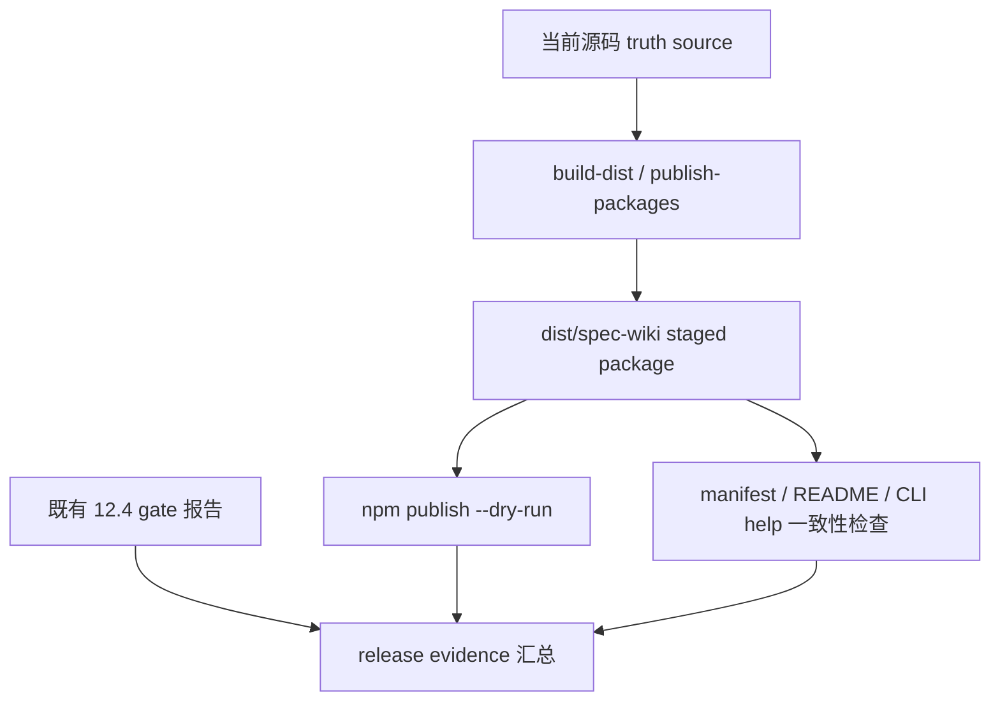

# iteration-12-7 release evidence

## Scope

本轮只做 `evidence / packaging gap closure`，不修改 public surface，也不修改 runtime contract。

## Fresh Evidence

### 1. distribution 测试

- Command: `pnpm vitest run scripts/tests/distribution.test.ts`
- Result: passed, `4/4` tests passed
- Evidence:
  - staged `package.json` 与 source package 的 `name / version / description / bin / main / exports / os / cpu` 一致
  - staged README 与当前根 `README.md` 一致
  - staged CLI help 与当前源码 help contract 一致
  - public actions 明确为 `init / status / update / query / sync / rebuild`
- Raw log: [distribution-test.log](E:/project/!byAI/spec-wiki/.spec/changes/iteration-12-7-v0-2-release-proof-and-package-evidence/reference-project-reports/raw/distribution-test.log)

### 2. `packages/spec-wiki` 自动化测试

- Command: `pnpm --dir packages/spec-wiki test`
- Result: passed, `10/10` files passed, `46/46` tests passed
- Role in evidence:
  - 验证 CLI/help、公开 workflow 常量、宿主 assets 与 runtime forwarding 没有回退
- Raw log: [spec-wiki-package-test.log](E:/project/!byAI/spec-wiki/.spec/changes/iteration-12-7-v0-2-release-proof-and-package-evidence/reference-project-reports/raw/spec-wiki-package-test.log)

### 3. staged package dry-run

- Command: `node scripts/publish-packages.mjs --dry-run`
- Result: passed
- Key facts:
  - `cargo build -p wiki-runtime --release` 完成
  - `packages/spec-wiki` fresh build 完成
  - `npm publish --dry-run` 直接针对 `dist/spec-wiki` 执行
  - tarball name: `spec-wiki-0.2.0.tgz`
  - tarball total files: `6`
  - staged package version: `0.2.0`
  - evidence checks: `10`
- Raw log: [npm-publish-dry-run.log](E:/project/!byAI/spec-wiki/.spec/changes/iteration-12-7-v0-2-release-proof-and-package-evidence/reference-project-reports/raw/npm-publish-dry-run.log)

## Inherited Gates

以下证据继承自 `12.4` 已归档报告；本轮没有重跑这些 gate，因为 `12.7` 不修改 runtime capability、public surface 或 query contract，只补 package evidence 与 release proof。

### Formal release gates

- `storybook` primary gate
  - Source: [primary-gate-storybook-dagger-2026-04-02.md](E:/project/!byAI/spec-wiki/.spec/archive/2026-04-02-iteration-12-4-query-route-and-v0-2-release-gate/reference-project-reports/primary-gate-storybook-dagger-2026-04-02.md)
  - Status: inherited as formal primary gate evidence
- `chi + zustand` smoke gate
  - Source: [smoke-gate-chi-zustand-2026-04-02.md](E:/project/!byAI/spec-wiki/.spec/archive/2026-04-02-iteration-12-4-query-route-and-v0-2-release-gate/reference-project-reports/smoke-gate-chi-zustand-2026-04-02.md)
  - Status: inherited as formal smoke gate evidence
- `COMMENTING.md` check
  - Source: [verification-and-commenting.md](E:/project/!byAI/spec-wiki/.spec/archive/2026-04-02-iteration-12-4-query-route-and-v0-2-release-gate/reference-project-reports/verification-and-commenting.md)
  - Status: inherited as formal commenting evidence

## Observation-only Scope

- `dagger`：本轮继续只作为观察项，不提升回强制 release blocker
- 19 项目全量 `init` / lifecycle 结果：本轮继续只作为 baseline guard，不回写成 `v0.2.0` 的 formal release gate

## Commenting Check

本轮新增或修改的代码/脚本主要是：

- `scripts/build-dist.mjs`
- `scripts/publish-packages.mjs`
- `scripts/tests/distribution.test.ts`

检查结论：

- `build-dist.mjs` 已保持文件头注释，并为新增 evidence helper 保留职责说明
- `publish-packages.mjs` 已补文件头注释与导出函数注释
- `distribution.test.ts` 继续使用中文文件注释，新增 helper 名称与断言语义保持直接可读
- 本轮没有新增违背 `COMMENTING.md` 的注释写法

## Conclusion

- `dist/spec-wiki` 的 staged package 已通过 source/staged truth-source consistency checks
- `npm publish --dry-run` 已证明当前 staged package 具备发布可行性
- `packages/spec-wiki` 测试、本轮 staged proof、以及继承的 `12.4` formal gates 已收口为同一份 release evidence
- 本轮只做 `evidence / packaging gap closure`，没有修改 public surface 或 runtime contract
