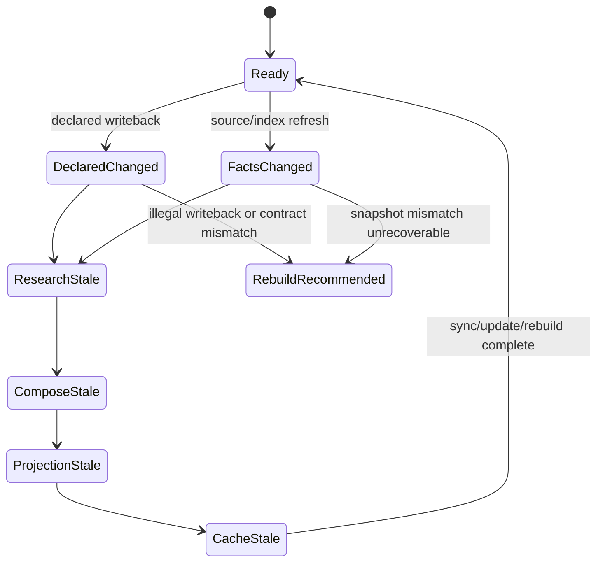

## Context

当前 `v0.2.0` 已经把公开合同从 `facts-only` 收敛到 `minimal formal knowledge runtime`，正式产物也已经覆盖 `.wiki/.knowledge/**`、`.wiki/pages/**`、`wiki.metadata.json` 与 `.wiki/.cache/**`。但当前 contract 仍偏薄，最明显的问题有四类：

1. `declared knowledge` 还不是正式可操作对象，当前更多是目录占位或未来能力预留。
2. `KnowledgeUnit` 作为一等抽象已经进入设计口径，但最小 schema、状态、引用、失效和回写关系还不够硬。
3. `research / compose` 已经在设计中存在，但当前公开合同还无法稳定回答“最小 research 输出是什么、最小 compose 输出是什么、它们如何进入 formal artifacts”。
4. `status / sync / update / rebuild` 已经进入公开 workflow，但仍缺少 knowledge 级状态流转与最小 health signals，所以 runtime 目前更像“已存在”，还不够“可依赖”。

本轮设计的目标不是补完完整 knowledge system，而是把已经进入 `v0.2.0` 语义、但仍偏薄的 knowledge runtime contract 收稳。边界仍以 [.wiki/06-设计文档/00-总体设计.md](E:/project/!byAI/spec-wiki/.wiki/06-设计文档/00-总体设计.md)、[.wiki/06-设计文档/01-Runtime设计.md](E:/project/!byAI/spec-wiki/.wiki/06-设计文档/01-Runtime设计.md)、[.wiki/06-设计文档/03-核心场景.md](E:/project/!byAI/spec-wiki/.wiki/06-设计文档/03-核心场景.md)、[.wiki/06-设计文档/04-扩展场景.md](E:/project/!byAI/spec-wiki/.wiki/06-设计文档/04-扩展场景.md) 为准，不回到 page-first，也不把参考实现抬成真相源。

## Goals / Non-Goals

**Goals:**

- 把 `KnowledgeUnit` 的最小 contract 收敛成正式对象边界，至少覆盖 identity、归属、来源、状态、更新时间和失效条件。
- 把 `declared / derived / projection / cache` 四层职责写成强边界，而不是只保留目录名。
- 把 `declared changed / facts changed / research stale / compose stale / projection stale / cache stale` 的传播规则写成最小有限状态机。
- 把 `research / compose` 收敛成当前 runtime 可稳定依赖的最小合同，而不是继续停留在模糊阶段名。
- 把 `sync` 收敛成受约束的 knowledge writeback contract。
- 给 `status` 与相关诊断补上最小 health signals，使 knowledge runtime 不只可存在，还可诊断。

**Non-Goals:**

- 不补完完整 knowledge system。
- 不引入新的 page-first 页面语义主线。
- 不做大而全的 lint / governance 平台。
- 不重写 query/research/compose 总体架构。
- 不把多 repo、复杂 agent orchestration 或样本仓库特化逻辑纳入本轮。

## Decisions

### 决策 1：先钉死 `KnowledgeUnit` 的最小正式合同

本轮先把 `KnowledgeUnit` 定义成 formal contract owner，而不是继续让它只存在于规划口径中。每个 `KnowledgeUnit` 至少需要稳定表达：

- `unit_id`
- `domain_id`
- `unit_kind`
- `declared_record_refs`
- `derived_research_ref`
- `projection_refs`
- `source_refs`
- `citation_refs`
- `status`
- `updated_at`
- `invalidation_reason`

其中：

- `declared_record_refs` 指向可审计声明对象，而不是页面路径。
- `derived_research_ref` 指向 research summary 或等价 formal derived object。
- `projection_refs` 只表达其投影结果，不让 projection 反向成为主真相。
- `status` 最少区分 `active / stale / blocked / removed`。

这样做的原因是：只要 `KnowledgeUnit` 仍然没有硬合同，后续 `declared`、`research`、`compose`、`sync` 和 `status` 都无法共享同一条主线。

备选方案是先从页面或 query 输出侧补 contract，再回推 unit 身份；该方案会重新把主抽象拉回 projection 或 transport，直接违背当前设计边界，因此放弃。

### 决策 2：把四层职责写成强边界，而不是目录名

本轮明确四层对象的角色：

- `declared`
  - 可审计真相源
  - 允许受约束的人为编辑与显式 writeback
  - 记录 scope、status、source 与适用范围
- `derived`
  - 基于 facts 或 declared 推导出的正式知识摘要
  - 可重建，但不是任意工作态缓存
  - 不允许人工直接改写为真相
- `projection`
  - 面向人和 Agent 的页面或页面片段投影
  - 可以承载受管 section 和回写入口
  - 不是系统主真相
- `cache`
  - 本地性能与工作态产物
  - 可删、可恢复、不可上升为正式 truth

这意味着：

- 允许人工编辑的是 `declared` 与 projection 中的受约束编辑面，而不是 `derived`。
- 永远只可生成的是 `derived` 与大部分 projection digest / readiness 对象。
- 删除后可恢复的是 `cache` 和部分 runtime mirror，而不是 `declared`。

备选方案是继续让 `.wiki/.knowledge/**` 只承载 `derived/runtime`，把 `declared` 留到后续；该方案会继续让长期知识真相源缺位，因此不接受。

### 决策 3：把状态流转收成最小有限状态机

本轮不再用散文描述“哪些东西可能过期”，而是把 knowledge runtime 的最小传播关系显式写成状态机。



收敛规则如下：

- `declared changed` 会先污染相关 `KnowledgeUnit`，再传播到 `derived -> projection -> cache`。
- `facts/index changed` 不直接污染页面，而是先污染 `research / derived`。
- `projection stale` 只表示投影结果过期，不自动等价 `rebuild`。
- `cache stale` 只表示本地工作态需要恢复或重建，不改变 formal knowledge truth。
- 只有当 writeback 非法、snapshot 锚点冲突、或 formal objects 无法恢复一致时，才升级为 `rebuild_recommended`。

备选方案是继续把这些传播关系藏在实现逻辑或 `recommended_action` 推断里；这样做会让 contract 不可审计，因此不接受。

### 决策 4：`research / compose` 只做最小正式化

本轮不做“大而全智能流水线”，只回答两个问题：

1. `research` 的最小正式输出是什么
2. `compose` 的最小正式输出是什么

最小定义：

- `research`
  - 输入：facts/index、declared refs、unit identity、dossier/evidence 摘要
  - 输出：`unit research summary`
  - 作用：形成 `derived` 层的 formal summary 与 citation/source 绑定
- `compose`
  - 输入：`unit research summary`、child rollup、projection policy
  - 输出：`projection digest` 与可写页面 section 计划
  - 作用：把 knowledge 组织成 projection，而不是直接生成新的 truth source

本轮显式不做：

- planner / agent orchestration 总体重写
- 多阶段 reasoning 框架
- 黑盒式“研究完自动生成一切”的模糊抽象

备选方案是把 research/compose 完整升级为更复杂的 agent 管线；这会显著放大范围，因此不进入本轮。

### 决策 5：`sync` 升级为受约束的 knowledge writeback contract

`sync` 不再被描述成单纯的文件同步动作，而是受约束的 knowledge 回写入口。

本轮约束如下：

- 允许回写 `declared`
  - 仅限受管 section 中显式映射到 declared contract 的编辑面
  - 必须能解析出结构化 `declared record`
- 只更新 metadata / runtime
  - 标题、排序、projection 层摘要、section hash 等不改变知识真相的编辑
- 非法编辑或要求 rebuild
  - 破坏 managed marker
  - 修改 derived-only 区段
  - 产生无法映射的 projection-first truth 覆盖

这意味着 `sync` 必须显式输出：

- 写回了哪些 declared records
- 哪些变化只影响 metadata/runtime
- 哪些编辑被拒绝或升级为 `rebuild_recommended`

备选方案是页面改动后直接覆盖 declared truth；这会让 projection 污染真相源，因此明确禁止。

### 决策 5A：先钉死最小 declared block contract，再实现 writeback

本轮不开放自由文本 declared 回写，只允许一个最小、显式、可解析的结构化块进入 `declared_writeback`。

最小 declared block contract：

- block kind
  - `wiki:declared`
- 承载位置
  - 只能出现在允许回写 declared 的 managed section 正文内
  - 不允许跨 section 聚合
- 最小字段
  - `kind`
  - `scope`
  - `status`
  - `source`
  - `body`
- section / marker 边界
  - 页面级 managed marker 继续由现有 `wiki:managed:*` 协议负责
  - declared block 只在 managed body 内部解析，不自创新的页面层 state machine

建议的最小形态：

```markdown
<!-- wiki:declared kind=policy scope=repo status=active source=manual -->
这里是结构化 declared body。
<!-- wiki:declared:end -->
```

本轮实现只接受这种显式 begin/end block。没有 block、字段不全、嵌套错误、跨 section 漂移，统一不进入 declared writeback。

这样做的原因是：如果 declared writeback 仍然依赖启发式正文判断，`declared_writeback / metadata_only / illegal_drift` 三类结果一定互相污染。

### 决策 5B：record identity 与 upsert 规则必须先于 writeback 固化

本轮 declared record 的 identity 不允许依赖页面正文全文 hash 或生成时随机值，必须稳定锚定到结构化编辑面。

最小规则：

- `record_id`
  - 由 `block kind + scope + page_id + section_id + ordinal` 稳定生成
- `unit_refs`
  - 优先绑定当前页面对应的 `KnowledgeUnit`
- `projection_refs`
  - 绑定当前 `page_id + section_id`
- `scope_ref`
  - 直接由 block 的 `scope` 字段解析
- upsert 语义
  - 同一 `record_id` 重复出现时执行 replace/update，而不是新增平行 record
  - 只有同一 `record_id` 的合法 block 才覆盖旧值
  - 同步时页面内已消失的合法 block，对应 record 需要从当前页面作用域内删除
- parse failure
  - 如果 block 明显存在但字段不全、边界损坏或 scope 非法，判定为 `illegal_drift`
  - 如果页面改动未命中任何 declared block，只影响标题、排序、摘要等 projection 元信息，判定为 `metadata_only`

本轮把 `sync` 分类优先级固定为：

1. 只要存在 marker 损坏、derived-only 修改、declared block 解析失败或受管区正文出现非合法 declared writeback，就先归类 `illegal_drift`
2. 在不存在 `illegal_drift` 的前提下，只要存在至少一个合法 declared block 变更，就归类 `declared_writeback`
3. 只有既没有 `illegal_drift`，也没有合法 declared block 变更时，才允许归类 `metadata_only`

判定矩阵：

```text
┌──────────────────────────────┬───────────────────────┐
│ 编辑形态                      │ sync 分类             │
├──────────────────────────────┼───────────────────────┤
│ 合法 declared block 变更       │ declared_writeback    │
│ 只改标题/排序/摘要等元信息      │ metadata_only         │
│ 改了 derived-only 或 marker 坏  │ illegal_drift        │
│ 存在 declared block 但无法解析  │ illegal_drift        │
└──────────────────────────────┴───────────────────────┘
```

### 决策 6：health signals 只做最小闭环

本轮只引入 5 类最小 health signals：

- 孤儿 `KnowledgeUnit`
- 缺失来源 / citation
- 失效但未刷新完成的 derived knowledge
- 过期 projection
- `declared` 与 `derived` 不一致

这些信号只要求：

- 能进入正式 runtime health object
- 能被 `status` 聚合为摘要
- 能给出稳定的 `recommended_action`

本轮不做：

- 评分系统
- 全局治理平台
- 新规则引擎
- 大盘式质量平台

## Risks / Trade-offs

- [Risk] `declared knowledge` 一旦进入正式 contract，会引入新的 authoring 约束与 writeback 风险
  - Mitigation：本轮只定义最小 declared record 与受限 writeback 面，不开放自由文本真相写回。

- [Risk] 把 `KnowledgeUnit` contract 写硬后，现有实现中一些“能跑但语义模糊”的对象会暴露不一致
  - Mitigation：通过 spec 和 health signals 先把不一致显式化，再逐步实现，不用页面 fallback 掩盖问题。

- [Risk] `sync` 语义收紧后，部分现有页面编辑路径会变成非法编辑
  - Mitigation：把合法回写面、metadata-only 改动和非法 drift 明确分层，并通过推荐动作返回。

- [Risk] 为 health signals 增加正式对象后，`status` 与 runtime 诊断会更复杂
  - Mitigation：只保留 5 类最小信号，避免引入新的治理子系统。

- [Risk] `research / compose` 的最小正式化可能被误解为要重做整个 pipeline
  - Mitigation：设计与 spec 只定义最小输入输出和 artifact 边界，不引入新的大而全 orchestration。

## Migration Plan

1. 先在 spec 层补齐 `declared`、`KnowledgeUnit`、`health signals` 与 `sync` 语义。
2. 再在 artifact contract 中扩展最小正式对象与状态字段。
3. 接着收敛 `status / update / sync / rebuild` 对这些对象的生命周期语义。
4. 最后补测试、文档与专项样本验证。

本轮不需要旧版兼容层。若旧字段、旧短路语义或旧 fallback 与本轮合同冲突，可以直接移除。

## Open Questions

- `declared record` 的最小字段集合是否需要单独的 `scope_ref` 对象，还是可直接嵌入 record。
- `projection` 中允许回写 declared 的受管 section，是否需要固定 section kind，还是允许由 page topology 显式标注。
- health signals 是集中落到单个 runtime health artifact，还是拆成 unit/page 两级 summary 更利于后续诊断。
