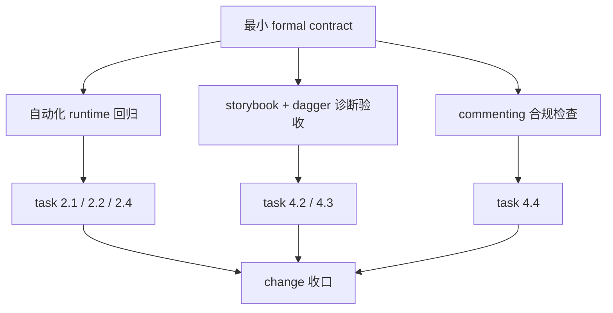

# iteration-12-8 runtime contract acceptance (2026-04-14)

## Scope

- change: `iteration-12-8-stabilize-knowledge-runtime-contract`
- objective: 验证本轮收稳的是 `minimal formal knowledge runtime contract`，不是把系统误写成“完整 knowledge system”
- report coverage:
  - `cargo test -p wiki-runtime --test runtime`
  - `cargo test -p wiki-knowledge artifact_summary_carries_provenance_and_status`
  - `node scripts/run-test-projects.mjs --no-build --timeout-minutes 2 storybook dagger`
  - `COMMENTING.md` 合规检查

## Commands And Results

### 1. runtime 回归

- Command: `cargo test -p wiki-runtime --test runtime`
- Date: `2026-04-14`
- Result: passed, `120/120`
- Meaning:
  - 验证 declared artifact、health signals、status/query 语义、sync 分类、update/rebuild 主链没有回退
  - 本轮新增的 declared/health-driven update scope 测试通过

### 2. research summary contract 补测

- Command: `cargo test -p wiki-knowledge artifact_summary_carries_provenance_and_status`
- Date: `2026-04-14`
- Result: passed, `1/1`
- Meaning:
  - 验证 research summary 已显式携带 `source_refs / citation_refs / summary_status`

### 3. 样本专项验收

- Command: `node scripts/run-test-projects.mjs --no-build --timeout-minutes 2 storybook dagger`
- Date: `2026-04-14`
- Result: passed, `2 passed, 0 failed`
- Key observations:
  - `storybook`：`diagnostic=runtime_incomplete`
  - `dagger`：`diagnostic=runtime_incomplete`
  - 两个样本都在短超时窗口内停留在 `research`，尚未进入稳定 `compose`
  - 当前观察到的问题是 provider-backed research 长尾，而不是 assemble 失败或样本特化逻辑分叉

## Diagnostic Acceptance Decision

本轮接受 `storybook + dagger` 的依据，不是“样本已经完整 compose 完成”，而是下面这条更窄的结论：

- 在 `2026-04-14` 的短超时诊断窗口下，`storybook + dagger` 没有暴露出 runtime contract 回退为样本特化逻辑
- 诊断结果稳定停在 `runtime_incomplete`
- 停留位置是 `research`，不是 `compose` / `assemble` 语义损坏

因此，本轮 `4.2` 的验收口径应明确写成：

- 通过的是 `minimal formal knowledge runtime contract` 的样本不退化验收
- 不是 provider-backed 大仓库 full compose 完整通过

## Full run-test-projects Decision

本轮没有补跑全量 `node scripts/run-test-projects.mjs`。

决定理由：

- 本轮变更集中在 formal artifact contract、health semantics、declared writeback scope 与 update 触发条件
- `wiki-runtime` 的整组 runtime 自动化回归已经覆盖主 workflow 语义
- `storybook + dagger` 已作为当前阶段的页面质量和抽象专项样本完成诊断验收
- 全量 `19` 项目更适合在 provider-backed lifecycle 或更广覆盖回归轮次中单独执行

因此，`4.3` 的结论是：

- 本轮可以不把全量 `run-test-projects` 设为 blocker
- 但必须把“不跑全量”的原因、已跑证据和残余风险写清楚

## Commenting Check

检查日期：`2026-04-14`

本轮显式复核的文件：

- `crates/wiki-model/src/domain/knowledge_artifact.rs`
- `crates/wiki-knowledge/src/domain/research.rs`
- `crates/wiki-runtime/src/domain/change_set.rs`
- `crates/wiki-runtime/src/workflows/update.rs`
- `crates/wiki-runtime/tests/runtime/status_and_update.rs`
- `crates/wiki-runtime/tests/runtime/knowledge_artifacts_roundtrip.rs`

检查结论：

- 新增或修改的文件级、类型级、函数级注释继续使用中文
- 新增注释重点解释 formal contract、scope 语义和测试场景，没有机械复述代码字面行为
- 新增测试说明了它们保护的具体场景
- 本轮没有发现违反 [COMMENTING.md](/E:/project/!byAI/spec-wiki/COMMENTING.md) 的新增注释写法

备注：

- `cargo fmt --all --check` 显示工作区里仍有既有格式化漂移，但不构成这轮 commenting 合规失败

## Residual Risks

- provider-backed `research` 在 `storybook / dagger` 这类大仓库上仍可能长时间停留在 `runtime_incomplete`
- 当前已收稳的是最小 `research summary / projection digest` contract，不是完整 answer assembly pipeline
- 全量 `19` 项目没有在本轮重新跑批，因此跨语言广覆盖回归仍留有观察面空白
- declared authoring 仍然只支持最小结构化 block writeback，不代表更宽 authoring 面已经成立

## Task Impact

- `2.1` 可以完成：`AffectedKnowledgeScope` 已正式填充 `stale_unit_ids / declared_record_ids / stale_projection_ids / health_signal_targets`，并接通 declared/health-driven update
- `2.2` 可以完成：research summary 已补 `source_refs / citation_refs / summary_status`，projection digest 继续由 `PageDigest` 承接 formal contract
- `2.4` 可以完成：`status / query / rebuild` 的 readiness 与 health 语义已分层稳定
- `4.2` 可以完成：已明确写成 diagnostic acceptance，不再误写成 full compose 验收
- `4.3` 可以完成：已明确说明本轮为何不跑全量 `run-test-projects`
- `4.4` 可以完成：本报告已记录单独的 `COMMENTING.md` 合规检查
- `5.2` 可以完成：本报告已明确本轮只收稳 `minimal formal knowledge runtime`

## Conclusion

本轮可以收口为：

- `v0.2.0` 已具备更硬的 `minimal formal knowledge runtime contract`
- declared / research / projection / health 的最小 formal object 已能被同一 runtime 主链消费
- 样本验收当前仍是“diagnostic acceptance”，不是“大仓库 full compose 已稳定通过”
