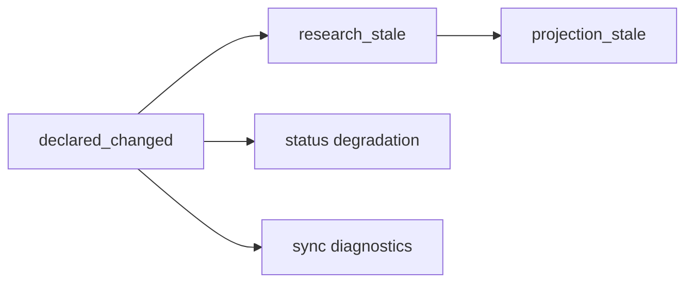

## Context

当前 `v0.2.0` 已经建立 `minimal formal knowledge runtime`，并且 `declared record / research summary / projection digest / health signal` 已有最小正式合同。但从 `.docs/release/v0-2-0-knowledge-runtime-gaps.md` 与 `.docs/roadmap/knowledge-system-completeness-roadmap.md` 看，`declared knowledge` 仍停留在“最小受约束 writeback block”阶段，主要缺口有三类：

- `DeclaredRecord` 还缺正式关系模型，尚不能稳定表达 `supersedes / replaced_by / deprecated`
- declared scope 仍偏弱，缺少可被 runtime / artifact / workflow 共同消费的 typed scope object
- `sync / update / status / restore` 还没有把 declared 当成完整 lifecycle truth source，只是把它当作页面回写的结果块

本轮设计必须遵守当前主边界：

- 主链仍是 `Facts -> Knowledge Planning -> Research -> Compose -> Assemble`
- `KnowledgeUnit` 仍是一等抽象，page 只是 projection / authoring surface，不回到 page-first
- `.wiki/.knowledge/declared/**` 必须是 formal truth layer 的一部分，而不是 cache 或正文暗语义
- 不把这轮扩成 answer assembly、provider 稳定性、冲突治理平台或自由文本提炼平台

参考实现只用于工程借鉴，不反向决定边界：

- `deepwiki-rs` 证明阶段化 `research -> compose` 编排值得保留，说明 declared lifecycle 应作为正式阶段输入，而不是临时注释
- `GitNexus` 的 phase DAG 与 declared dependency runner 说明“只有显式声明过的输入依赖才应驱动下游阶段”，适合作为 declared lifecycle 传播设计的工程参考

## Goals / Non-Goals

**Goals:**

- 让 `DeclaredRecord` 具备正式 schema，可表达作用范围、生命周期关系与审计锚点
- 让 declared scope 从松散字符串升级为稳定 typed object
- 让 `sync / update / status / restore` 正式消费 declared lifecycle，而不是只消费 writeback 结果
- 让 `.wiki/.knowledge/declared/**` 成为可 roundtrip、可恢复、可诊断、可测试的 artifact contract
- 保持 page 作为 projection，不把页面正文重新定义为 declared 真相

**Non-Goals:**

- 不实现自由文本 declared 提炼或开放式 authoring 平台
- 不实现 conflict 自动裁决、治理看板或人工审批系统
- 不定义 answer assembly host contract
- 不解决 `storybook / dagger` 一类 provider-backed full compose 稳定性
- 不为样本仓库新增特化 planner / renderer 分支

## Decisions

### 1. `DeclaredRecord` 升级为正式 authoring object，而不是 writeback 附件

`DeclaredRecord` 将扩展为稳定对象，至少包含：

- `record_id`
- `record_kind`
- `scope`
- `status`
- `relations`
- `source_ref`
- `unit_refs`
- `projection_refs`
- `updated_at`

其中 `relations` 至少支持：

- `supersedes`
- `replaced_by`
- `deprecated`

关系语义以 declared artifact 为准，page 只能作为编辑面或投影面。

受管 declared block 的合法输入面也要同步收紧。本轮只承认“受管 marker + 结构化字段”的 declared block 语法，不把开放正文提炼当成正式输入。最小约束：

- declared block 只能出现在受管 section
- header 字段只允许映射到稳定 declared schema
- parse failure 不得静默降级为成功 writeback
- 任何无法映射到正式 schema 的编辑都回到 `illegal_drift`

备选方案：

- 继续把关系埋在页面 managed section 的附加 metadata 中
- 继续只保留单向字符串标记，由 runtime 临时猜测生命周期

不采用原因：这两种方案都无法支撑 restore、audit 与稳定 workflow 消费，仍然会把 declared 真相退回 page-first 暗语义。

### 2. declared scope 改为 typed scope object

当前字符串 scope 只够展示，不够做 runtime 传播、恢复与诊断。本轮将其收敛为稳定 scope object，最小上至少回答：

- scope 属于哪一类目标
- scope 指向哪个稳定对象或路径
- scope 与 `KnowledgeUnit` / projection 的绑定边界是什么

推荐的最小形态是 discriminated object，而不是开放字符串，例如：

```text
{ kind, ref, selectors? }
```

这里不强行承诺复杂选择器语言；先收一个能稳定 roundtrip、能被 runtime 消费的最小 typed shape。

同时需要写死 identity 参与规则。建议：

- `record_id` 由稳定 authoring identity 生成，而不是由页面位置临时派生
- typed `scope` 参与 identity 归一化
- typed `scope` 必须有 canonical serialization，保证不同 writer / reader 不会因字段顺序或等价表示不同而漂移
- section 重排或页面重排不得单独导致 `record_id` 漂移
- 只有 scope/record kind/authoring identity 发生正式变更时，才允许 upsert 到新 identity 或显式替代旧记录

备选方案：

- 保留字符串 scope，靠约定解析
- 直接上复杂 DSL scope

不采用原因：前者不可诊断，后者超出本轮 formal completeness 的克制边界。

### 3. declared lifecycle 采用显式失效传播，不做 page-first 反推

declared 变更后，下游状态按显式链传播：



核心规则：

- declared relation 或 scope 变更先更新 declared artifact
- runtime 基于 declared artifact 计算受影响 `KnowledgeUnit` 与 projection
- `update` 刷新 stale derived / projection，而不是重新把页面当真相反推 declared
- `status` 暴露 declared 导致的 stale、blocker 或 recommended action

为避免 relation 只变成脏字段，本轮还需收紧最小 lifecycle 状态：

- `active`
- `deprecated`
- `superseded`
- `replaced`

最小一致性规则：

- `deprecated` 可单独成立，不要求必须存在替代目标
- `supersedes` 与 `replaced_by` 必须能映射出稳定的前后关系，且 `superseded / replaced` 的状态判定规则必须单义
- relation 不一致时，runtime 必须产出显式诊断，而不是静默覆盖

备选方案：

- 仅在 `sync` 当次返回 affected scope，不把 lifecycle 写入长期对象
- 只在页面 diff 时临时推断 stale

不采用原因：这会让 declared lifecycle 无法被后续 `update / status / restore` 重用。

### 4. `.wiki/.knowledge/declared/**` 成为 restore/audit 的正式输入

declared artifact 必须进入正式 snapshot，而不是只作为一次性写盘副产物。`restore` 与 snapshot 校验需要直接消费它，而不是重新扫描 page managed section 才能恢复 declared truth。

这意味着：

- declared artifact 需要稳定 identity
- declared artifact 需要稳定 relation / scope roundtrip
- recovery / metadata 锚点需要能覆盖 declared snapshot
- restore / rebuild 需要定义 upsert、delete 与 parse failure 的恢复规则

source of truth 优先级也必须写死：

1. `.wiki/.knowledge/declared/**` 是正式 declared truth
2. page declared block 是受管 authoring surface，只能通过 `sync` 改写 truth
3. runtime/status 聚合结果只是消费层摘要，不反向覆盖 declared truth

对应恢复规则：

- 同 ID declared record 默认 upsert 覆盖
- authoring 面删除合法 declared block 时，需要显式 tombstone、`deprecated` 或等价删除语义，不能靠“缺失即消失”猜测
- parse failure 时保留旧值并产出 health signal / `illegal_drift`，不静默丢失记录；局部 parse failure 不应默认阻断同页其它合法 declared block 的写回
- `restore` 直接从 declared artifact 恢复 declared state，不从 page 反推

备选方案：

- restore 时从页面 managed block 重新提取 declared

不采用原因：这会重新把 page 提升为 truth source，并且破坏审计可重复性。

### 5. workflow 消费 declared lifecycle，但不扩大为治理平台

本轮 workflow 只做 contract 收口，不做更大治理系统：

- `sync`：返回 declared writeback 分类、受影响 records、lifecycle delta
- `update`：即使源码 dirty set 为空，只要 declared lifecycle 标记了 stale scope，也必须刷新相应 derived / projection
- `status`：同时暴露 readiness、health 与 declared lifecycle 诊断，不把 declared 问题压平为普通 `needs_update`
- `query`：保持既有 `index -> knowledge -> page fallback` 主线，只增强其对 declared 状态的可解释性，不新增 answer assembly contract

其中 `sync` 分类优先级必须固定为：

1. `illegal_drift`
2. `declared_writeback`
3. `metadata_only`

混合变更按最高优先级归类，防止调用方误判“页面只是轻微变更”。

`status` 的 declared-aware 语义也必须保持克制，只输出：

- readiness 层级
- health summary / counts
- 单值 `recommended_action`

它不是治理策略引擎，也不在本轮直接暴露裁决动作。

备选方案：

- 顺手把 conflict resolution、answer assembly、governance decision 一起纳入

不采用原因：这会把一个 formal completeness 变更扩成多阶段平台改造，范围失控。

## Risks / Trade-offs

- `[scope object 过宽]` → 先收最小 typed shape，只允许少量稳定 kind，避免一开始就引入复杂 DSL
- `[relation 语义互相打架]` → 只正式承诺最小关系集，并对 `supersedes / replaced_by / deprecated` 做一致性校验与测试
- `[status/update 误把 declared stale 压平成普通脏数据]` → 在 workflow spec 中单独写死 declared lifecycle 的推荐动作与诊断输出
- `[restore 仍偷偷依赖 page managed section]` → 要求 declared artifact roundtrip 与 cache-less restore 测试必须直接消费 `.wiki/.knowledge/declared/**`
- `[范围滑向治理平台]` → 在 specs 与 tasks 中明确排除 conflict arbitration、answer assembly、provider hardening

## Validation

最小验证闭环必须覆盖：

- unit tests：declared record 的 scope / relation / status 序列化与 identity 稳定性
- storage roundtrip tests：artifact 的 canonical serialization、load / persist / restore 一致性
- workflow integration tests：`illegal_drift > declared_writeback > metadata_only`、declared stale propagation、status recommended action
- cache-less restore tests：仅凭 `.wiki/.knowledge/** + official page tree + metadata` 恢复 declared-aware runtime
