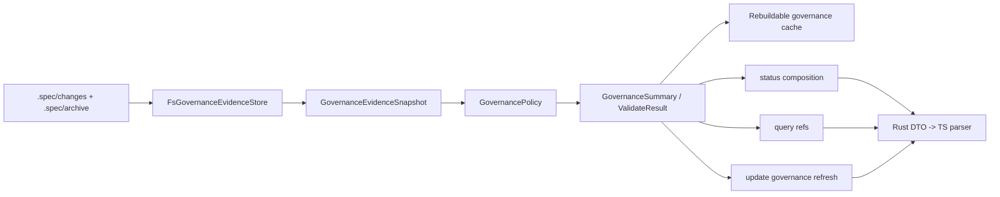

# refactor-specwiki-around-contract-closure-governance-isolation 设计方案

## 方案概述

本 change 在现有 Wiki runtime 与 UniSpec 治理规则之间增加一层只读治理内核。它以 `.spec/changes/**` 和 `.spec/archive/**` 为 evidence truth，通过独立的 `GovernanceEvidenceStore` 读取证据，由 `GovernancePolicy` 计算 change 状态、artifact gate、review / verification gate、parent / child 一致性和治理 readiness，再把稳定 DTO 组合进 status、query 和 update 响应。

治理内核不读取 code graph 来判断治理状态，也不把 `.spec` 放入源码扫描、代码 FTS、knowledge truth 或 Wiki 页面正文。现有 `@uni-sw/unispec` 0.1.0 的 `status / validate / archive readiness` 行为作为迁移期 parity oracle；SpecWiki runtime 不在生产路径 shell out 到全局 `unispec`，而是通过共享 fixture corpus 固定行为等价性。TS CLI 和 Skill 只消费 runtime DTO 或调用公共命令，不再维护 required artifact matrix。

### 方案范围

- 覆盖范围：治理 evidence discovery、只读 status / inspect / validate、独立 fingerprint、产品级 readiness 组合、query refs、Rust / TS DTO 闭集和 parity fixtures。
- 边界说明：不实现 CLI 一级命令 router，不执行 archive、parent 写回、operation manifest 或其它 `.spec` 写事务。
- 设计边界：本 change 不修改 code graph schema，不把治理摘要写入正式 Wiki 页面，不产品化 release gate 或 capability baseline。

### 核心设计思路

1. `.spec` 文件系统内容是唯一 evidence truth；缓存只能保存带 fingerprint 的可重建摘要。
2. `GovernanceReadiness` 是产品级独立状态，不加入 `RuntimeReadiness` 的 index / knowledge / projection / fusion 内部闭集。
3. evidence 读取、规则判断、查询投影分层，避免文件布局、validator 和 query 互相耦合。
4. source `ChangeSet` 与 governance delta 完全隔离；同一次 update 可以分别得到 source no-op 和 governance refreshed。
5. 第一阶段以确定性文件读取和轻量 artifact reference lookup 为主，不引入新的通用索引或 Agent 判断。

## 架构分析

### 现有架构概述

| 架构层级 | 组件 / 模块 | 当前状态 |
| --- | --- | --- |
| 共享对象语言 | `wiki-model::domain::query` | 已预留 governance route tag 与 ref kind，尚无正式 governance DTO |
| Wiki runtime | `workflows::status/query/update` | 只组合 index / knowledge / projection；query governance readiness 固定为 `not_enabled` |
| 变化检测 | `domain::change_set` | 只描述源码与页面变化，`.spec` 被 scanner 排除 |
| Transport | Rust JSON response + `packages/spec-wiki/src/runtime/parseResult.ts` | TS parser 仅接受 `governance_readiness: not_enabled` |
| 治理规则 | `@uni-sw/unispec` core | metadata、artifact、review evidence、archive readiness 已有确定性实现 |

### 目标组件与所有权

| 组件 | 所属模块 | 责任 | 明确不负责 |
| --- | --- | --- | --- |
| Governance DTO | `wiki-model::domain::governance` | readiness、change summary、artifact ref、issue、gate、validation result | 文件 I/O、runtime 装配 |
| `GovernanceEvidenceStore` | `wiki-runtime` governance port | 枚举 active / archived change，读取 metadata、artifact、report evidence | 解释业务规则、写入 `.spec` |
| `FsGovernanceEvidenceStore` | `wiki-runtime::storage` | 规范化路径、读取文件、计算 content hash | 决定 ready / blocked / conflict |
| `GovernancePolicy` | `wiki-runtime::domain` | required artifact、metadata consistency、report gate、parent / child 规则 | 查询排序、transport 序列化 |
| `GovernanceService` | `wiki-runtime::workflows` | discover、status、inspect、validate、query refs、fingerprint comparison | archive 或修复 |
| `SqliteGovernanceCache` | 现有 `.wiki/.cache` SQLite | 保存 fingerprint、summary 和 artifact refs，支持 stale 判断与 query 加速 | 保存 artifact 正文或替代 `.spec` |
| 产品响应组合 | status / query / update | 把 governance summary 与 core runtime 响应并列组合 | 改写 core `RuntimeReadiness` |

### 架构设计图



### 依赖与迁移关系

| 依赖项 | 用途 | 采用方式 |
| --- | --- | --- |
| `@uni-sw/unispec` 0.1.0 core change / review rules | 迁移期 validator parity oracle 与 fixture 期望 | 改写为 Rust policy；不在生产路径调用全局 CLI |
| 已归档 query-route-readiness change | governance route tag、result provenance、recommended action | 扩展既有合同 |
| 已归档 code-graph-index change | `.spec` 与 code facts 隔离 | 直接约束 |
| `.docs/design/governance-runtime-integration.md` | EvidenceStore、只读 status / validate、cache 边界 | 改写 |
| `.upstream/codegraph` / `.upstream/GitNexus` | artifact ref lookup 与阶段化 ingestion 的历史参考 | 仅借鉴，不迁移 schema、CLI 或产品形态 |

## 功能设计

### Governance evidence discovery

`FsGovernanceEvidenceStore` 只读取仓库根目录下的：

```text
.spec/changes/<change-id>/
.spec/archive/YYYY-MM-DD-<change-id>/
```

它输出规范化 evidence snapshot，不直接输出 readiness。读取范围包含 `meta.yaml`、已知 lifecycle artifacts、review / test report frontmatter，以及 parent 引用的 archive marker。`evidence/**` 等附件不作为 required artifact；只有被正式 report 引用时才通过 report evidence 间接参与判断。

路径必须仓库相对化并拒绝逃逸。未知文件保留为未解释 evidence，不进入 required artifact matrix，也不进入 query 正文。

### Governance policy 与 parity

`GovernancePolicy` 使用稳定规则目录计算：

- 当前 stage 对应的 required artifacts。
- metadata id、delivery shape、parent / child role、order、dependsOn 一致性。
- parent child archive marker 与真实 active / archive 目录的一致性。
- verification / archive 阶段的 `review-result: pass`、`verification-result: pass` 和 `scope: full` gate。
- 可操作的 blocking issue，包括 rule id、change id、artifact ref、reason 和 recommended action。

规则使用稳定 `rule_id`，不得依赖英文错误文案作为机器合同。迁移期 fixture 同时运行 `unispec status/validate --json` 与 Rust validator，对比以下规范化结果：

```text
change identity
stage / role / dependencies
required artifact presence
blocking / non-blocking classification
review / verification gate
archive readiness
```

Skill 文案不是 parity truth。TS parser 只验证 DTO 闭集，不实现 rule matrix。parity 通过后，SpecWiki 产品路径以 Rust policy 为唯一 validator；旧 UniSpec CLI 仍可作为独立开发工具，但不再被 SpecWiki host assets 当作第二产品状态机。

Archive readiness 是独立 gate，不等于当前 change 被阻断。只有当前 stage 已进入 `verification / archive` 且 report evidence 不满足 full/pass 时，它才进入 repo/change 的 blocking issues；proposal、design、cases、tasks、implementation 等正常进行中的 change 只报告 `archive_ready: false`，不会因此把治理 readiness 降为 blocked。

### Governance readiness

正式闭集为：

| 状态 | 判定 |
| --- | --- |
| `not_enabled` | 仓库不存在 `.spec` 治理根目录 |
| `ready` | evidence 可解析，关系一致，当前只读操作不存在 blocking issue，derived snapshot 与当前 fingerprint 一致 |
| `stale` | SQLite 中存在 derived snapshot，但其 fingerprint 与当前 evidence 不一致；live evidence 仍可读取，但 query refs 尚未通过 update 刷新 |
| `blocked` | evidence 可解析且关系不冲突，但 required artifact、review / verification gate 或依赖条件不满足 |
| `conflict` | YAML / frontmatter 无法解析、id/path 矛盾、parent-child/archive marker 互相冲突，无法形成唯一可信状态 |

enabled-but-empty 仓库返回 `ready`，active / archived count 均为 0。`blocked` 只阻断治理动作；`conflict` 使治理 query 降级，但普通 Wiki status/query/update 仍根据 core readiness 继续工作。

`status` 每次读取 live evidence 并比较 SQLite snapshot fingerprint：一致时返回 live policy 结论；不一致时返回 `stale`、当前 evidence fingerprint 和 `update` 建议，但不在 status 内写 cache。`validate` 始终绕过 cache，对 live evidence 计算 `ready / blocked / conflict`。`query` 只消费 fingerprint 一致的 cached refs；stale 时不返回旧治理命中。`update` 是本 change 中唯一刷新 governance cache 的现有 workflow。

### Status、validate 与 inspect

- `governance_status(repo)`：返回 repo 级 readiness、fingerprint、active / archived counts、blocking issue 摘要和 next action。
- `list_governance_changes(repo)`：返回 active / archived change summaries，按 active 优先、order / id 稳定排序。
- `inspect_governance_change(repo, change_id)`：返回单个 change、artifact refs、parent / child 关系和 gate summary。
- `validate_governance_change(repo, change_id)`：返回完整 rule results 与 blocking issues，不修改文件。

不存在的 change 返回 typed not-found error，不回退为全文搜索。损坏的单个 change 不能使其它可读 change 消失；repo summary 标记 conflict，并保留已成功读取的 summaries 与失败诊断。

### 独立 fingerprint 与 update 行为

Governance fingerprint 对以下规范化输入做内容 hash：

```text
contract version
relative artifact path
artifact bytes hash
active / archived location
```

mtime 只能用于 I/O 预筛选，不能作为正式 identity。fingerprint 不包含 `.wiki`、源码或 code graph snapshot id。

`update` 在 source planning 之外始终执行 governance preflight：

```text
source delta -> existing source ChangeSet
governance delta -> GovernanceRefreshPlan
```

源码无变化但 governance fingerprint 改变时，source workflow 保持 no-op，只刷新 governance derived cache 和产品响应。治理变化不得触发 scan、symbol resolve、knowledge compose 或页面重写。

### Governance query refs

第一阶段不建立治理全文索引。查询只匹配结构化字段：change id、stage、artifact kind、artifact path、parent / child id 和 blocking rule id。

- change summary 使用 `governance_summary_hit + governance_change`。
- artifact 命中使用 `governance_evidence_ref + governance_artifact`。
- readiness 为 `ready` 时 confidence 为 high / medium。
- readiness 为 `blocked` 时仍可返回 refs，但 provenance 标记 blocked，recommended action 为 `review_governance`。
- readiness 为 `conflict` 时不读取或返回 artifact 正文，只返回可定位的诊断 ref。

`.spec` 原文不进入 `files_fts`、`symbols_fts`、knowledge record 或 Markdown fallback。

### 产品级组合规则

`StatusReport`、`QueryReport` 和 update terminal response 增加并列的 `governance` summary。现有 `RuntimeReadiness` 保持不变：

```text
core readiness: index / knowledge / projection / fusion
product governance: governance readiness / issues / fingerprint
```

产品 next action 采用显式优先级：core blocker 优先于 governance blocker；core ready 且 governance blocked/conflict 时推荐 `review_governance`，但不把 fusion 改成 blocked。query trust 只描述当前结果来源：治理 route 根据 governance readiness 降级，index / knowledge route 不被治理问题连带降级。

workflow 级 `RecommendedAction` 新增 `review_governance`，与 query result 已有同名序列化值对齐；不使用自由字符串或映射到 `rebuild`。Rust status/update DTO 与 TS parser 同步扩展该闭集。

## 数据设计

### 公开 DTO

| DTO | 关键字段 | 约束 |
| --- | --- | --- |
| `GovernanceReadiness` | 五态闭集 | serde snake_case；Rust / TS 同步拒绝未知值 |
| `GovernanceSummary` | readiness、fingerprint、active_count、archived_count、issues、recommended_action | 产品级组合对象，不嵌入 `RuntimeReadiness` |
| `GovernanceChangeSummary` | id、location、stage、role、parent、order、depends_on、gate | 不包含 artifact 正文 |
| `GovernanceArtifactRef` | change_id、kind、relative_path、status、content_hash | path 必须仓库相对化 |
| `GovernanceBlockingIssue` | rule_id、severity、message、change_id、artifact_ref、recommended_action | severity 闭集为 `blocking / warning`；`rule_id` 是机器合同，message 仅展示 |
| `GovernanceValidationResult` | valid、readiness、rule_results、issues | validate 与 status 共用 policy 输出 |
| `GovernanceGateSummary` | artifact_gate、review_gate、verification_gate、archive_readiness | archive readiness 本 change 只读计算 |

### Evidence、derived cache 与 truth

| 数据 | 位置 | 权威性 | 保留策略 |
| --- | --- | --- | --- |
| 原始 governance evidence | `.spec/changes/**`、`.spec/archive/**` | 正式 truth | 本 change 只读 |
| Derived snapshot | 现有 `.wiki/.cache` SQLite 中的 governance tables | 可重建 | fingerprint 不匹配即 stale，由 update 事务刷新 |
| Query refs | derived snapshot 内的结构化 refs | 可重建 | 不存 artifact 正文 |
| Governance summary | runtime response | 派生 | 每次 discover / refresh 重新计算 |

cache 使用现有 SQLite，不新增平行 JSON 状态文件。新增 `governance_snapshots`、`governance_changes`、`governance_artifact_refs` 和 `governance_issues` 表，并通过 `SqliteGovernanceCache` wrapper 在单个事务内替换同一 evidence fingerprint 的派生集合。每次 snapshot 携带 `schema_version`、`policy_version` 和 `evidence_fingerprint`。cache 缺失时 status 报 governance `stale` 并建议 update；validate 仍可直接读取 live evidence，不把治理状态报为全局 runtime missing。

当前没有旧 governance cache schema，因此只新增当前 schema，不实现旧表迁移、字段 fallback 或双写。SQLite schema version 不匹配时丢弃治理派生表并从 `.spec` 重建，不影响 index / knowledge / runtime 其它表。

### 数据流向设计

```text
.spec evidence
  -> normalized evidence snapshot
  -> policy evaluation
  -> governance summary + validation result + query refs
  -> rebuildable cache
  -> status / query / update transport
```

## 接口设计

### Store 与 service 接口

`GovernanceEvidenceStore` 提供 evidence 层原语：

```text
discover_repo()
list_active_change_ids()
list_archived_change_ids()
read_change(change_ref)
read_artifact(change_ref, artifact_kind)
read_report_evidence(change_ref)
compute_fingerprint()
```

`GovernanceService` 提供产品操作：

```text
status()
list_changes()
inspect_change(change_id)
validate_change(change_id)
refresh_if_changed(previous_fingerprint)
query_refs(term, limit)
```

Store 不返回产品文案；service 不直接拼文件路径。所有公开结果使用 `wiki-model` DTO。

### Transport 合同

- Rust status / query / update response 增加唯一的 `governance: GovernanceSummary`。
- 删除 query 中只支持 `not_enabled` 的 `QueryGovernanceReadiness` 和扁平 `governance_readiness` 字段，不保留兼容层。CLI product-surface child 直接消费新的单一对象。
- TS `parseResult.ts` 扩展 readiness、summary、change/artifact ref 和 issue 闭集，继续保留未知非合同字段，但拒绝未知 enum 和缺失必需字段。
- 本 change 只增加 runtime action / library entrypoint，不修改顶层用户命令布局。

### 错误分类

| 错误 | 对外分类 | 行为 |
| --- | --- | --- |
| `.spec` 不存在 | `not_enabled` | 返回成功，不生成 issue |
| change 不存在 | `not_found` | inspect / validate 失败，repo status 不受影响 |
| YAML / frontmatter 损坏 | `conflict` | 返回路径和 parse diagnostic，不猜测 stage |
| required artifact 缺失 | `blocked` | 返回稳定 rule id 与 artifact ref |
| cache 缺失或 schema 旧 | `stale` | status/query 建议 update；validate 继续读取 live evidence；update 从 truth 重建 cache |
| 单个 artifact 无权限读取 | `conflict` | 保留其它可读 change，repo summary 标记 conflict |

## 非功能性设计

### 可靠性与安全

- 所有 evidence path 在 repo root 下解析并拒绝 `..`、绝对路径和 symlink 逃逸。
- artifact 内容设单文件读取上限；validate 只解析所需 YAML/frontmatter，不加载附件或大段正文。
- derived cache 损坏时丢弃并重建，不能反向覆盖 `.spec`。
- 规则计算必须确定性排序，保证同一 evidence snapshot 得到稳定 fingerprint、issues 和 query refs。

### 可维护性

- required artifact matrix、stage 闭集和 gate 规则集中在一个 Rust `GovernancePolicy` 目录中。
- 每条规则拥有稳定 id，测试断言 id，不断言易变文案。
- Skill 和 TS parser 不复制规则；CLI child 只做命令路由和展示。
- 测试开发阶段不保留旧 `QueryGovernanceReadiness::NotEnabled` 专用兼容类型；新 DTO 稳定后直接替换。

### 验证方向

- Rust model 序列化闭集：readiness、issue、change / artifact ref、validation result。
- EvidenceStore fixture：无 `.spec`、enabled-empty、active、archived、损坏 YAML、权限失败、未知 artifact。
- Policy parity fixture：standalone、parent、child、exploration stub、各 stage required artifacts、report frontmatter、archive marker。
- Composition fixture：governance blocked/conflict 不改变 core fusion；core blocker 与 governance issue 的 next action 优先级稳定。
- Delta fixture：只修改 `.spec` 时 source fingerprint、graph snapshot 和 source dirty set 不变，governance fingerprint 改变。
- Query fixture：ready / blocked / conflict 下的 route tag、confidence、provenance 和 recommended action。
- TS parser fixture：接受完整闭集并拒绝未知状态或残缺 governance summary。

## 资源评估

无新增外部服务、网络或长期运行进程。治理扫描规模通常远小于源码扫描；通过已知 artifact 白名单、内容 hash 和可重建 cache 控制重复 I/O。第一阶段不引入治理全文 FTS，因此 SQLite 或 cache 增量仅包含 summary、fingerprint 和 artifact refs。

## 风险与对策

| 风险 | 影响 | 对策 |
| --- | --- | --- |
| Rust policy 与 UniSpec CLI 漂移 | 同一 change 得到不同 validate 结论 | fixture parity、稳定 rule id；parity 失败阻断迁移 |
| `blocked` 与 `conflict` 混用 | 用户无法判断是补 artifact 还是修复损坏证据 | 结构矛盾归 conflict，合法证据上的 gate 不满足归 blocked |
| governance 状态污染 core readiness | 普通 Wiki 因治理问题不可用 | 产品级并列组合，禁止写入 core fusion |
| cache 被误当 evidence truth | 丢失或伪造治理状态 | 所有详情可从 `.spec` 重建，cache 带 evidence fingerprint |
| change 范围扩张为 CLI / archive 重构 | single-change 无法独立验收 | 本 child 只提供 library/runtime action 和 transport DTO，写事务留后续 child |
| 查询功能诱发治理全文索引 | `.spec` 原文进入错误 truth 层 | 只查询结构化 refs，不保存或返回 artifact 正文 |
| 全仓库 `.spec` 扫描成本失控 | status/query 延迟增长 | 只读取已知 lifecycle artifact，mtime 预筛选但内容 hash 定案 |

## 设计决策

- `GovernanceReadiness` 采用 `not_enabled / ready / stale / blocked / conflict` 五态；不复用 core `LayerReadiness`。
- enabled-but-empty 视为 `ready`，而不是 `not_enabled`。
- `.spec` evidence 与 source `ChangeSet` 使用两套 fingerprint 和 refresh plan。
- 第一阶段 query 只做结构化 artifact ref lookup，不建立治理全文索引。
- 生产 runtime 不依赖全局 `unispec` executable；迁移期通过 fixture 和 CLI JSON 输出做 parity 验证。
- Rust `GovernancePolicy` 是 SpecWiki 产品路径的唯一规则所有者；版本化 parity fixtures 固定从 `@uni-sw/unispec` 0.1.0 核验得到的规范化期望，生产和常规 CI 均不调用全局 `unispec` executable。可选 oracle 刷新脚本只用于显式更新 fixture，不参与 runtime 判定。
- Governance derived cache 固定使用现有 SQLite 和独立 wrapper，不新增平行 JSON 状态文件。
- Rust / TS transport 直接切换到唯一 `governance: GovernanceSummary`，删除旧扁平字段和专用 `NotEnabled` 类型。
- archive readiness 可以只读计算，但任何目录移动、parent 写回、manifest 和恢复事务均留给 archive child。
- 当前仍保持 single-change：model、runtime service、transport 和 fixtures 共同构成一个可独立验收的只读纵向能力；CLI 命令面和 archive 写事务已经由后续 child 隔离。

## 待确认问题

- 无。proposal 中关于 readiness、EvidenceStore、cache、fingerprint、validator parity、transport composition 和 query 边界的未知项均已在本设计中形成明确决策。

## 参考资料

- `proposal.md`：来源为当前 child 的已确认目标与边界；目标落点是本设计全部模块和成功标准；采用方式为直接约束。
- `../refactor-specwiki-around-contract-closure/split.md`：来源为 parent program；目标落点是 child 顺序、依赖和非目标；采用方式为直接约束。
- `.docs/design/governance-runtime-integration.md`：来源为阶段性治理融合设计；目标落点是 EvidenceStore、status / validate、query refs 与 cache 分层；采用方式为改写。
- `.docs/design/specwiki-contract-closure.md`：来源为 runtime 合同收口设计；目标落点是治理不阻断 core Wiki、统一 query route 和 truth 分层；采用方式为直接约束。
- `@uni-sw/unispec` 0.1.0 `core/change/*`、`core/review/*`：来源为当前 UniSpec CLI 实现；目标落点是 stage、artifact、metadata、report 和 archive readiness parity；采用方式为改写，不在生产路径直接迁移或调用。
- `.spec/archive/2026-06-18-refactor-specwiki-around-contract-closure-query-route-readiness/`：来源为已归档 query 合同；目标落点是治理 route tag、provenance 与 query trust；采用方式为扩展。
- `.spec/archive/2026-07-01-refactor-specwiki-around-contract-closure-code-graph-index/`：来源为已归档 graph 合同；目标落点是 `.spec` 与 code facts 隔离；采用方式为直接约束。
- `.upstream/codegraph`、`.upstream/GitNexus`：来源为本地参考实现；目标落点仅限 artifact reference lookup 和阶段化 ingestion 思路；采用方式为仅借鉴，不迁移 schema、源码或产品面。
