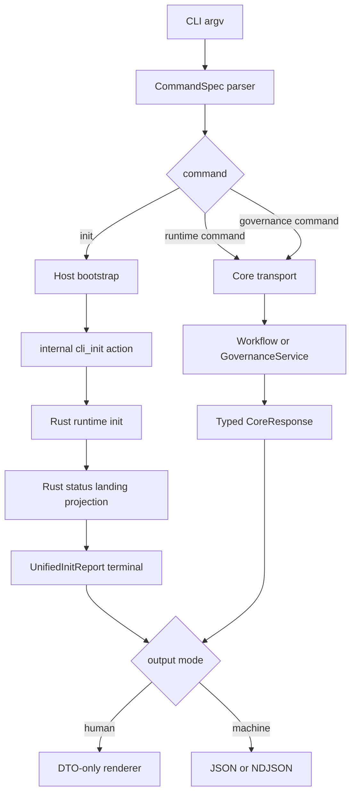

# refactor-specwiki-around-contract-closure-cli-product-surface 设计方案

## 方案概述

本方案将用户侧 CLI 收敛为一级命令，同时保持 Rust runtime 为业务事实和机器协议的唯一来源。TypeScript CLI 负责 argv 解析、宿主 bootstrap、输出模式选择和 DTO 到人类文本的翻译；Rust transport 负责 workflow/governance 调度、结构化 outcome、错误分类和统一 init 的最终 landing state。

统一初始化使用用户命令 `spec-wiki init` 映射到内部 transport action `cli_init`。原有 `init` action 与 `wikiInit` JS API 保持现有 `WikiInitData` 合同，避免同一 action 因调用方不同返回两套 DTO。`cli_init` 不加入公开 JS action 集合，只供 CLI orchestration 使用。

### 方案范围

- 覆盖一级 router、默认/完整 help、参数校验、human/machine 输出、统一 init、只读治理命令、宿主资产和当前文档测试迁移。
- 不注册 archive、workspace validate、doctor、repair、trace 或 advanced namespace。
- 不改变 `wikiInit/wikiStatus/...` JS tools API 和 `wiki-*`、`/wiki:*` identity。
- 不引入 codebase-memory-mcp 的索引、memory 或 MCP 能力。

### 核心设计思路



## 架构分析

### 模块关系

| 模块 | 职责 | 设计变化 |
| --- | --- | --- |
| `packages/spec-wiki/src/cli.ts` | argv、help、命令路由 | 改为一级 CommandSpec router |
| `orchestration/init/**` | 宿主发现与资产写入 | 参数改为 host；返回结构化 bootstrap report |
| `runtime/coreEventStream.ts` | CLI 机器事件执行 | 新增完整行解析、终态校验和 bridge 转发 |
| `runtime/humanRenderer.ts` | DTO 到人类文本 | 新增；只翻译，不推导业务状态 |
| `runtime/exitPolicy.ts` | outcome/error kind 到退出码 | 新增集中映射，禁止字符串匹配 |
| `runtime/parseResult.ts` | TypeScript DTO 守门 | 增加 error kind、governance envelope、unified init parser |
| `crates/wiki-runtime/transport` | JSON/NDJSON transport | 增加 `cli_init`、`changes/change/validate` 和 `changeId` |
| `GovernanceService` | live evidence 与 policy | 增加基于单次 evaluation 的 report 方法 |
| host assets | Agent 调用文本 | 迁移到一级 CLI，保留 identity |

### 依赖关系

| 依赖项 | 用途 | 来源 | 采用方式 |
| --- | --- | --- | --- |
| Query/readiness contract | human renderer 与 landing 状态 | 已归档 child 4 | 直接复用 DTO |
| Projection/writeback contract | sync/rebuild 命令语义 | 已归档 child 3 | 直接约束 |
| GovernanceService | changes/change/validate | 已归档 child 6 | 增加薄 transport，不复制规则 |
| CodeGraph CLI | 一级命令和命令级 JSON 产品形态 | `.upstream/codegraph/src/bin/codegraph.ts` | 仅借鉴，不迁移实现 |

## 功能设计

### 命令规格

| 命令 | 公开语法 | 流式 | 说明 |
| --- | --- | --- | --- |
| init | `spec-wiki init [options]` | 是 | host bootstrap + internal `cli_init` |
| status | `spec-wiki status [options]` | 否 | runtime/governance 状态 |
| query | `spec-wiki query <term...> [options]` | 否 | 所有非 option token 以单空格连接，至少一个 |
| update | `spec-wiki update [options]` | 是 | 日常增量刷新 |
| sync | `spec-wiki sync [options]` | 否 | 高级维护 |
| rebuild | `spec-wiki rebuild [options]` | 是 | 显式全量重建 |
| changes | `spec-wiki changes [options]` | 否 | 列出治理 changes |
| change | `spec-wiki change <change-id> [options]` | 否 | 查看单个 change |
| validate | `spec-wiki validate <change-id> [options]` | 否 | 只验证显式 change-id |

通用参数可以出现在命令参数的任意位置：

- `--repo-root <path>`：所有命令。
- `--json`：所有执行命令，强制 machine mode。
- `--development-mode`：所有 runtime-backed 命令；统一 init 只传给 `cli_init`，不影响 host bootstrap。
- `--bridge-stdio`：仅 `init/update/rebuild`；强制 machine mode。
- `--host <id>`：仅 init，可重复。
- `--hosts <id,id,...>`：仅 init，只能出现一次。
- `--no-interactive`：仅 init。

`--host` 与 `--hosts` 互斥；重复 host 去重后保持首次出现顺序。未知 option、缺少 option value、非法组合或多余位置参数均为 `invalid_argument`。

### Help 分层

- `spec-wiki`、`spec-wiki --help`、`spec-wiki -h`：输出默认 help，退出 0，只突出 `init/status/query/update`。
- `spec-wiki --help-all`：输出全部已实现命令，`sync/rebuild/changes/change/validate` 位于 Advanced 分组，退出 0。
- `spec-wiki <command> --help`：输出单命令 help，退出 0。
- help flag 与 `--json` 或 `--bridge-stdio` 同时出现：`invalid_argument`，退出 64，不输出普通帮助文本。
- 未知命令不回退 help，输出 usage error。

### Host bootstrap

`runBootstrapInit` 改为逐项记录结构化事实，不在首个写入异常时丢弃已完成结果：

```text
BootstrapReport
  outcome: ready | partial | failed
  hosts[]
    host
    status: ready | partial | failed
    files[]: path / kind / status
    failed_target?: path
    error?: string
  recovery_hint?: string
```

- 全部目标完成为 `ready`。
- 已有至少一个文件成功写入后失败为 `partial`。
- 尚无任何写入即失败为 `failed`。
- 不执行跨宿主或跨文件回滚；重试依赖写入幂等性。
- machine mode（`--json` 或 bridge）强制非交互；显式 host 优先，其次唯一检测结果，否则返回 `invalid_argument`。
- human mode 才允许 TTY 多选；`--no-interactive` 使用 machine mode 相同选择规则。

### Unified init

CLI 在 bootstrap `ready` 或 `partial` 时调用内部 `cli_init`：

```text
CoreCommand
  action: cli_init
  repoRoot
  developmentMode
  bootstrap: BootstrapReport
```

`bootstrap` 只允许出现在 `cli_init`；Rust 严格校验枚举、路径字符串、host id 和 outcome 一致性。它是本次 CLI 已执行写入的事实输入，不参与 runtime readiness 判断。

Rust `cli_init`：

1. 发出 runtime init progress/LLM bridge 事件。
2. 执行现有 init workflow。
3. 使用现有 status workflow生成 landing state，包含 governance。
4. 根据 bootstrap outcome 与 `status.readiness.fusion` 生成稳定 `UnifiedInitOutcome`。
5. 输出且只输出一个 `UnifiedInitReport` terminal。

```text
UnifiedInitReport
  outcome: ready | partial | failed
  bootstrap: BootstrapReport
  runtime: InitReport?
  landing: StatusReport?
  recovery_hint?: string
```

Outcome 矩阵由 Rust 单一函数实现并测试：

| Bootstrap | Runtime init | Landing fusion | Outcome |
| --- | --- | --- | --- |
| ready | success | ready | ready |
| partial | success | ready/degraded/blocked | partial |
| ready | success | degraded | partial |
| ready | success | blocked | partial |
| ready/partial | failure | 未执行或任意 | partial |
| failed | 未执行 | 未执行 | failed（由 TS pre-runtime terminal） |

governance `not_enabled/stale/blocked/conflict` 不单独降低 init outcome；其状态和 recommended action 由 landing 原样呈现。只有 core `readiness.fusion` 决定 runtime 可用度。

runtime init 失败时，Rust `error` terminal 的 data 必须携带 bootstrap report、已有 runtime summary/blocker hint 和 recovery hint。旧 JS/host `init` 不提供 bootstrap，继续走原 action 和原 DTO，不进入该合同。

### 事件流与输出

新增专用 `runCoreEventStream`，按完整 NDJSON 行解析，不再使用“stdout chunk 先透传、结束后倒扫终态”的模式。它必须验证：

- 未知事件拒绝。
- chunk 边界可以跨行。
- terminal 前允许 progress、LLM/agent bridge 事件。
- terminal 后任何事件拒绝。
- 零 terminal 或多个 terminal 拒绝。
- bridge request/response 原样转发，不经过 human renderer。

Machine mode：

- 短动作输出一个 `CoreResponse` JSON。
- 长动作输出 NDJSON，事件顺序不变且唯一终态。
- `--bridge-stdio` 强制 machine mode。
- TTY 不改变协议。

Human mode：

- 短动作解析完整 JSON 后渲染。
- 长动作按完整 NDJSON 行解析；progress 可逐行渲染，terminal 渲染最终摘要。
- renderer 只读取 DTO 字段，不重算 readiness、outcome、recommended action 或 validation。
- stderr 只承载子进程诊断；业务错误由 terminal renderer 输出。

### Governance transport

`GovernanceService` 新增基于一次 `evaluate_live()` 的 report 方法，transport 不通过多次 `status/list/inspect` 拼接响应。

```text
GovernanceChangesReport
  governance: GovernanceSummary
  changes: GovernanceChangeSummary[]

GovernanceChangeReport
  governance: GovernanceSummary
  change: GovernanceChangeSummary

GovernanceValidateReport
  governance: GovernanceSummary
  change_id: string
  validation: GovernanceValidationResult
```

报告中的 governance 是同一次 live evaluation 的摘要，不叠加 cache freshness；`changes` 在 not_enabled 时成功返回 summary + 空列表。`change/validate` 在 not_enabled 或不存在时返回结构化失败。

### 结构化错误与退出码

`CoreResponse` 增加可选 `errorKind`，Rust serde 使用 camelCase，TS parser 严格校验闭集：

```text
invalid_argument
governance_not_enabled
change_not_found
workflow_failed
protocol_error
internal_error
```

| 情况 | 机器输出 | 退出码 |
| --- | --- | --- |
| help | 普通 help（禁止 machine flag 混用） | 0 |
| 正常成功 | JSON/NDJSON success | 0 |
| unified init partial | result terminal，outcome=partial | 2 |
| validate valid=false | success response，validation.valid=false | 2 |
| parser/缺参/未知命令或 option/非法组合/host 选择失败 | 单 JSON `CoreResponse`（识别到 machine flag 时）或 human usage error | 64 |
| change 不存在、治理未启用 | structured error | 1 |
| workflow/protocol/internal failure | structured error | 1 |

未知/缺失 command 无法确定 stream 时，machine mode统一输出单 JSON error，不伪装 NDJSON terminal。`--bridge-stdio` 与不支持的动作组合在启动 runtime 前输出单 JSON `invalid_argument` 并退出 64。`update/rebuild/sync` 不推导 partial：成功 0，失败 1。

## 数据设计

本 change 不增加持久化存储。新增数据均为进程内 DTO：`BootstrapReport`、`UnifiedInitReport`、governance reports 和 `CoreErrorKind`。所有路径字段为展示/定位用途，不写入 `.wiki` metadata 或 cache。

## 接口设计

### CoreCommand

- 新增 `changeId?: string`，仅 `change/validate` 使用。
- 新增 `bootstrap?: BootstrapReport`，仅内部 `cli_init` 使用。
- TypeScript 同步 `developmentMode?: boolean`。
- 不把 `cli_init` 加入 `WIKI_ACTIONS`、`PUBLIC_WIKI_ACTIONS` 或 `HOST_EXPOSED_ACTIONS`。

### Runtime action 映射

| 用户命令 | 内部 action |
| --- | --- |
| init | `cli_init`（CLI only） |
| status/query/update/sync/rebuild | 同名 action |
| changes/change/validate | 同名 action |
| JS `wikiInit` | 保持 `init` |

`cli_init` 加入 Rust `should_stream_command`、JSON-RPC stream dispatch 和 CLI internal streaming set；公开 JS streaming/action set仍只描述 JS API 可调用动作。

## 非功能性设计

### 可靠性

- 所有机器流必须满足唯一终态。
- bootstrap partial 不丢失已写事实。
- governance report 使用单次 evaluation，避免同一响应内 fingerprint 和 change 列表不一致。
- 不依赖错误文本或 TTY 推导机器行为。

### 可维护性

- CommandSpec 是命令/参数/help 的单一事实来源。
- exit policy 集中管理，禁止散落 `ok ? 0 : 1` 与字符串匹配。
- human renderer 按 DTO 类型拆分并提供 exhaustive tests。
- 测试开发阶段删除旧 namespace/参数，不维护兼容分支。

## 资源评估

无新增常驻服务、数据库或网络资源。governance list/inspect/validate 从多次 live scan 收敛为单次 scan，I/O 不高于现状。统一 init 额外执行一次 status landing 读取，属于初始化尾部的有限本地开销。

## 风险与对策

| 风险 | 对策 |
| --- | --- |
| CLI init 与 JS init DTO 混淆 | 内部 `cli_init` action 隔离 |
| human renderer 重算业务状态 | outcome/error/action 由 Rust DTO 提供，renderer 只翻译 |
| bootstrap 半失败无法恢复 | 结构化记录已完成文件与 recovery hint，幂等重试 |
| NDJSON chunk/终态处理不严 | 专用 line parser + 零/多/后置终态测试 |
| governance 多次扫描不一致 | 单次 evaluation report API |
| help 污染机器 stdout | help 与 machine flags 混用直接 usage error |
| 迁移误伤历史材料 | 固定扫描模式与排除范围 |

## 设计决策

- 默认 help 只突出 `init/status/query/update`，完整入口固定为 `--help-all`。
- `query` 使用一个或多个位置 token 合并为 term，不再接受 `--term`。
- `validate` 只接受显式 change-id。
- `archive` 不注册、不占位，留给 child 8。
- `cli_init` 是内部 transport action，不是用户或 JS API 名称。
- partial 只用于有结构化事实来源的 unified init 和 validate invalid，不扩展 update/rebuild workflow 合同。
- 旧 CLI namespace、参数和调用文本直接删除，不保留兼容 alias。

## 待确认问题

无。用户已授权完成设计、计划、实现、自动化验证、review 和归档，不再设置人工阶段 gate。

## 参考资料

- `./proposal.md`：本 change 已确认的问题、目标、非目标和成功标准。
- `../refactor-specwiki-around-contract-closure/split.md`：parent 顺序、依赖和 archive 后置边界，直接约束。
- `../../../.docs/design/specwiki-contract-closure.md`：四命令默认主路径、landing 和治理非阻断合同，直接约束。
- `../../../.docs/design/specwiki-cli-unification.md`：一级命令阶段性设计，按当前实现能力改写。
- `../../../.spec/archive/2026-07-10-refactor-specwiki-around-contract-closure-governance-isolation/`：GovernanceService 与共享 DTO，直接复用并增加薄 transport。
- `../../../.upstream/codegraph/src/bin/codegraph.ts`：一级命令和命令级 `--json` 产品形态，仅借鉴，不迁移索引、MCP、命令全集或实现。
