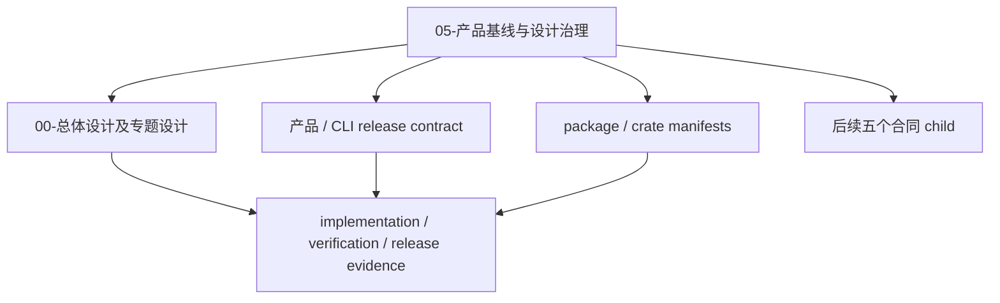

# close-specwiki-3-0-design-baseline-product-contract 设计方案

## 方案概述

本 change 建立一个最小、唯一且可引用的 Repo Wiki 3.0 产品基线入口，用它统一回答三类问题：3.0 架构基线承诺什么、不同版本域分别由什么材料授权、何时可以宣称单个合同域或整个项目的设计已经完成。

设计采用“治理入口与架构正文分离”的方式：新增 `.wiki/06-设计文档/05-产品基线与设计治理.md`，由它唯一负责 baseline identity、产品目标与非目标、版本域、状态证据和完成规则；现有 `.wiki/06-设计文档/00-总体设计.md` 继续负责四包架构、主链和架构原则，不复制版本治理正文。两者通过明确的职责优先级消除双 authority。

本 change 只创建最小长期 authority、必要导航入口和聚焦的一致性检查。现有设计页状态修正、capability Purpose 补齐、roadmap 清理、旧 authority 指针迁移和全库引用收口仍由 `close-specwiki-3-0-design-baseline-documentation-closure` 执行。

### 方案范围

- 覆盖范围：canonical baseline 页面、三类版本域 authority、显式版本关系、设计决策与交付证据模型、单域与全项目完成规则、有界材料迁移矩阵、聚焦合同检查。
- 边界说明：不统一 Runtime Query、核心场景、可靠性或宿主触发的具体合同；不实现全库文档迁移；不修改历史 archive。
- 设计边界：本 change 不新增 Runtime DTO、CLI、配置、数据库或发布流程；版本与状态合同首先以长期 Markdown 页面表达。

### 核心设计思路



`05-产品基线与设计治理.md` 只定义 identity、authority、关系和判定规则，不把不同版本号改成一致，也不把 release note、manifest 或归档 change 提升为其职责之外的 authority。

## 架构分析

### 文档职责

| 组件 / 材料 | 当前职责 | 本方案中的职责 | 明确不负责 |
| --- | --- | --- | --- |
| `.wiki/06-设计文档/05-产品基线与设计治理.md` | 新增 | baseline identity、产品范围、版本域、状态证据、完成规则的唯一 authority | 四包实现细节、具体 Runtime/Agents 合同、发布证明 |
| `.wiki/06-设计文档/00-总体设计.md` | 总体架构正文 | 继续负责四包架构、主链、原则和场景映射，并回链治理入口 | 版本域映射、全项目完成判定 |
| `.wiki/06-设计文档/01-04` | 专题设计与场景 | 在各自范围内提供设计内容 | 产品级版本和完成定义 |
| `.wiki/06-设计文档/INDEX.md` | 稳定设计导航 | 增加 canonical baseline 的最小可达入口 | 本 change 不借此修正全部旧状态标签 |
| `.docs/release/v0-2-0.md` | 当前 release contract / 历史发布面记录 | 作为 `v0.2.0` 的版本化合同证据 | 当前架构 baseline authority、真实发布证明 |
| `packages/spec-wiki/package.json` | npm 主包 manifest | 主包 source artifact version；按当前显式规则映射产品 / CLI release | Rust crate 版本、registry 发布事实 |
| `crates/*/Cargo.toml` | Rust crate manifests | 各 crate 独立 source artifact version | 产品 release、crate 已发布事实 |
| `.spec/archive/**` | 不可改历史记录 | 只作为历史决策、review 和 verification evidence | 当前设计 authority |

### Authority 优先级

发生冲突时按问题类型选择 authority，不使用一个全局“最高优先级”覆盖所有事实：

1. “3.0 是什么、完成如何判断”读取 `05-产品基线与设计治理.md`。
2. “3.0 架构如何工作”读取 `00-总体设计.md` 和对应专题设计。
3. “某个产品 / CLI release 承诺什么”读取对应版本化 release contract；当前 release 的版本标识必须与显式产品映射一致。
4. “源码声明的制品版本是什么”读取对应 `package.json` 或 `Cargo.toml`。
5. “是否实现、验证或发布”只读取相应 evidence refs，不从 design status、版本号或文档存在性推导。

### 依赖关系

| 依赖项 | 用途 | 来源 | 采用方式 |
| --- | --- | --- | --- |
| Parent 拆分方案 | 六个 child 的顺序、依赖和全项目完成边界 | `../close-specwiki-3-0-design-baseline/split.md` | 直接约束 |
| 总体设计与设计索引 | 当前 3.0 identity、架构正文和现有状态冲突 | `.wiki/06-设计文档/00-总体设计.md`、`INDEX.md` | 改写为职责分离，不复制正文 |
| v0.2.0 release contract | 当前产品 / CLI release 的公开边界和证据缺口 | `.docs/release/v0-2-0.md` | 仅作为版本化合同证据，不提升为架构 authority |
| npm / Cargo manifests | 独立制品 source version | `packages/spec-wiki/package.json`、`crates/*/Cargo.toml` | 直接读取各自版本，不强制一致 |
| Wiki SSOT 与沉淀规则 | 长期页面、阶段材料和历史 artifact 边界 | `.wiki/00-文档约定/**` | 直接约束 |

本方案未使用 upstream；不存在直接迁移、改写或仅借鉴的外部实现。

## 功能设计

### Canonical baseline 页面

`05-产品基线与设计治理.md` 使用稳定二级标题组织以下合同：

| 合同段 | 内容 | 对应 proposal |
| --- | --- | --- |
| 基线身份 | `Repo Wiki Design 3.0` 的 canonical id、目标、适用范围、非目标 | 产品基线与范围 |
| Authority 模型 | architecture、product / CLI release、artifact 三类版本域的 authority 和 scope | 版本真相模型 |
| 版本关系 | 显式关系、映射 scope、evidence refs 和漂移判定 | 允许独立版本演进 |
| 状态与证据 | decision status 与三类 delivery evidence 的正交模型 | 避免 adopted 误报为 delivered |
| 完成规则 | 单合同域与全项目两级完成条件 | 设计完成定义 |
| 下游输入 | 后续 Runtime、场景、可靠性、宿主和文档 child 必须消费的规则 | parent 依赖链 |

该页面的 frontmatter 只沿用 Wiki 通用的 `title / description / updated / owner`。本 change 不新增未被项目模板定义的状态 frontmatter；状态枚举、版本域和关系通过页面中的稳定表格表达，避免把页面级状态错误地套到每个合同域。

### 版本域与显式关系

版本域固定为：

| 域 | 标识示例 | Authority | Scope |
| --- | --- | --- | --- |
| `architecture` | `repo-wiki-design-3` / `3.0` | canonical baseline 页面 | 产品目标、设计范围、治理和完成定义 |
| `product-release` | `v0.2.0` | 版本化 release contract；当前主 CLI 版本由显式映射绑定主包 manifest | 该 release 的公开 CLI、平台和稳定合同 |
| `artifact` | npm `spec-wiki@0.2.0`、各 Rust crate `0.1.0` | 对应 `package.json` / `Cargo.toml` | 单个 source artifact 的版本声明 |

关系记录使用以下概念结构：

```text
VersionRelation
  from: domain + id
  relation: targets | implements-subset-of | distributed-by | contains
  to: domain + id
  scope: 关系适用范围
  evidenceRefs: 证明关系的源码、合同或报告
```

规则：

- 只有 authority、scope 或显式 relation 相互冲突才构成版本漂移。
- 数值相等不自动建立映射；数值不同也不自动构成漂移。
- 当前 npm 主包与产品 / CLI release 可以声明一对一分发映射，但 Rust crates 仍是独立 artifact 域。
- manifest 只证明 source tree 中的版本声明，不证明 build、verification、registry publish 或 release 已完成。
- release contract 描述版本承诺，不单独证明 staged package、registry、tag 或 binary evidence 齐备。

### 设计决策与交付证据

不建立把所有事实压成一个值的生命周期状态。每个合同域使用以下正交向量：

```text
ContractStatus
  decisionStatus: proposed | adopted | superseded | withdrawn
  implementationEvidence: none | partial | implemented | not-applicable
  verificationEvidence: none | partial | passed | failed | not-applicable
  releaseEvidence: none | planned | released | not-applicable
  evidenceRefs: 按证据轴分别记录引用
```

- `adopted` 只表示该设计在声明 scope 内是当前 authority。
- `implemented`、`passed`、`released` 必须分别提供可核验 evidence refs，三者互不推导。
- 合法状态包括“adopted 但未实现”“已实现但未验证”“验证通过但未发布”。
- `superseded` 或 `withdrawn` 不删除历史证据，只停止其作为当前 authority。
- `.spec/archive/**` 可作为证据引用，但不能仅因已归档就把 implementation、verification 或 release 设为完成。

### 完成判定

单个合同域的“设计完成”必须同时满足：

1. `decisionStatus=adopted`。
2. 唯一 authority 与适用 scope 明确。
3. 目标、非目标和依赖明确。
4. 可验证条件明确，已知冲突有明确处置或责任归属。
5. 对应设计 change 的 review 与 verification 证据通过。

单域设计完成不要求产品实现、发布或所有 delivery evidence 均完成。

全项目“Repo Wiki 3.0 设计完成”必须同时满足：

1. parent 下六个 child 均已实际完成并归档，不能用 active changes 为空或 artifact 存在替代。
2. 每个 child 的合同域满足上述单域设计完成条件。
3. `documentation-closure` 完成最终 authority、状态、引用和 INDEX 一致性门禁。
4. canonical baseline 不存在未处置的 blocking conflict。

“设计完成”与“产品已实现”“验证通过”“产品已发布”必须分别报告，不合并成一个完成百分比或布尔值。

### 有界材料分类与迁移矩阵

该矩阵是后续 `documentation-closure` 的输入，不表示本 change 已执行迁移：

| 材料 / 范围 | 当前角色 | 目标分类 / 落点 | 处理方式 | 负责 child | 验证方式 |
| --- | --- | --- | --- | --- | --- |
| `.wiki/06-设计文档/00-04` 与 `INDEX.md` | 当前设计与场景材料 | 专题设计 authority + canonical baseline 导航 | 本 change 只新增 `05`、最小回链和导航；状态修正后置 | product-contract / documentation-closure | 聚焦合同测试 + 最终交叉引用检查 |
| `.wiki/05-规格基线/capabilities/**` | 稳定 capability 基线，部分 Purpose / 版本措辞过时 | 继续作为 capability authority | 本 change 只登记责任；最终补齐、改名或回链 | documentation-closure | capability 清单和内容门禁 |
| `.wiki/04-对外方法/**`、README、CLI/help | 当前公开 surface 消费者 | 产品 / CLI release 合同的公开投影 | 不在本 change 迁移；按后续合同统一 | runtime-query-contract / documentation-closure | 公开 surface 一致性检查 |
| `.docs/release/**` | 版本化 release contract、gap 与历史发布面记录 | 保留阶段 / 历史材料；稳定公开边界回链长期 authority | 保留原位，不提升为架构 baseline | documentation-closure | 分类与 authority 指针检查 |
| `.docs/roadmap/**`、`.docs/design/**`、`.docs/quality/**` | 阶段规划、迁移存根和分析材料 | 保留阶段材料或迁移存根 | 旧 roadmap、状态和 authority 指针最终收口 | documentation-closure | `.docs` 分类和失效指针检查 |
| `packages/spec-wiki/package.json` | npm 主包 manifest | npm artifact version authority；当前产品 / CLI 显式分发映射输入 | 保留代码事实来源 | product-contract / documentation-closure | 读取 manifest 与映射声明 |
| `crates/*/Cargo.toml` | Rust crate manifests | 各 crate 独立 artifact version authority | 保留代码事实来源，不要求 lockstep | product-contract | 逐 manifest 验证独立声明 |
| `.spec/archive/**` | 历史 change、review 和 test evidence | 只读历史证据 | 禁止重写，不作为当前 authority | 所有 child | archive 不变性与引用检查 |

### 最小导航与延期收口边界

后续 apply 创建 canonical 页面时，同步完成两个最小可达性更新：

- 在 `.wiki/06-设计文档/INDEX.md` 增加 canonical baseline 入口。
- 在 `.wiki/06-设计文档/00-总体设计.md` 的设计文档索引或相邻治理说明中增加回链，并声明职责优先级。

这两个更新是新增长期页面必须具备的导航，不等同于 proposal 明确后置的“设计 INDEX 状态修正”。现有 `当前 / 后续 / 草案` 标签纠正、其它页面反向链接和旧 authority 清理仍由 `documentation-closure` 执行。

## 数据设计

本 change 不增加运行时数据结构、数据库、配置文件或 machine-readable manifest。版本域、版本关系、状态证据和完成规则作为 Markdown 合同结构存在于 canonical 页面中。

后续如需要将 `VersionRelation` 或 `ContractStatus` 提升为 Runtime DTO，必须由独立 change 证明消费者和持久化需求；本 change 不为未知运行时需求预设 schema。

设计阶段的有界迁移矩阵保留在本 `design.md` 中，归档后作为 `documentation-closure` 的历史输入。长期 canonical 页面只保留稳定分类和治理规则，不复制一次性迁移任务。

## 接口设计

本 change 无 CLI、API、事件、配置或 Runtime DTO 变化。新增的是文档级合同接口：

| 接口 | 消费者 | 稳定输入 | 稳定输出 |
| --- | --- | --- | --- |
| Canonical baseline path | 人、Agent、后续 child | `.wiki/06-设计文档/05-产品基线与设计治理.md` | 唯一治理入口 |
| Version authority table | release、Runtime、Agents、reviewer | domain、authority、scope | 某个版本声明应由哪里回答 |
| Version relation table | release 与 artifact 维护者 | from、relation、to、scope、evidence refs | 显式映射和漂移判定 |
| Contract status model | reviewer、documentation closure | decision status + 三类 evidence | 不混淆的设计与交付状态 |
| Completion rules | parent 与六个 child | child archive / review / verification / consistency evidence | 单域或全项目设计完成判定 |

## 非功能性设计

### 可维护性

- 新页面只承载产品级治理，不复制 `00-04` 的架构和场景正文。
- 版本关系必须显式记录，禁止通过相同 semver 或文档标题猜测映射。
- 当前材料测试使用显式文件清单或有限 scan roots，不递归扫描历史 archive 和阶段 release 文档来制造误报。
- 测试检查稳定结构和必要语义，不把整篇中文措辞固化为快照。

### 一致性检查

后续 plan/apply 增加 `scripts/tests/product-baseline-contract.test.ts`，由现有 root Vitest 自动纳入 `scripts/run-tests.mjs`，不新增测试编排入口。测试至少验证：

1. canonical baseline 文件存在，并从设计索引和总体设计可达。
2. architecture、product-release、artifact 三类版本域均有 authority、scope 和映射规则。
3. 合同明确禁止用版本数值相等或不同直接判断映射 / 漂移。
4. decision、implementation、verification、release 四个维度保持正交。
5. 单域完成与六个 child + documentation closure 的全项目完成规则同时存在。
6. 有界材料分类覆盖当前设计、capabilities、release、manifests、`.docs` 和只读 archive。
7. manifest 当前值如被 canonical 页面声明，必须与对应源文件一致；不得强制不同 manifest 数值相等。

该测试不验证 Runtime/CLI/Agents 具体行为，也不替代 `documentation-closure` 的全库引用、状态和 INDEX 门禁。

### 兼容性

项目处于测试开发阶段，不保留旧版本治理口径的兼容层。旧状态词、旧 authority 指针和隐式版本映射在最终主线成立后直接删除或改写，不新增 fallback。

## 资源评估

无新增运行资源、存储、网络或外部服务。新增成本仅为一个长期 Markdown 页面、两个最小导航更新和一个工作区级合同测试。

## 风险与对策

| 风险 | 影响 | 对策 |
| --- | --- | --- |
| `05` 与 `00` 形成双 authority | 同一问题得到不同答案 | 明确 `05` 负责版本 / 状态 / 完成，`00` 负责架构内容，并双向回链 |
| npm `0.2.0` 与产品 `v0.2.0` 数值相同被误认为天然同域 | 后续 release 漂移判断错误 | 要求显式 `distributed-by` 关系，数值不参与隐式推导 |
| 四个 crate 当前同为 `0.1.0` 被推导为 lockstep | 独立制品发布被错误绑死 | 每个 manifest 独立授权，除非未来另有明确 lockstep policy |
| adopted 被误报为 implemented / verified / released | 设计完成与交付完成再次混淆 | 使用正交状态向量，并要求每个 evidence 轴单独引用证据 |
| release contract 被当作真实发布证明 | 缺少 registry、tag 或 staged evidence 时误报发布 | 区分 release promise 与 release evidence |
| 本 child 扩张为全库文档迁移 | 依赖倒置、范围失控 | 只创建最小 authority / 导航 / 测试，其余矩阵项交给 documentation-closure |
| 纯关键词测试与文案强耦合 | 合理改写导致脆弱失败 | 测试稳定标题、表格行和 authority 路径，不做全文快照 |
| canonical 页面声明当前版本后未同步 manifest | 页面与代码事实漂移 | 聚焦测试只对显式声明值做 source comparison |

## 设计决策

- canonical baseline 固定落在 `.wiki/06-设计文档/05-产品基线与设计治理.md`。
- `05` 唯一治理 baseline identity、版本域、状态证据和完成定义；`00` 继续治理架构内容。
- 产品 / CLI release 与主 npm artifact 当前允许一对一显式映射，但概念上仍是两个版本域；Rust crates 独立演进。
- 版本数值相同不自动建立映射，版本数值不同不自动构成漂移。
- 使用 `decisionStatus` 加 implementation / verification / release 三类 evidence 的正交模型，不创建单一生命周期状态。
- 单合同域设计完成不要求实现或发布完成；全项目设计完成要求六个 child 实际完成并通过最终 documentation closure 一致性门禁。
- material migration matrix 保留在 change design 中；canonical Wiki 页面只保留稳定治理规则。
- apply 只做 canonical 页面、两个最小导航更新和聚焦合同测试，不做全库迁移。
- 不新增 Runtime schema、CLI、配置或兼容 fallback。
- 未采用 upstream 参考实现。

## 待确认问题

- `product-release` 长期 release contract 是否继续保留在 `.docs/release/**`，或在最终 `documentation-closure` 中建立新的长期公开 release authority，由该 child 根据届时发布流程决定；本 change 只标记当前材料为过渡性的版本化合同。
- registry、Git tag、binary checksum 与 staged package 等真实 release evidence 的统一落点尚未在当前材料中定义；本 change 只要求不能把 release contract 或 manifest 误报为这些证据。

上述问题不阻塞本设计：它们不改变三类版本域、显式关系和正交证据模型，只影响最终文档收口与发布证据的具体落点。

## 参考资料

- `./proposal.md`
- `../close-specwiki-3-0-design-baseline/split.md`
- `.wiki/06-设计文档/00-总体设计.md`
- `.wiki/06-设计文档/INDEX.md`
- `.wiki/00-文档约定/00-边界与SSOT规则.md`
- `.wiki/00-文档约定/04-文档盘点与沉淀规则.md`
- `.wiki/02-开发指南/01-测试与验收.md`
- `.wiki/02-开发指南/02-脚本与工作流.md`
- `.docs/release/v0-2-0.md`
- `packages/spec-wiki/package.json`
- `crates/wiki-model/Cargo.toml`
- `crates/wiki-index/Cargo.toml`
- `crates/wiki-knowledge/Cargo.toml`
- `crates/wiki-runtime/Cargo.toml`
- `scripts/run-tests.mjs`
- `scripts/tests/cli-surface.test.ts`
