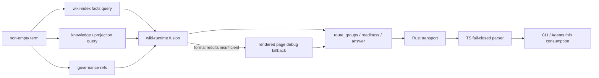

# close-specwiki-3-0-design-baseline-runtime-query-contract 设计方案

## 方案概述

本方案以新增长期 authority `.wiki/06-设计文档/06-Runtime查询合同.md` 为中心，把现有 query 能力收口为一个可由 Rust Runtime、TS CLI 和 Agents 共同消费的稳定合同。实现采用“共享 DTO 定义语义、Runtime 独占决策、adapter 只做解析与呈现”的边界，修复当前 score、排序、provenance、字段必备性、输入校验和错误分类偏差。

外部输入继续限定为非空 `term`。主响应只保留 `term`、`runtime_state`、`readiness`、`query_mode`、`query_trust`、`recommended_action`、`governance`、`route_groups` 和 `answer`；`route_groups` 是唯一结果 authority。删除公开 transport 中的扁平 `results` 以及 `matched_pages`、`provenance_summary`、`summary`、`hits` 派生视图。内部 rich `QueryReport` 可继续承载 workflow 装配数据，但不得被 CLI 或宿主当作公开合同。

查询路由定义为正式层 fusion：index、knowledge、governance、projection 在各自 readiness 允许时并行贡献结果；只有正式层不足时才启用 `rendered_page_debug_fallback`。每个 route group 明确 ranking basis 与 score direction，result 通过组内 `rank` 表达稳定次序，score 只保留该 route 的原始可解释量纲；跨 route 不比较。

### 方案范围

- 覆盖：共享 query DTO、index score adapter、Runtime 装配与错误、transport payload、TS parser、CLI/bridge、Agents 生成资产、Runtime/Agents Wiki 和自动化测试。
- 边界：不新增检索后端，不公开 richer query request，不实现 owner/entrypoint/impact/process/community 新算法，不迁移全部 capability 历史正文。
- 兼容：当前处于测试开发阶段，不保留旧公开派生字段兼容层。

## 架构分析

### 现有架构与改造关系

| 层级 | 当前职责 | 本次改造 |
| --- | --- | --- |
| `wiki-model` | route/result/source ref 共享 DTO | 新增 module route/ref、闭集 provenance layer/state，收紧 score 与 group 合同 |
| `wiki-index` | facts、FTS、module/symbol/graph query substrate | 保留 internal intent；修正 FTS 分数方向和 source 命中排序 |
| `wiki-runtime` workflow | fusion、readiness/trust、result/answer 装配 | 统一 route availability、provenance state、组内排序、fallback 与空结果语义 |
| `wiki-runtime` transport | 外部 JSON 与错误分类 | 只输出主合同；空数组不省略；校验 term；区分 `invalid_argument` 与 `index_not_ready` |
| `packages/spec-wiki` | CLI forwarding、TS parser、人类输出 | fail-closed 解析必备字段；不重算 Runtime 决策；同步错误与字段合同 |
| Agents assets | 宿主 query 操作说明 | 引导消费 readiness、route groups、answer，不再引用旧摘要字段或扁平结果副本 |
| `.wiki/06-设计文档` | 稳定设计 authority | 新增专题 authority，Runtime/Agents 页面改为摘要和链接 |

### 依赖关系



`wiki-model` 是跨 crate DTO owner；`wiki-runtime` 是 route、ranking、readiness、trust、recommended action 和 error policy owner。TS 与宿主不得复制这些判断。

## 功能设计

### Stable request

- 外部 query 只有 `term: string` 一个检索输入。
- `term.trim()` 必须非空；TS CLI、Rust IPC、bridge 和直接 workflow 入口均执行一致校验。
- intent、focus、scope、traversal 不进入本次公开 request；Runtime 固定使用 internal `Auto` intent。

### Route 与结果闭集

稳定 route tag：

- `index_symbol_hit`
- `index_path_hit`
- `index_module_hit`
- `index_graph_hit`
- `knowledge_declared_hit`
- `knowledge_derived_hit`
- `governance_evidence_ref`
- `governance_summary_hit`
- `projection_ref`
- `rendered_page_debug_fallback`

新增 `source_module` ref kind，module result 使用 module id、name、root path refs 和结构化 match basis。entrypoint 虽已有内部 substrate，但没有稳定 route/ref、ranking 和宿主验收，继续延期。

每个 `QueryResultDto` 必须包含：

| 字段 | 语义与约束 |
| --- | --- |
| `route_tag` | 上述闭集 route |
| `ref_kind/ref_id/label` | 稳定目标身份与展示名 |
| `rank` | 从 1 开始的稳定组内次序 |
| `score` | 可选的 route-local 原始分数；方向由 group 声明 |
| `provenance` | 闭集 layer + layer readiness state + 可选 reason |
| `confidence` | 由规范化 score 或正式 graph confidence 派生，不读取 SQLite raw rank |
| `recommended_action` | 针对该结果的验证或恢复动作 |
| `source_refs` | 可打开核验的源码、knowledge、projection 或 governance refs |

`QueryRouteGroup` 必须包含 `ranking_basis`、`score_direction`、`total_count`、`returned_count` 和 `truncated`。每组按其 basis 排序，并以 `ref_kind/ref_id` 稳定 tie-break；排序后去重、截断并分配 rank。group 本身按固定语义顺序输出，该顺序不表示跨 route 相关性。

### Score 与 confidence

- SQLite BM25 route 使用 `ranking_basis=bm25`、`score_direction=lower_is_better`，保留 raw rank 并保持数据库相关性次序；禁止路径字典序覆盖 FTS 次序。
- 无分数的结构化 exact/path/module route 使用 `ranking_basis=structural_match`、`score_direction=none`，按 match basis 优先级与稳定 ref key 排序。
- graph route 使用 `ranking_basis=graph_confidence`、`score_direction=higher_is_better`。
- knowledge/projection/fallback 使用 `ranking_basis=deterministic_match`、`score_direction=none`，按命中依据与稳定 ref key 排序。
- confidence 按来源 authority、diagnostics、layer readiness 和 fallback 状态派生；BM25 raw rank 不参与 high/medium/low 阈值判断。fallback 永远是 low confidence。

### Readiness、trust 与 provenance

`QueryProvenance.layer` 使用闭集 `index / knowledge / governance / projection / fallback`；`state` 使用闭集 `ready / stale / missing / rebuilding / conflict / blocked / not_enabled / fallback`。declared/derived 由 route tag 表达，不再伪装成 readiness state。

| 场景 | 顶层 query trust | route 行为 | result provenance | action |
| --- | --- | --- | --- | --- |
| 正式层 ready | `ready` | 输出可用 formal routes | 对应 layer `ready` | `none` 或打开 ref |
| index stale，仍有可用命中 | `stale_but_queryable` | 可输出 index 命中 | index `stale` | `update` |
| index missing/blocked，但 knowledge/projection 可恢复 | `stale_but_queryable` | 禁止 index route；保留可用其它 route | 各 layer 真实 state | `rebuild`/`update` |
| 仅 rendered fallback | `stale_but_queryable` | 只输出 debug fallback | fallback `fallback` | `rebuild`/`update` |
| 无任何可消费正式或 fallback 结果且 core blocked | `blocked` | 空 route groups | 无伪命中 | 对应恢复动作 |
| governance blocked，普通 core ready | core trust 保持 `ready` | governance route/action 可提示 review | governance `blocked`，index/knowledge 不降级 | 顶层可为 `review_governance`，answer 不伪降级普通结果 |

`answer_mode/answer_trust` 由 Runtime 基于实际支持 refs 和 core trust 生成；TS 与 Agents 直接消费，不再次推导。

### 主合同与内部 rich report

公开 `ExternalQueryReport` 固定包含：

```text
term
runtime_state
readiness
query_trust
recommended_action
governance
route_groups
answer
```

`route_groups` 即使为空也必须序列化。公开面删除扁平 `results`、`matched_pages`、`provenance_summary`、`summary` 和 `hits`；保留 `query_mode` 作为 fusion/fallback 的顶层闭集摘要，但它不承载排名。内部 `QueryReport.results/matches/matched_*` 暂保留给 workflow 测试和 answer 装配，代码注释必须明确它们不是 transport authority。

### 错误和空结果

| 场景 | 结果分类 | error kind | data / action |
| --- | --- | --- | --- |
| term 缺失或 trim 后为空 | failure | `invalid_argument` | 不执行 query |
| runtime/index 尚未初始化 | failure | `index_not_ready` | reason + `recommended_action=init` |
| 已初始化但 graph/facts 需恢复且可降级 | success | 无 | readiness/trust + `rebuild/update` |
| 合法 term 无命中 | success | 无 | `route_groups=[]`、empty answer |
| 非预期 I/O/协议错误 | failure | `workflow_failed`/`protocol_error` | 不伪装为空结果 |

Rust `CoreErrorKind` 新增 `IndexNotReady`。query transport 使用专用 encoder：先校验 term，再映射 `NotFound` 为稳定错误和结构化恢复上下文。TS parser 对缺失 `route_groups`、`answer` 或非法闭集值直接抛 protocol error，不用默认值掩盖旧 runtime。

### Richer query 延期边界

| 能力 | 本次判定 | 升级条件 |
| --- | --- | --- |
| explicit intent/focus/scope/traversal | 延期 | request schema、默认规则、各入口 parity 与系统测试完成 |
| owner | 延期 | 先建立 owner facts authority、置信度与 source refs |
| entrypoint | 延期 | 新增稳定 route/ref、ranking 与宿主验收；内部 substrate 不等于公开合同 |
| callers/callees/impact | 延期 | 定义 traversal/depth/truncation 和独立输出 schema；当前 graph edge 只作上下文 |
| process/community | 延期 | workflow 实际填充、route/ref、ranking/provenance 与质量证据完成 |
| semantic/vector/LLM rerank | 非目标 | 另立 change，不能成为当前 deterministic 主链前提 |

## 数据设计

不新增持久化表或 runtime artifact。变化仅涉及内存 DTO 和 JSON transport：

- `QueryRouteTag` 新增 `IndexModuleHit`。
- `QueryRefKind` 新增 `SourceModule`。
- 新增 `QueryProvenanceLayer`、`QueryProvenanceState` 闭集枚举。
- `QueryProvenance.layer/state` 从自由字符串收紧为枚举，state 必填。
- `QueryResultDto` 新增必填 `rank`，`score` 改为可选 route-local 数值。
- `QueryRouteGroup` 新增闭集 `ranking_basis`、`score_direction` 以及计数/截断字段。
- 不修改 SQLite 存储的 BM25 原值；只修正结果顺序、声明方向和 confidence 推导。

## 接口设计

### Query command

- 命令：`spec-wiki query <term...> [--json]`
- IPC：`{ action: "query", repoRoot, term }`
- 输入：trim 后非空字符串；多位置 token 仍由 TS CLI 合并为一个 term。
- 成功：返回上述稳定 `ExternalQueryReport`。
- 失败：`invalid_argument`、`index_not_ready` 或通用 workflow/protocol error。

### Parser contract

- Rust raw JSON 与 TS `WikiQueryData` 字段集合一致。
- parser 必须验证 `answer` 是对象、`route_groups` 存在并逐项闭集解析。
- 未知 route/ref/provenance/action/score basis 立即失败，防止宿主静默消费漂移协议。

## 非功能性设计

- 确定性：route 顺序固定，组内排序有稳定 tie-break，去重 key 固定。
- 可解释性：score basis、provenance layer/state、confidence 和 source refs 同时存在。
- 可维护性：所有闭集落在 `wiki-model` 和 TS parser；Agents 不复制枚举或状态机。
- 兼容性：不保留旧外部字段或扁平结果副本；测试与当前文档同步迁移。内部 rich report 的临时保留不是兼容承诺。
- 性能：不新增第二次索引或外部调用；只增加小规模 route 内排序，复杂度为每组 `O(n log n)`，现有限制下可忽略。

## 资源评估

无新增服务、存储、网络或发布资源要求。

## 风险与对策

| 风险 | 对策 |
| --- | --- |
| raw score 量纲不同 | group 明确 basis/direction，消费者只使用 rank；以真实 SQLite fixture 验证 lower-is-better |
| 删除派生字段影响旧测试或生成资产 | 当前无需兼容；通过全仓非历史扫描和 E2E 同步迁移 |
| provenance state 再次混入 declared/derived 类型 | 类型由 route tag 表达，state 收紧为 readiness 闭集 |
| module route 扩大 schema | 仅投影现有成熟 module substrate，不新增算法；entrypoint 等继续延期 |
| capability 历史正文仍冲突 | canonical 设计与代码先收口，最终 capability/roadmap 全量迁移留给 documentation-closure |
| governance action 与 core trust 混淆 | 保留正交 governance summary，专项测试 blocker 不降低普通 core query trust |

## 设计决策

- 采用 `route_groups` 作为唯一公开结果主合同，删除扁平 `results` 和旧派生视图。
- 采用 formal layer fusion + conditional rendered fallback，不采用严格 cascade 描述。
- 外部继续 term-only，不把内部 `IndexQueryIntent` 暴露为产品合同。
- score 只保留 route-local 原始量纲，由 group 声明方向；rank 是消费次序，禁止跨 route 比较。
- 新增 module route 兑现现有宿主模块定位承诺；其它 richer 能力延期。
- raw transport 与 TS parser fail closed，空数组必备，错误不伪装为空成功。
- 不使用 upstream；本方案没有直接迁移、改写或仅借鉴的外部实现。

## 待确认问题

- 无阻塞问题。用户已授权无需人工审核，按本设计进入 plan 与自动化 TDD。

## 参考资料

- `./proposal.md`：本 change 已确认的目标、成功标准与范围；采用方式为直接约束。
- `./research/runtime-query-contract-audit.md`：当前代码、测试、Wiki 与历史合同的技术证据；采用方式为设计输入。
- `../close-specwiki-3-0-design-baseline/split.md`：parent 顺序与依赖；采用方式为直接约束。
- `../../../.wiki/06-设计文档/05-产品基线与设计治理.md`：产品 authority、scope 与证据规则；采用方式为直接约束。
- `../../archive/2026-06-18-refactor-specwiki-around-contract-closure-query-route-readiness/`：历史实现与验证证据；采用方式为只读参考，不作为当前 authority。
