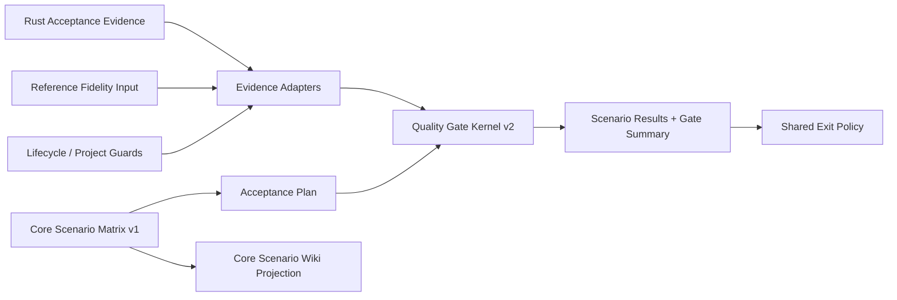
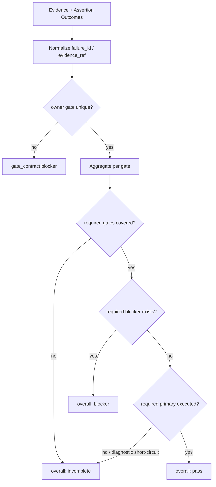

# close-specwiki-3-0-design-baseline-core-scenario-acceptance 设计方案

## 方案概述

本方案把核心场景验收拆成三个相互解耦但可组合的部分：版本化的 9 场景 acceptance matrix、统一的 quality gate/failure 聚合内核、以及复用现有 Runtime/CLI/脚本的自动化 fixture。场景矩阵定义“验收什么”，gate 内核定义“如何作出唯一决定”，各脚本和 Rust tests 提供“证据从哪里来”。

### 方案范围

- 覆盖范围：9/9 场景矩阵、formal/primary/baseline/diagnostic 语义、唯一 failure owner、最终聚合、退出码、A/B restore、declared/governance 当前边界和 Wiki authority。
- 边界说明：不新增 intent-aware/richer query、authoring 产品 CLI、自然语言语义冲突检测、宿主 trigger parity 或完整 reliability lifecycle。
- 设计边界：system test 编号、TDD 顺序和逐文件任务由 `unispec-plan` 生成。

### 核心设计思路

1. `core-scenario-acceptance.mjs` 保存可机器校验的场景 authority，Wiki 页面只做人读投影。
2. `quality-gates.mjs` 升级为唯一 decision kernel；所有脚本先产生 evidence/failure，再由内核聚合。
3. failure 先归属唯一 owning formal/primary gate；baseline 与 diagnostic 只能引用，不得重复计数。
4. `run-core-scenario-acceptance.mjs` 组合场景结果和 gate 结果，输出唯一 overall decision 与 exit code。
5. Rust acceptance 证明真实行为，workspace contract tests 证明矩阵、脚本 summary 和文档没有漂移。

## 架构分析

### 现有架构与改造关系

| 层级 | 现有模块 | 本次设计 |
| --- | --- | --- |
| 场景 authority | `.wiki/06-设计文档/03-核心场景.md` 自然语言草案 | 新增机器可读 acceptance matrix；Wiki 改为稳定投影和阅读入口 |
| gate 内核 | `scripts/testing/quality-gates.mjs` v1 summary | 原地升级为 v2 decision/failure/coverage 内核，不保留兼容 fallback |
| primary input | reference fidelity 计算与报告 | 继续只提供指标/evidence，由 acceptance plan 决定是否 required |
| baseline guard | `run-test-projects.mjs`、`test-wiki-lifecycle.mjs` | 输出结构化 observations/failures，不自行冒充最终 gate |
| 行为证据 | Rust runtime/acceptance tests、TS/workspace tests | 新增 core scenarios 聚合用例并复用现有 fixture |
| 最终编排 | 三类脚本各自产 summary | 新增核心场景 acceptance orchestrator，统一 overall decision/exit |

### 依赖关系

| 依赖项 | 类型 | 用途 | 约束 |
| --- | --- | --- | --- |
| 产品基线与设计治理 | 已归档设计合同 | 单域完成与 evidence 规则 | 文档采纳不推导实现/验证/发布 |
| Runtime Query 合同 | 已归档公开合同 | 场景 2/3/4/7 的 query evidence | 只消费 canonical `route_groups/answer` |
| `wiki-runtime` | Runtime/测试 | 场景真实行为和 A/B restore | 不新增 transport 字段 |
| Vitest/workspace scripts | 测试基础设施 | matrix、gate、subprocess exit 和文档合同 | 保持确定性，不依赖外部网络 |

### 架构设计图



## 功能设计

### 功能模块划分

| 模块 | 功能 | 优先级 | 对应 proposal |
| --- | --- | --- | --- |
| Core Scenario Matrix | 定义 9 场景字段、支持等级、入口、产物、恢复和 evidence | P0 | 9/9 canonical matrix |
| Acceptance Plan | 声明本次 primary fixtures、required gates/guards 和 report-only | P0 | 不再全局硬编码样本 |
| Gate Kernel v2 | 校验 failure owner、聚合 gate/overall decision、计算退出码 | P0 | 单失败单 blocker、未覆盖不可 pass |
| Script Adapters | 将 reference/lifecycle/project-set 结果映射为 evidence/failure | P0 | 三类脚本一致语义 |
| Core Scenario Orchestrator | 运行/组合场景结果，输出唯一 summary | P1 | 可追溯验收入口 |
| Rust Scenario Fixtures | 证明 init/update/declared/conflict/A-B restore 行为 | P0 | 9 场景自动化证据 |
| Wiki/Capability Contract | 投影场景状态并收口 gate authority | P1 | 当前长期知识一致 |

### 9 场景支持矩阵

| ID | 支持等级 | 当前公开验收边界 | 关键新增证据 | 明确延期 |
| --- | --- | --- | --- | --- |
| CS-01 | `supported` | `init` 生成正式 knowledge/metadata/pages，status 可解释 | 多模块 fixture 串联 init、概览、正式产物和 ready/failure | 完整架构真相 |
| CS-02 | `degraded` | declared rule 经 `sync/update/query` 被 canonical route 命中 | repo/module scope policy/convention fixture | task-aware 自动 scope 匹配 |
| CS-03 | `degraded` | term-only symbol/path/module 候选、rank/provenance/source refs | canonical transport 负例和无命中/未初始化 | intent、owner、独立 entrypoint |
| CS-04 | `degraded` | 已知 symbol 的局部 graph route 与 readiness | graph ready/stale/missing/rebuild fixture | 完整 callers/callees/impact |
| CS-05 | `supported` | source delta -> needs_update -> scoped update -> fresh | 局部 unit/page/artifact 稳定性串联 | 自动 PR 触发策略 |
| CS-06 | `degraded` | pitfall marker -> formal record -> update/query | `kind=pitfall`、非法/重复 ID、restore | 专用 bug authoring UX |
| CS-07 | `degraded` | 结构化 declared conflict、双方 refs、review action | conflict create/status/query/clear 与 drift 去重 | 任意规则-vs-code 语义检测 |
| CS-08 | `degraded` | policy/convention marker -> sync -> update -> query | declared-owned/derived-owned 原子性负例 | 专用 authoring CLI/API、完整 lifecycle |
| CS-09 | `supported` | B 仅凭正式产物恢复 level1 runtime 和 query substrate | A/B 双目录、page/source drift、cache exclusion | 直接恢复 graph/index 到 ready |

`supported` 表示已存在正式公开入口并可由 fixture 完整证明；`degraded` 表示当前入口能提供有界结果，但 proposal 所述用户价值仍有明确能力限制。`deferred` 作为每条记录的能力列表，不允许用内部 rich DTO 或测试 helper 伪装为公开支持。

### Gate 聚合流程



规则如下：

- 一个 `failure_id` 必须有且仅有一个 `owner_gate_id`，owner 只能是 formal 或 primary gate。
- baseline guard 可以报告同一 failure，但只能写入 `failure_refs`，不能再次增加 blocker 数。
- diagnostic observation 与 gate decision 正交；只有违反明确 assertion 时才生成带 owner 的 failure。
- required gate 缺失或 `not_covered` 时 overall 为 `incomplete`；不得以 totals 为 0、skipped 或 diagnostic 代替 pass。
- formal/primary required blocker 使 overall 为 `blocker`。
- 只有所有 required gates covered/pass、required primary 执行且没有 blocker 时 overall 才是 `pass`。

### 脚本迁移策略

- `run-test-projects.mjs` 保持 baseline guard 职责；diagnostic project 进入 observations，是否 required 由 acceptance plan 决定。
- `test-wiki-lifecycle.mjs` 为每个 assertion 标注 owning gate，不再用全局 `failedAssertions` 批量设置四个 blocker；短路阶段将未执行 gates 标为 `not_covered`。
- `collect-reference-project-reports.mjs` 继续产出 fidelity input；样本、阈值和 required companion gates 从 acceptance plan 注入，primary blocker 使用共享 exit policy。
- `reference-fidelity.mjs` 不承载 gate authority，保持纯指标模块。
- 当前源码、tests 和 Wiki 一次性迁移到 v2；删除旧 v1 fallback 与互相冲突的当前 requirements，历史 archive 不改。

### A/B restore fixture

fixture 在测试运行时创建 A、B 两个临时仓库：

```text
seed source
  -> copy to A
  -> A: init (+ declared sync when needed)
  -> copy same source + formal .wiki artifacts to B
  -> assert B has no .wiki/.cache
  -> B: status/query triggers restore
```

B 复制 `.wiki/.knowledge/**` 全部内容、`wiki.metadata.json` 和 metadata 声明的全部正式页面；不复制 `.wiki/.cache/**`、SQLite、debug trace 或临时报告。manifest 中 A 的绝对 `repo_root` 原样保留但不作为 identity/trust anchor。

最小用例：

1. 成功恢复：cache 被重建，knowledge/projection ready，index missing，fusion degraded，restored level1，recommended action 为 `rebuild`；query 不得伪造 index route。
2. 正式页面漂移：修改 B 页面后 restore fail closed，状态和 reason 指向 page/hash drift，不建立可信 runtime。
3. 源码漂移：修改 B 源码后恢复状态必须给出 `needs_update/update`；若现有实现不满足则按 TDD 修实现，不降低断言。

### 异常处理设计

| 异常 | 处理 | 对外结果 |
| --- | --- | --- |
| duplicate/unknown scenario id | matrix validator fail closed | contract test / orchestrator blocker |
| unknown support/gate/decision value | schema validation failure | 不生成 summary |
| failure 无 owner 或多个 owner | gate contract blocker | overall `blocker`，列出冲突 refs |
| required gate 未执行 | 保留 `not_covered` | overall `incomplete`，exit 2 |
| diagnostic 短路主流程 | 保留 observation 和未覆盖 gates | overall `incomplete` 或 `diagnostic`，不得 pass |
| evidence ref 不存在 | acceptance contract failure | 对应场景/gate blocker |
| A/B 正式 artifact 漂移 | 调用现有 restore 校验拒绝 | needs_rebuild/rebuild 或对应 typed state/action |

## 数据设计

### CoreScenarioRecord

| 字段 | 类型 | 约束 | 含义 |
| --- | --- | --- | --- |
| `scenario_id` | string | `CS-01`..`CS-09` 唯一且连续 | 稳定场景身份 |
| `title` | string | 非空 | 人读名称 |
| `support_level` | enum | `supported/degraded`；`deferred` 放能力列表 | 当前公开支持程度 |
| `actor` / `trigger` | string/list | 非空 | 用户与触发语境 |
| `public_entrypoints` | string[] | 只列当前公开入口 | command/API/允许的 managed edit |
| `formal_artifacts` | string[] | repo-relative contract names | 正式证据，不含 cache |
| `state_readiness` | object | 声明成功与降级状态 | 允许的 Runtime 状态 |
| `success` | string[] | 至少一个可观察 assertion | 通过条件 |
| `failure_or_degraded` | string[] | 非空 | 失败/降级边界 |
| `recovery` | string[] | 非空 | recommended action/恢复入口 |
| `verification_fixtures` | string[] | repo-relative test ids | 自动化 fixture |
| `evidence_refs` | string[] | 必须存在 | 规范、源码或测试证据 |
| `owning_gates` | string[] | 必须来自 gate registry | 场景依赖的正式 gate |
| `deferred_capabilities` | string[] | 可空但不得伪装支持 | 明确延期能力 |

### Gate 与 Failure 合同

```text
GateDefinition
  gate_id
  gate_level: formal_quality_gate | primary_gate | baseline_guard
  gate_scope
  required_companion_gates[]

FailureRecord
  failure_id
  owner_gate_id
  source_ref
  assertion_ref
  evidence_refs[]

GateResult
  gate_id
  decision: pass | blocker | not_covered
  blocking
  evidence_refs[]
  failure_refs[]

DiagnosticObservation
  diagnostic_id
  state
  reason
  recommended_action
  evidence_refs[]

AcceptanceSummary
  contract_version
  acceptance_plan_id
  decision: pass | blocker | incomplete | diagnostic
  scenario_results[]
  gate_results[]
  diagnostics[]
  failures[]
  exit_code
  report_only
```

`blocking` 由 gate level、required set 和 decision 计算，不接受 adapter 自由填写与 decision 冲突的值。`covered` 不再作为独立可矛盾布尔值；`decision != not_covered` 即表示有覆盖结果。

### 存储与迁移

- 场景矩阵和 gate registry 保存在版本控制下的 JS module，测试直接导入。
- summary 仍作为脚本 JSON/Markdown 临时报告，不进入 Runtime SQLite 或 `.wiki/.knowledge`。
- Wiki 只保存稳定规则和场景状态，不复制单次测试结果。
- 当前 gate contract version 升级为 `knowledge-quality-gates.v2`；在测试开发阶段直接迁移所有当前消费者，不保留 v1 fallback。

## 接口设计

### 内部模块接口

| 接口 | 输入 | 输出 | 责任 |
| --- | --- | --- | --- |
| `validateCoreScenarioMatrix(matrix)` | 9 场景记录 | normalized matrix 或错误 | 闭集、唯一性、必填/evidence 检查 |
| `createAcceptancePlan(input)` | plan id、required gates/guards、primary fixtures、report-only | immutable plan | 显式声明本次验收范围 |
| `normalizeFailure(input)` | assertion/source/owner/evidence | `FailureRecord` | 生成稳定 failure identity |
| `aggregateGateResults(input)` | plan、gate evidence、failures、diagnostics | `AcceptanceSummary` | 唯一归因、coverage、overall decision |
| `exitCodeForAcceptance(summary)` | summary | `0/1/2` | 统一 CLI/process 退出语义 |

默认退出策略：

| overall decision | 默认 exit | `report-only` exit |
| --- | --- | --- |
| `pass` | 0 | 0 |
| `blocker` | 1 | 0，summary 保持 blocker |
| `incomplete` | 2 | 0，summary 保持 incomplete |
| `diagnostic` | 2 | 0，summary 保持 diagnostic |

本 change 不新增产品 CLI action。`scripts/run-core-scenario-acceptance.mjs` 是开发/CI 编排入口，参数只负责选择 acceptance plan、输出 JSON 和显式 report-only；Runtime/TS public DTO 不改变。

## 非功能性设计

### 可靠性与可维护性

- 聚合器必须是无 I/O 纯函数；脚本 adapter 负责读取文件和运行子进程。
- matrix、gate registry、decision/level 闭集集中定义，禁止脚本复制字符串列表。
- 所有 evidence path 使用 repo-relative 形式，报告不把绝对临时目录作为稳定引用。
- 同一输入必须生成稳定排序的 scenario/gate/failure/diagnostic 列表和相同 exit code。
- corruption、未知枚举、缺 required coverage 和 evidence drift 均 fail closed。

### 兼容性设计

当前处于测试开发阶段，不保留 v1 summary、旧 `covered` fallback、旧 query 派生字段或全局固定 primary sample 的兼容路径。现有当前消费者和 tests 同步迁移；历史 archive 只读，不回写新结构。

## 资源评估

无新增运行服务、数据库、网络或持久化资源。matrix/聚合 contract tests 是毫秒级纯函数测试；Rust A/B restore fixture 动态创建两个临时仓库，磁盘和执行时间按单个小型 fixture 控制，结束后清理。

## 风险与对策

| 风险 | 影响 | 对策 |
| --- | --- | --- |
| v1 summary 破坏性迁移遗漏消费者 | 脚本或 snapshot 失败 | `rg` 枚举所有 `contract_version/formal_gates/decision` 消费者，合同测试 fail closed |
| gate owner 选错导致漏报 | blocker 被隐藏 | failure registry 需 owner 存在且唯一；负例断言无关 gate 不污染 |
| diagnostic/report-only 被滥用 | CI 误放行 | report-only 必须显式并写入 summary；默认 diagnostic/incomplete exit 2 |
| 场景 3/4 读取内部 rich report | 扩大公开合同 | matrix/fixture 只允许 canonical transport 字段，contract test 拒绝旧字段 |
| 场景 6/8 被描述为完整 authoring UX | 高估产品能力 | support_level 固定 degraded，入口明确为 managed edit + sync |
| 场景 7 高估语义冲突检测 | 伪造完成证据 | 只验收结构化 declared conflict，deferred 列出任意语义检测 |
| A/B restore 误称 index ready | 错误 readiness/action | 断言 restored level1、index missing、fusion degraded、rebuild action |
| workflow-verification 旧 MUST 残留 | 长期 authority 冲突 | 当前 capability 直接重写为 v2 规范，并用 fixed-path contract test 阻止旧表述回归 |

## 设计决策

- 采用“独立场景矩阵 + 共享 gate 内核 + 薄 adapter”，不把矩阵和聚合器合并。
- 采用 gate-level `pass/blocker/not_covered` 与 overall `pass/blocker/incomplete/diagnostic` 双层状态。
- 采用 failure identity + 唯一 owner 作为去重和归因基础，不再从总失败数反推所有 gates。
- 采用显式 acceptance plan 选择 primary fixtures 和 required guards，不保留全局固定 `storybook + dagger` 语义。
- 采用默认 0/1/2 退出策略；report-only 只改变进程退出，不改变 summary decision。
- 采用动态 A/B 临时仓库 fixture，不提交生成后的 `.wiki` 或 cache。
- 采用当前实现证据决定 support level；没有公开入口或完整能力的场景标 degraded/deferred，不通过文案补齐。
- 不新增产品 CLI/Runtime DTO/数据库结构，不使用 upstream。

## 待确认问题

- 无阻塞设计问题。system-tests 阶段需要把 9 场景矩阵、gate 聚合负例、脚本 subprocess exit、declared/governance fixture 和 A/B restore 分解为可执行用例。
- 若 TDD 证明 B 源码漂移不能稳定得到 `needs_update/update`，实现阶段应修正现有 restore/status 主链；不得将成功标准降低为只检查 cache 已创建。

## 参考资料

- [proposal](./proposal.md)
- [核心场景验收与质量门禁调研](./research/core-scenario-acceptance-audit.md)
- [核心场景验收技术设计调研](./research/core-scenario-acceptance-design.md)
- [parent 拆分方案](../close-specwiki-3-0-design-baseline/split.md)
- [产品基线设计](../../archive/2026-07-15-close-specwiki-3-0-design-baseline-product-contract/design.md)
- [Runtime Query 合同设计](../../archive/2026-07-15-close-specwiki-3-0-design-baseline-runtime-query-contract/design.md)
- `.wiki/06-设计文档/03-核心场景.md`
- `.wiki/02-开发指南/01-测试与验收.md`
- `.wiki/02-开发指南/02-脚本与工作流.md`
- `.wiki/05-规格基线/capabilities/workflow-verification/spec.md`
