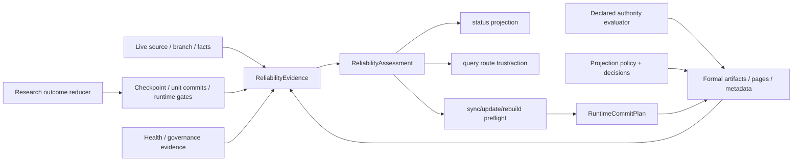

# close-specwiki-3-0-design-baseline-reliability-lifecycle 设计方案

## 方案概述

本方案以一个 Runtime 独占的可靠性决策内核为中心，把 live source/facts、formal artifacts、workflow progress、health、declared authority、projection decision 和 local cache 统一解释为 `ReliabilityAssessment`。`status/query/sync/update/rebuild/restore` 只消费或投影同一 assessment，不再各自根据字符串状态、局部 `Ok/Err` 或 cache 存在性推导结论。

方案同时闭合四条行为主线：A1 用 freshness 与 consumability 双轴表达 stale；A6 将 declared semantic status、authoring presence 和 authority group 分离；A8 用正式 projection decision 治理 page 的存在与回收；A9 用 exhaustive failure reducer 区分 accepted、diagnostic 和 blocked。compose resume 保持 KnowledgeUnit 粒度，provider session 保持单次 request-local，多余历史承诺直接校准而不补兼容层。

### 方案范围

- 覆盖范围：跨层 reliability assessment、declared authority 与治理事件、page projection policy/decision、安全 demotion、provider failure matrix、KnowledgeUnit resume、扩展场景分类及直接相关 Wiki/capability authority。
- 边界说明：不改变 canonical query payload，不新增 richer query/host trigger，不实现 PR/onboarding/ACL/incident，不持久化 provider turn/session，不重写整个 decomposition planner。
- 设计边界：system test 编号、TDD 顺序和逐文件任务由后续 `unispec-plan` 生成。

### 核心设计思路

1. `ReliabilityEvidence` 收集事实，纯函数 reducer 一次生成 `ReliabilityAssessment`；所有公开状态都是它的投影。
2. declared group 使用 canonical replacement graph 求 authority，authoring block 消失只能形成 `missing/detached`，不能直接删除 formal record。
3. `PageProjectionDecision` 独立表达 eligibility、lifecycle 和 action；`ProjectionDigestStatus` 继续只表达技术 readiness。
4. production research 必须有通过 quality gate 的 provider output；structural seed 只允许显式 development fixture 产生 diagnostic。
5. `PipelineResumeIdentity` 固定 action/facts/tree/contract 边界，完整 unit 产物才可复用；当前 unit 从新 provider request 重跑。
6. 页面、formal artifact、metadata、snapshot pointer 和 cache 通过 repo-local commit plan/staging 一致提交，删除最后生效。

## 架构分析

### 现有架构与改造关系

| 层级 | 现有模块 | 本次设计 |
| --- | --- | --- |
| 共享模型 | `wiki-model` 的 declared、health、projection、query DTO | 新增 authority/authoring、projection decision、failure evidence 类型；query DTO 不变 |
| Knowledge planning | `wiki-knowledge` planning/projection/declared validation | 新增纯 authority evaluator 和 projection eligibility planner；不读写 Markdown |
| Runtime 决策 | `runtime_profile.rs`、`status.rs`、`query.rs` 分散推导 | 新增 `reliability` 纯 reducer；删除重复 state/action/trust helper |
| Provider research | stop reason、strict failure、structural seed | 增加 failure kind 与 outcome reducer；production 无有效 output fail closed |
| Compose resume | checkpoint、cache、gate、summary | 增加统一 resume identity 和完整 unit commit-point 校验 |
| Runtime commit | workflow 直接写 page/artifact/metadata | 新增 lock、immutable plan、staging、rollback/roll-forward |
| 长期 authority | Runtime/扩展场景/capability 页面 | 同步 A1/A6/A8/A9 合同、A1-A10 分类和真实术语边界 |

### 依赖关系



`wiki-model` 继续拥有跨 crate 对象语言；`wiki-knowledge` 拥有纯 planning/authority 判断；`wiki-runtime` 独占 evidence 收集、failure policy、commit 和公开投影。TS CLI 与 Agents 只解析和呈现既有 Runtime 结论。

## 功能设计

### 统一可靠性决策

新增内部 `ReliabilityEvidence -> ReliabilityAssessment` 纯决策链。每个 layer 同时具有 freshness 和 consumability：

| layer | freshness authority | direct consume 条件 | stale/invalid 行为 |
| --- | --- | --- | --- |
| facts/index | repo identity、branch/head、tracked/working source hash、graph snapshot | identity 与当前 live source 一致，snapshot 可验证 | stale 可受限查询；invalid/missing 禁止伪 index route |
| declared | declared snapshot、authority decision、authoring binding | artifact 合法且 authority state 可判定 | missing authority/conflict 只约束相关 declared/governance 消费 |
| derived | facts hash、declared snapshot、research input identity | provenance/input hash 完整且 upstream current | stale 不可 grounded；等待 update/rebuild |
| projection | projection decision、digest、page/section binding | eligibility 允许存在且 hash/binding 一致 | retiring/invalid 不得作为普通 ready page |
| metadata/mirror | committed snapshot identity 与 page/artifact manifest | 与 commit pointer 完整一致 | mismatch 为 formal blocker，不从 cache 修补 |
| local cache | resume identity 与 formal snapshot ref | 只作工作态/加速，可丢弃重建 | mismatch 直接丢弃，永不提升 trust |

决策按前置条件短路，不使用任意 action 数值 rank：

1. 无可恢复 runtime/formal snapshot：`missing`，core blocked，`init`。
2. formal truth、binding 或 commit plan 非法：`needs_rebuild/blocker`，`rebuild`，禁止 page/cache fallback 抹平。
3. production workflow/provider/research/compose/assemble 中断：`runtime_incomplete`，重试最近 workflow action（`init/update/rebuild`）。
4. formal truth 有效但 index/cache 缺失：Level 1 degraded，`rebuild`；knowledge/projection 可按各自 evidence 受限消费。
5. source/branch/facts drift：index/derived/projection stale，declared 可保持 current，`update`。
6. 合法未同步 declared authoring：`sync` 先于 update，避免更新覆盖待采纳 authoring。
7. 仅 health degradation：runtime 可保持 `fresh`，health/action 非空，不把 ready truth 伪装为 missing。
8. governance 正交合并：core `init/rebuild` blocker 优先；否则 open authority conflict 可给 `review_governance`，但不降低无关 ready core route 的 trust。

query 在 route groups 组装后按实际 supporting layers 计算 trust：所有 supporting core layer current 为 `ready`；任一 stale/fallback 为 `stale_but_queryable`；无可消费 route 且 core blocked 为 `blocked`。result provenance/action 来自所属 layer，answer 只有实际引用 governance conflict 时才使用 `review_governance`。公开 query 字段闭集不变。

### Declared 生命周期与 authority

declared record 拆成三个正交维度：

| 维度 | 闭集 | 说明 |
| --- | --- | --- |
| semantic status | `active/deprecated/superseded/replaced` | 规则当前语义；保留既有名称 |
| authoring state | `bound/detached/missing` | page authoring block 是否仍合法绑定 |
| authority state | `unique/none/conflict` | `record_kind + canonical scope` group 的现行 authority |

replacement relation 统一归一化为 `old_record -> new_record` canonical edge。authoring 输入仍可使用 `replaced_by/supersedes`，candidate snapshot 必须在 group-level 校验后才提交：

- 无 replacement edge 的单条 active record 是 `unique` head。
- 有入边、无出边的 replaced record 是 replacement head，必须进入 declared query。
- 有出边的 record 是 superseded；多代链中间节点可以同时有入边和出边。
- 全部记录显式 deprecated 时 authority 为合法 `none`，query 无 declared hit，action 为 `none`。
- parallel head、replacement graph 无唯一末端、authority block missing 为 `conflict`，action 固定 `review_governance`。
- target 缺失、跨 kind/scope、self-loop、cycle 或 authoring status 与 graph 推导不一致，在 candidate commit 前拒绝。

删除语义固定为：

```text
active/replaced bound block disappears
  -> authoring=missing
  -> retain formal record and last binding evidence
  -> authority=conflict
  -> sync conflict + review_governance

deprecated/superseded bound block disappears
  -> authoring=detached
  -> retain record and lifecycle edges
  -> legal sync
```

要移除唯一现行规则，必须先显式改为 deprecated 并 sync，使 authority 成为 `none`，之后才可 detach。相同 `authoring_id` 合法恢复时 `missing -> bound`。本 change 不提供 hard purge；隐私/错误数据彻底清除需要独立治理操作。

现有 `conflict-records.jsonl` 保留为当前 open conflicts 视图；新增 authority decision 与 append-only governance event。`conflict_opened/conflict_resolved/authoring_missing/authoring_restored/authoring_detached/authority_changed` 都绑定 before/after snapshot 和 evidence refs。no-op sync 不新增 event；同一冲突 resolved 后再出现生成新 occurrence event。resolved history 不继续降低当前 status/query。

### Page projection governance

`plan_pages_from_knowledge_tree` 被两步入口替代：

```text
KnowledgeTree + ProjectionPolicy + previous decisions
  -> PageProjectionDecision for every unit
  -> PagePlan only for required/selected decisions
```

状态分三轴：

| 维度 | 闭集 |
| --- | --- |
| eligibility | `required/selected/knowledge_only` |
| lifecycle | `absent/projected/retiring/retired` |
| action | `promote/retain/refresh/demote/remove/block/none` |

默认 policy 不依赖在线遥测：

- `Overview/Architecture/DomainIndex` 是 structural `required`，不可被 exclude。
- leaf unit 可由 `pages.include` 显式选中，或按每 domain 预算选中；`pages.exclude` 只作用于 leaf。
- 默认 leaf 排序为 unit priority、显式 priority boost、稳定 unit id tie-break。
- `pages.max_projected_leaf_pages_per_domain` 默认 `5`；显式 include 可超过预算并记录 policy authority。
- `pages.hints` 只影响 compose，不得改变 eligibility。
- 相同 tree/policy/previous decision 必须输出相同 decision、page path 和顺序。

promotion/retain/refresh 只有在 compose gate 与 upstream evidence 合法时才能进入 `projected`。不再 eligible 的 page 先进入 `retiring` 并执行 protection preflight：

- 非空 `manual_unmanaged` section 阻止 removal。
- active/replaced declared authoring 阻止 removal；deprecated/superseded 必须先 detach。
- manual section 指向该 page 的内部 link 阻止 removal；Runtime 不越权改写 manual text。
- managed link 必须在同一候选 plan 中被重渲染到 retained ancestor/替代页或移除。
- 任何 protection/hash precondition 失败都保留 page/binding，并给出 `review_governance`。

clean demotion 在同一 commit 中删除 page、binding、digest、metadata item 和 cache；`retired` decision tombstone 保留，但正式 page 必须不存在。外部网站/仓库引用不可观测，不承诺 redirect 或旧 URL 兼容。

### A9 failure/degradation matrix

新增 `ResearchOutcomeEvidence -> ResearchOutcomeDecision` exhaustive reducer。`degraded` 描述旧 committed snapshot 仍有 remaining capability，不表示本次无 output workflow 成功。

| evidence | production decision | development fixture | remaining capability / action |
| --- | --- | --- | --- |
| `completed` + valid output | `accepted` | `accepted` | 当前 unit 可 commit |
| `no_further_tool_calls` + valid output | `accepted` | `accepted` | no-tools 不是失败 |
| tools unsupported 后 emulated/no-tools valid output | `accepted` + observation | `accepted` | 保留 fallback evidence |
| `not_run` / no output | `blocked` | `diagnostic` | 旧 snapshot 可受限 query；重试当前 action |
| `no_meaningful_delta` / no output | `blocked` | `diagnostic` | structural seed 不可 formal commit |
| `turn_budget_exhausted` / no output | `blocked` | `diagnostic` | 当前 unit 重跑 |
| `call_budget_rejected` | `blocked` | `diagnostic` | 修正预算后重跑 |
| `invalid_output` | `blocked` | `diagnostic` | negative cache 只作 failure evidence |
| provider unavailable / transport / timeout / tool error | `blocked` | `diagnostic` | typed failure，重试当前 action |
| context limit，单次 canonical trim retry 成功 | 按最终 valid output 决策 | 同左 | 记录 retry observation |
| context trim retry仍失败 | `blocked` | `diagnostic` | 保留原始 failure kind |

`ResearchStopReason` 只描述 session 终止；新增 `ProviderFailureKind` 至少区分 `unavailable/transport/timeout/tool_error/context_limit`。production 不再通过 `strict_failure=false + Ok(structural seed)` 形成 ready summary/page。reducer 结果必须 exhaustive 映射到 research summary reason、unit gate、checkpoint、runtime summary、status/action、transport terminal 和进程退出码。

parser/index/graph/formal/compose/assemble 的共用规则：

- parser/index/graph failure 阻断对应 layer；若 Level 1 formal knowledge/projection 合法，可 degraded query，但不得伪造 index route。
- formal artifact、page、marker 或 binding drift fail closed，cache 不得修复 authority。
- illegal derived/static page drift 保留 formal truth，projection blocked，action `review` 或 authority conflict 时 `review_governance`。
- compose/assemble interruption保留已完成 unit commit points，workflow 返回 failure；status 为 `runtime_incomplete` 并推荐原 action。
- cache 与 formal mismatch 时丢弃 cache；formal 有效则恢复，formal 无效则 rebuild。

### KnowledgeUnit compose resume

新增 `PipelineResumeIdentity`：

```text
contract_version
workflow_action
facts_input_hash
knowledge_tree_hash
research_contract_hash
resume_key
```

knowledge tree hash 只包含稳定 identity/parent/order/scope 字段并稳定排序；research contract hash 包含 planner/provider model、budget、turn/tool policy 和相关配置。任一字段变化都拒绝旧 checkpoint、working research cache 和 draft/digest；不以 target id 相同替代 identity。

提交点固定为：

- research：可反序列化且 target/unit/input identity 匹配的完整 research result。
- compose：同一 unit 的合法 `PageDraft + PageDigest` pair；单边、path/id/readiness 不一致均整 unit 重算。
- gate/summary 是从提交点重建的观察投影，不是第二 truth。
- assemble 不新增 page-by-page durable journal；可从完整 draft/digest pair 幂等重做。

full init/rebuild 与 scoped update 使用相同 resume 判定。planning 必须先确定 tree，再计算 identity，再决定复用；action 纳入 research input hash。完整公开 workflow 只有在 page、formal artifacts、metadata 和 runtime summary 一致提交后才清 checkpoint。

`PageResearchSessionState` 继续只存在于单次 `research_page` 调用：`session_id` 是 trace correlation，不是 durable key/resume token；session summary、recent turns、tool refs 不进入 cache、checkpoint、formal manifest。中断 unit 下一次以 `session=None` 新建 request；已完成 unit 依靠 research commit point避免再次调用 provider。

### 扩展场景与术语 authority

| 场景 | 分类 | 当前 baseline / 升级条件 |
| --- | --- | --- |
| A1 stale | `baseline` | 本 change 闭合 source/facts/formal drift 与恢复生命周期 |
| A2 PR/review ingestion | `next` | 需 connector、采纳 authority 和 merge lifecycle |
| A3 onboarding | `next` | 需角色、入口和安全操作产品合同 |
| A4 query route | `baseline` | 直接引用 canonical Runtime Query；richer intent/impact 仍延期 |
| A5 monorepo impact | `next` | 需多 scope authority、traversal/depth/truncation |
| A6 declared lifecycle | `baseline` | 本 change 闭合 authority/delete/conflict/restore |
| A7 ACL/visibility | `non-goal` | repo-local Runtime 无 identity/ACL authority |
| A8 page governance | `baseline` | 本 change建立 deterministic projection policy/decision |
| A9 failure degradation | `baseline` | 本 change建立 exhaustive decision/evidence/action matrix |
| A10 incident pattern | `next` | 需 incident/timeline/recurrence/runbook 模型 |

当前 capability 使用以下机器可验收边界：

```text
compose_resume.granularity = knowledge_unit
compose_resume.turn_resume = false
provider_session.scope = request_local
provider_session.durable = false
decomposition.strategy = deterministic_heuristic
decomposition.generic_typed_surface_complete = false
decomposition.page_independent = false
```

保留稳定 profile、unit id/path/parent、signal bundle、有限 collapse diagnostics 和 leaf-first processing。撤回“已彻底摆脱关键词”“generic typed surface 已完成”“任意大仓 full compose 已证明”的当前承诺；历史 archive 不修改，全库 Purpose/命名迁移留给 documentation-closure。

### Runtime commit 与恢复

新增 repo-local `RuntimeCommitPlan`：

```text
evaluate candidate assessment/authority/projection decisions
  -> scan manual/declared/link protections
  -> create immutable plan + base hashes
  -> stage pages/artifacts/metadata
  -> verify preconditions
  -> move removal targets to local trash
  -> atomically replace staged files
  -> atomically replace committed snapshot pointer
  -> refresh cache
  -> mark complete and delete trash/checkpoint
```

commit point 前中断按 before hashes rollback；commit point 后按 immutable plan roll-forward。removal 最后生效。存在 incomplete commit 时 status/query 不得 direct-trust。

committed snapshot identity 不再只由 facts hash 派生，而包含 facts snapshot、declared snapshot、authority/event snapshot、projection decision snapshot 和 page hashes。Level 1 restore 直接验证并恢复 formal decisions：projected/retiring page 必须存在且 binding 匹配，knowledge-only/retired page 必须不存在，open conflict/protection blocker 保真；restore 不重新运行 eligibility policy，也不从 Markdown 重建 truth。

## 数据设计

### 核心数据模型

| 实体 | 关键字段 | 存储 / 责任 |
| --- | --- | --- |
| `LayerAssessment` | layer、freshness、consumability、reasons、evidence refs、repair action | Runtime 内存；public readiness 的细粒度 authority |
| `ReliabilityAssessment` | runtime state、layers、public readiness、core action、trust ceiling | Runtime 内存；status/query/workflow 共用 |
| `DeclaredAuthorityDecision` | group id、kind/scope、authority state、head/member refs、reason、snapshot id | `.wiki/.knowledge/runtime/declared-authority-decisions.jsonl` |
| `DeclaredGovernanceEvent` | event/sequence、kind、before/after heads/snapshots、record/evidence refs、time | `.wiki/.knowledge/runtime/declared-governance-events.jsonl` |
| `PageProjectionDecision` | decision/page/unit/path、eligibility、lifecycle、action、reasons、policy/protection refs、input hash | `.wiki/.knowledge/runtime/projection-decisions.jsonl` |
| `PageLinkRef` | source page/section/owner、target page/path、content hash | formal projection artifact，用于 removal preflight |
| `ResearchOutcomeDecision` | accepted/diagnostic/blocked、stop reason、failure kind、remaining capability、retry action、evidence | unit gate/summary 的统一输入 |
| `PipelineResumeIdentity` | version/action/facts/tree/research contract/resume key | SQLite checkpoint/summary 与 cache input hash |
| `RuntimeCommitPlan` | operation id、base snapshot/hash、writes/removals、commit state | `.wiki/.cache/runtime-commits/<operation-id>/` 本地工作态 |

current open conflict view、authority decisions、governance events、projection decisions 和 link refs 都纳入 committed snapshot validation。working commit plan/provider session 不进入 formal artifact。

### 迁移策略

- 当前处于测试开发阶段，直接迁移现有 SQLite checkpoint/cache schema；旧 resume identity 缺失时丢弃 working cache，不保留 fallback。
- 现有 declared snapshot 首次评估时生成 authoring/authority decision；旧 block 缺失不得推导为删除。
- 现有 page tree 按新 policy 生成 candidate decisions。超预算 page 先进入 retiring，只有 protection preflight 通过才删除。
- 现有 snapshot identity、metadata/digest fixtures 和 tests 同步迁移；历史 archive 不改。
- 删除 `block disappears -> prune`、`one unit -> one page`、production structural success 和旧 action rank/string preflight 双轨。

## 接口设计

### 内部接口

| 接口 | 输入 | 输出 | 责任 |
| --- | --- | --- | --- |
| `assess_runtime_reliability(evidence)` | live/formal/progress/health/restore evidence | `ReliabilityAssessment` | 唯一 state/readiness/action authority |
| `evaluate_declared_authority(records, previous)` | candidate records 与上一 snapshot | decisions、open conflicts、events 或校验错误 | canonical graph/head/delete/history |
| `plan_projection_intents(tree, policy, previous)` | tree、配置、previous decisions | 每 unit decision | eligibility 与稳定预算 |
| `reconcile_projection_commit(decisions, pages, bindings, links)` | candidate decisions 与 protected evidence | `RuntimeCommitPlan` 或 blocker | promote/refresh/demote/removal |
| `reduce_research_outcome(evidence)` | execution policy、stop/output/failure/stats | accepted/diagnostic/blocked | A9 单值决策 |
| `validate_resume_unit(identity, cached)` | resume identity 与 research/draft/digest | reusable 或 recompute reason | unit 提交点校验 |
| `execute_or_recover_runtime_commit(plan)` | immutable plan | committed/rolled back/blocked | staging、commit、恢复 |

### 配置接口

现有 steering config 增加 `pages`：

| 字段 | 类型 | 默认 | 约束 |
| --- | --- | --- | --- |
| `include` | `PageProjectionOverride[]` | `[]` | 以 stable `unit_ref` 显式选中 leaf；未知 ref fail closed |
| `exclude` | `PageProjectionOverride[]` | `[]` | 不能排除 structural required；include/exclude 冲突 fail closed |
| `priority` | 现有 `PagePriority[]` | `[]` | 继续使用 `path + boost`，只影响 budget 内稳定排序 |
| `max_projected_leaf_pages_per_domain` | non-negative integer | `5` | 不限制 explicit include；遵循当前 snake_case 配置约定 |

不新增产品 CLI action。`status/query/sync/update/rebuild/init` 的公开入口保持不变；canonical query JSON 字段保持不变。配置 schema、Rust parser 和文档必须同次迁移，未知/冲突值 fail closed。

## 非功能性设计

### 可靠性

- reducer、authority evaluator、projection planner 和 resume validator 必须是确定性纯函数并覆盖闭集 table tests。
- formal commit 采用 repo-local single-writer lock；base hash 不匹配时拒绝提交，不覆盖并发编辑。
- page removal 只有在 staging、protection、managed-link 和 base hash 全部通过后执行。
- public workflow blocked 时必须同时满足：typed failure terminal、非零进程退出、checkpoint/gate/summary evidence、status/action 一致。
- cache 可完全删除并由 formal artifacts 恢复；cache 永远不是 truth 或 trust source。

### 性能与规模

- reliability assessment 与 authority/projection planning 主要是稳定排序和 map/set 运算，目标复杂度 `O(n log n)`。
- 默认 leaf page 数上界为 `required pages + domain_count * 5 + explicit includes`，不再随所有 KnowledgeUnit 一对一增长。
- 大规模 required fixture 使用动态 32-64 unit workspace、计数 provider 和确定性第 K unit 中断；不依赖网络、真实外部仓库、sleep 或放大 timeout。

### 可维护性与兼容性

- failure kind、stop reason、decision、layer state 和 projection/authority 状态使用 Rust enum exhaustive match；禁止 `_ => success`。
- 当前无需旧 schema、旧 page 集、旧 checkpoint 或旧 structural fallback 兼容；所有当前消费者同次迁移。
- 真实 Storybook/Dagger 只作显式 diagnostic evidence，不进入普通离线 required gate，也不用于宣称任意大仓完成。
- 本 change 不使用 upstream。

## 资源评估

无新增服务、网络或外部数据库。新增持久化内容是少量 JSONL formal decisions/events/link refs，以及 `.wiki/.cache/runtime-commits` 的临时 staging；完成或恢复后清理 working operation。默认 projection budget 会减少长期页面、metadata、digest 和 compose 开销。

## 风险与对策

| 风险 | 影响 | 对策 |
| --- | --- | --- |
| reliability reducer 迁移遗漏旧 helper | status/query 继续双口径 | 全仓 `rg` 枚举旧 helper，删除而非 wrapper；合同测试比较同 evidence 的所有投影 |
| replacement graph 改变 query 命中 | replaced head 过去被 active-only filter 漏掉 | group evaluator + query integration tests 覆盖多代链、none/conflict |
| active block 删除不再 prune | 旧测试和用户预期变化 | 当前不兼容；改为 missing conflict，并提供先 deprecated 再 detach 的明确路径 |
| projection budget 引发大批 demotion | 页面、链接和 manual 内容风险 | retiring + protection preflight + staging commit；blocked 时不删任何文件 |
| commit journal 实现错误 | page/artifact/metadata 半提交 | 每个 commit phase 注入失败，验证 rollback/roll-forward 和幂等恢复 |
| provider stop 收紧导致 workflow blocker 增多 | production 暴露历史静默降级 | 这是目标行为；typed reason、remaining capability 和原 action retry 保持可恢复 |
| resume hash包含不稳定字段 | 相同输入永不复用 | tree/contract canonical serialization、稳定排序和重复运行 identity tests |
| action 纳入 cache 降低命中率 | 跨 action 重算 | 保证可靠性隔离；verified cross-action cache 延期独立设计 |
| documentation-closure 与本 child 重叠 | 全库迁移范围膨胀 | 本 child 只改直接相关 Runtime/扩展场景/capability authority；索引/Purpose/roadmap 全量收口留给 sibling |

## 设计决策

- 采用单一 `ReliabilityAssessment`，不继续扩展字符串 state、action rank 和多层 helper 特判。
- freshness 与 consumability 分轴；stale-but-queryable 是受限消费，不是 direct-ready。
- declared semantic/authoring/authority 三轴分离；replaced head 可 query，全部 deprecated 是合法零 authority。
- 禁止 authoring block 消失物理删除 formal record；本 change 不提供 hard purge。
- current conflicts 与 append-only governance history 分开；resolved history不污染当前 trust/action。
- 采用 deterministic projection policy、显式 include/exclude 和 domain leaf budget；删除默认一 unit 一 page。
- page governance 与 projection technical readiness 正交；manual/declared/manual-link protection 默认 fail closed。
- 采用 repo-local immutable commit plan/staging，removal 最后生效；snapshot identity覆盖 facts、declared、decision 和 page hashes。
- production 无有效 provider output 一律 blocked；development structural fallback 只能 diagnostic。
- 采用 `PipelineResumeIdentity` 和完整 unit commit points，不实现 provider turn/session resume。
- 正式撤回未被代码证明的 generic typed surface、page-independent decomposition 和任意大仓完成承诺，不删除已证明 planner 能力。
- A1/A4/A6/A8/A9 为 baseline，A2/A3/A5/A10 为 next，A7 为 non-goal。
- 不采用 upstream；没有直接迁移、改写或仅借鉴来源。

## 待确认问题

- 无阻塞设计问题。plan 阶段需把 reducer table、declared graph/delete/history、projection policy/protection/commit recovery、provider matrix、unit resume 和 32-64 unit deterministic fixture拆成 system tests、unit tests 与实施任务。

## 参考资料

- [proposal](./proposal.md)
- [可靠性与生命周期边界调研](./research/reliability-lifecycle-audit.md)
- [可靠性与生命周期技术设计调研](./research/reliability-lifecycle-design.md)
- [parent 拆分方案](../close-specwiki-3-0-design-baseline/split.md)
- [Runtime Query 合同设计](../../archive/2026-07-15-close-specwiki-3-0-design-baseline-runtime-query-contract/design.md)
- [核心场景验收设计](../../archive/2026-07-16-close-specwiki-3-0-design-baseline-core-scenario-acceptance/design.md)
- `.wiki/06-设计文档/01-Runtime设计.md`
- `.wiki/06-设计文档/04-扩展场景.md`
- `.wiki/06-设计文档/06-Runtime查询合同.md`
- `.wiki/05-规格基线/capabilities/knowledge-runtime-health-signals/spec.md`
- `.wiki/05-规格基线/capabilities/declared-knowledge-lifecycle/spec.md`
- `.wiki/05-规格基线/capabilities/knowledge-unit-decomposition/spec.md`
