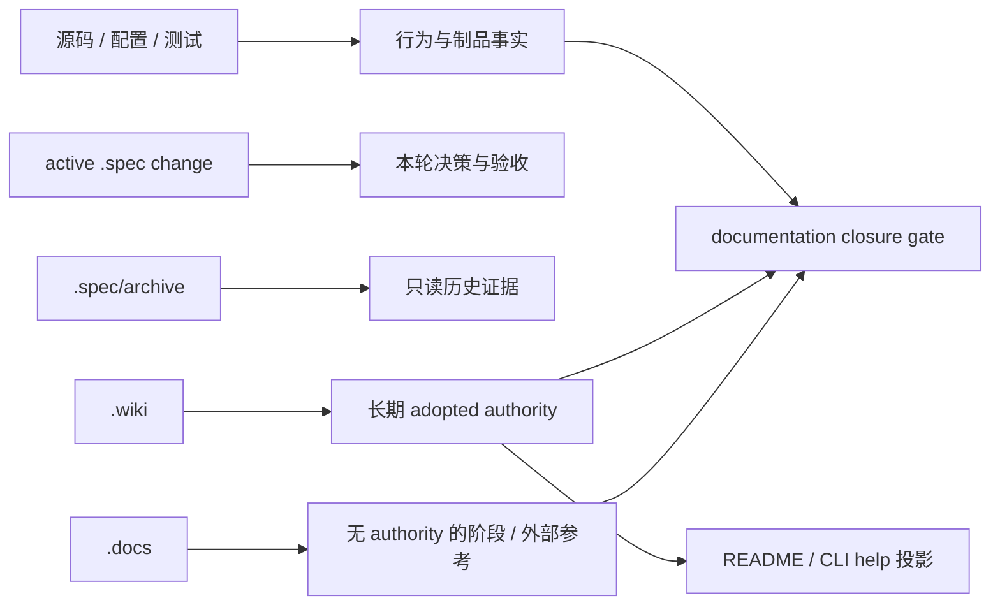

# close-specwiki-3-0-design-baseline-documentation-closure 设计方案

## 方案概述

本方案把 documentation closure 实现为一次有界的 authority 迁移，而不是全文措辞清理。实现以产品基线、Runtime query、核心场景、可靠性和 Codex-first host trigger 五个已归档合同为输入，建立五类输出：capability inventory、长期 Wiki authority、公开入口投影、阶段材料清单和自动化一致性门禁。

核心原则是：当前事实只在 `.wiki`、源码/配置/测试和 active UniSpec artifact 中表达；`.docs` 只保留明确登记且无 authority 的 reference；`.spec/archive/**` 保持只读。项目处于测试开发阶段，不为已删除 capability、旧命令 identity、旧 query 字段或旧文档深链保留兼容层。

### 方案范围

- 覆盖：proposal 列出的 capability、Wiki 设计/对外方法、README、`.docs` 和合同测试。
- 不覆盖：Runtime/CLI/host 行为代码、runtime 产物、真实发布动作和历史 archive 修改。
- 设计完成：所有迁移项有唯一落点，当前 authority 无硬冲突，root 合同测试能阻止回退。

## 架构分析

当前文档架构已经具备正确分层，但残留内容跨层泄漏：

本 change 不新增运行时组件。唯一新增工程组件是 root Vitest 合同测试；其余均是已有文档层的迁移与索引同步。

### Authority 优先级

| 问题 | 唯一 authority | 次级投影 / 证据 |
| --- | --- | --- |
| 3.0 产品范围、版本域、状态证据、完成规则 | `.wiki/06-设计文档/05-产品基线与设计治理.md` | manifests、archive reports |
| Runtime query transport | `.wiki/06-设计文档/06-Runtime查询合同.md` + source DTO | capability 与 README 只做摘要 |
| CLI 命令、archive 模式和退出语义 | `.wiki/04-对外方法/00-CLI.md` + CLI source/help | README EN/CN |
| v0.2.0 product-release contract | `.wiki/04-对外方法/02-v0.2.0发布合同.md` | manifests、staging/dry-run、历史 archive evidence |
| host roles 与 trigger | `.wiki/06-设计文档/02-Agents设计.md`、host-trigger capability | README 宿主摘要 |
| capability requirements | `.wiki/05-规格基线/capabilities/**` | capability INDEX |
| 测试与验收规则 | `.wiki/02-开发指南/01-测试与验收.md` + test code | `.docs` 不保留平行 gate authority |

## 功能设计

### 1. Capability inventory 收口

| capability / 文件 | 处理方式 | 收口结果 |
| --- | --- | --- |
| `content-family-planner` | 删除 capability 与 INDEX 项；有效 requirements 合并进 `knowledge-unit-decomposition` | family 只作为 deterministic signal / projection style，不再是平行主抽象 |
| `research-driven-page-composition` | 保留并补 Purpose；把 family page hierarchy 改为 leaf/parent KnowledgeUnit 与 page projection | research/compose/assemble 主链与 KnowledgeUnit 对齐 |
| `wiki-index-query-surface` | 保留并补 Purpose；明确 facts-only internal substrate | richer intent 不泄漏为公开 CLI request |
| `workspace-crate-boundaries` | 保留并补 Purpose | 固定四 crate ownership 与依赖方向 |
| `wiki-bm25-query` | 重写旧顶层/自动扩展叙事 | 只拥有 index/FTS substrate 与 route-local BM25 |
| `repo-wiki-runtime` | 删除顺序 fallback 与 `matched_*` 顶层字段 | 只描述 formal layer fusion、`route_groups` 和 debug fallback |
| `adapter-distribution`、`repo-wiki-workflow` | 修正“真实发布”措辞 | 表达 adopted staging/product-release contract，不推导 released |
| evidence/dossier/LLM/topic capabilities | 将 family identity 改为 unit/domain/section/projection scope | 允许受限 family signal，不保留独立 durable identity |

Capability INDEX 与目录必须形成一一对应 inventory。测试解析每个 `spec.md` 的首个 `## Purpose` section，要求非空、无归档占位，并检查 INDEX 链接集合与实际目录集合一致。

### 2. 长期 Wiki authority 收口

- 新增 `.wiki/04-对外方法/02-v0.2.0发布合同.md`，承载 product-release identity、正式 surface、artifact 映射、target、non-goals 和 evidence checklist。
- release contract 使用 `decisionStatus` 与 implementation/verification/release evidence 正交表达；Windows x64 staging、`npm publish --dry-run` 或 manifest 只作为局部证据，不自动推出 released。
- `.wiki/04-对外方法/INDEX.md`、`.wiki/INDEX.md` 和必要 README 链接到该唯一入口。
- `.wiki/02-开发指南/01-测试与验收.md` 吸收 formal gate、primary gate、baseline guard 和 diagnostic 的稳定角色；删除 `.docs/quality` 平行 authority。
- `.wiki/06-设计文档/INDEX.md` 的状态列只表达 adopted authority 角色，明确 implementation/verification/release 由独立 evidence 轴回答。
- `.wiki/06-设计文档/00-总体设计.md` 删除旧 implementation roadmap 导航。
- `.wiki/06-设计文档/02-Agents设计.md` 将已实现的 `compatibilityRole`、trigger capability、asset validator 和 CodeBuddy structured parser 移入当前代码事实；完整 HostAdapter 仍标为未实现。
- `.wiki/06-设计文档/03-核心场景.md` 将 query/status semantic trigger 标为已支持且不自动执行，task-aware scope 继续延期。
- `.wiki/06-设计文档/05-产品基线与设计治理.md` 删除“后续 child/本 change”时态，改为稳定材料职责和条件式完成规则。

### 3. `.docs` 迁移与删除矩阵

| 当前材料 | 处理 | 稳定落点 / 理由 |
| --- | --- | --- |
| `.docs/design/*.md` 5 个 migrated stub | 删除 | 稳定入口已在 Wiki，原始快照已在 archive |
| `.docs/roadmap/implementation-roadmap.md` | 删除 | 已完成迭代仍标计划中；baseline/next/non-goal 已由产品与场景 authority 承担 |
| `.docs/roadmap/knowledge-system-completeness-roadmap.md` | 删除 | 历史 program 已归档，不再保留伪 current authority |
| `.docs/release/v0-2-0.md` | 迁移稳定内容后删除 | 新 `.wiki/04/02-v0.2.0发布合同.md` |
| `.docs/release/v0-2-0-release-gap-closure.md` | 删除 | 已完成 gap plan，历史证据在 archive |
| `.docs/release/v0-2-0-knowledge-runtime-gaps.md` | 删除 | 当前/延期边界已进入产品、Runtime 和场景 authority |
| `.docs/quality/knowledge-quality-gates-acceptance.md` | 迁移稳定规则后删除 | `.wiki/02-开发指南/01-测试与验收.md` |
| `.docs/research/karpathy-llm-wiki-analysis.md` | 保留并补 front matter | `status: reference`、`authority: none`、adopted Wiki refs；建议不构成 backlog |
| `.docs/INDEX.md` | 重写 | 只登记实际 survivor 及其无 authority 角色 |

删除后必须验证仓库内 Markdown 不再链接这些路径。`.spec/archive/**` 中的历史链接不参与检查，也不修改。

### 4. 公开入口投影

README EN/CN 使用同一组结构性断言保持一致：

- 首屏明确 Codex 是唯一 reference host，Claude/CodeBuddy 是 compatible hosts。
- 公开命令与 `.wiki/04-对外方法/00-CLI.md` 一致，包含 archive 的 dry-run/apply/resume 模式和退出语义。
- 删除旧 Claude `/wiki:*` command identity；只保留一级 CLI 与 repo-local `wiki-*` skills。
- Windows x64 表述为 v0.2.0 release/staging contract target，不宣称存在真实 release evidence。
- query 摘要回链 canonical Runtime query authority，不复制旧 transport 字段。

### 5. 一致性测试

新增 `scripts/tests/documentation-closure-contract.test.ts`，由现有 root Vitest 自动发现，不修改测试编排器。测试分为六组：

1. Capability Purpose 与 inventory：解析 Purpose section，比较 INDEX 和目录集合。
2. Canonical query projection：只扫描当前 query capability、release contract、Runtime/Agents authority，禁止旧顶层 transport 字段重新成为正向合同。
3. Design/status/host projection：检查 adopted/evidence 正交、Codex-first 和已实现 trigger 事实。
4. `.docs` inventory：只允许 INDEX 和登记的 reference survivor；front matter 必须声明 `authority: none`，不得指向 active authority。
5. README/CLI/release parity：检查一级命令、archive 模式、宿主角色和 release contract 链接；不比较整段文案。
6. Link/authority integrity：在当前 Wiki、README 和 `.docs/INDEX.md` 解析相对 Markdown 链接；`.spec/changes/<id>` current pointer 必须真实 active，archive 只能作为 history/evidence。

现有 `product-baseline-contract.test.ts`、`runtime-query-contract.test.ts`、`core-scenario-*`、`host-trigger-contract.test.ts` 和 `quality-gates-contract.test.ts` 继续提供专题回归；新测试只负责跨文档 closure，不复制其全部断言。

### 异常处理规则

| 异常 | 处理 |
| --- | --- |
| Purpose 缺失/空/归档占位 | 合同测试失败并报告 capability path |
| INDEX 与 capability 目录不一致 | 报告 missing/extra 集合 |
| `.docs` 出现未登记 survivor | 失败并要求分类，不自动删除 |
| current authority 指向不存在或已归档 change | 失败并报告 source/target |
| archive 中含旧字段/断链 | 忽略；archive 只读且不属于 current scan root |
| 合法否定句包含旧字段 | 通过 section/正向声明范围判断，不做全库裸 grep |

## 数据设计

无运行时数据结构、配置、数据库或持久化变化。新增内容均为 Markdown authority 与一个测试内静态 inventory/parser。

测试读取实时 capability 目录、Markdown front matter、标题 section、相对链接、package manifest 和当前 UniSpec 目录，不生成持久化快照。版本比较只验证 Wiki 中显式声明的 mapping 与源 manifest 一致，不要求各版本数值相等。

## 接口设计

无 CLI、API、event、config 或 Runtime DTO 变化。文档级接口调整如下：

| 接口 | 输入 | 输出 / 消费者 |
| --- | --- | --- |
| v0.2.0 release authority | product-release identity、公开 surface、artifact mapping、evidence refs | README、发布维护者、reviewer |
| capability inventory | capability directories + Purpose sections | Wiki 规格索引、Agent、合同测试 |
| `.docs` reference inventory | survivor front matter + INDEX entry | 人与 Agent 的历史/外部参考导航 |
| documentation closure gate | current authority roots + manifests + active/archive status | root Vitest pass/fail issues |

## 非功能性设计

### 可维护性

- 断言稳定结构、路径集合和合同标识，不做全文 snapshot。
- scan roots 显式限定为 current authority；archive 永不递归扫描。
- 错误输出包含 source path 和缺失/冲突 marker，便于定位。
- 新增 capability 或 `.docs` survivor 时必须同时更新对应 inventory，而不是依赖隐式发现。

### 兼容性

项目处于测试开发阶段，不保留删除的 `.docs` 深链、`content-family-planner` capability、旧 `/wiki:*` command identity、旧 query transport 字段或旧 roadmap 兼容入口。历史证据继续通过 `.spec/archive/**` 保留。

## 资源评估

无新增运行资源、网络调用或外部服务。root 合同测试只读取有限 Markdown/manifest 文件，成本相对于现有工作区 Vitest 可忽略。

## 风险与对策

| 风险 | 影响 | 对策 |
| --- | --- | --- |
| 只补 Purpose 导致假收口 | authority 仍冲突 | 同步正文 query/family/release 合同并由专题测试回归 |
| 全局替换 family/page | 合法 signal/projection 语义丢失 | 只迁移 identity 层，保留有明确限定的术语 |
| 删除 `.docs` 造成库内断链 | 导航失败 | 实现前后运行相对链接解析测试；archive 排除 |
| release contract 被误报为 released | 治理状态错误 | 强制 decision/evidence 正交和 evidence checklist |
| current active pointer 门禁误伤 generic path 文档 | 假阳性 | 只解析具体 Markdown target，不禁止 `.spec/changes/**` 通用约定 |
| README EN/CN 再次漂移 | 用户获得不同公开合同 | 对相同结构 marker 和链接集合分别断言 |

## 设计决策

- 删除 `content-family-planner` 并合并有效规则，不保留兼容 capability。
- v0.2.0 product-release 的唯一长期 authority 落在 `.wiki/04-对外方法/02-v0.2.0发布合同.md`。
- 删除已迁移 design stub、旧 roadmap、release gap 和 quality 阶段材料；只保留明确无 authority 的外部理念 research。
- `.wiki/06-设计文档/INDEX.md` 表达 adopted authority，不用实现状态筛选设计。
- README 只投影一级 CLI、repo-local skills、Codex-first roles 和 release authority，不复制内部 DTO。
- 新增一个 root documentation closure 合同测试，复用现有 runner，不增加第二套测试入口。
- `.spec/archive/**` 不修改、不扫描、不要求符合当前合同。
- 未采用 upstream 实现；本设计完全基于仓库内已归档合同、当前源码/测试和 Wiki authority。

## 待确认问题

- registry、Git tag、binary checksum 和 staged publish 的统一采集/持久化机制仍未定义；本 change 只在 release contract 中声明 evidence 缺口，不实现采集。
- 外部系统可能持有已删除 `.docs` 深链，仓库内无法检测；按测试开发阶段约束接受该不兼容变更。

## 参考资料

- [proposal](./proposal.md)
- [文档收口现状与迁移边界审计](./research/documentation-closure-audit.md)
- [父 change 拆分方案](../close-specwiki-3-0-design-baseline/split.md)
- [product-contract 归档设计](../../archive/2026-07-15-close-specwiki-3-0-design-baseline-product-contract/design.md)
- [Runtime query 归档设计](../../archive/2026-07-15-close-specwiki-3-0-design-baseline-runtime-query-contract/design.md)
- [核心场景归档设计](../../archive/2026-07-16-close-specwiki-3-0-design-baseline-core-scenario-acceptance/design.md)
- [可靠性生命周期归档设计](../../archive/2026-07-16-close-specwiki-3-0-design-baseline-reliability-lifecycle/design.md)
- [宿主触发归档设计](../../archive/2026-07-17-close-specwiki-3-0-design-baseline-host-trigger-contract/design.md)
