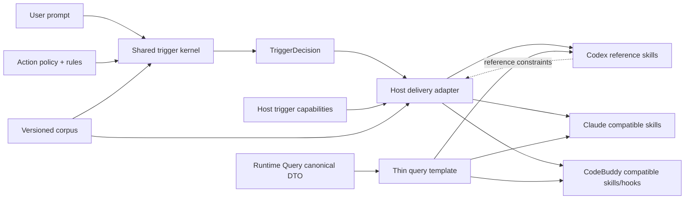
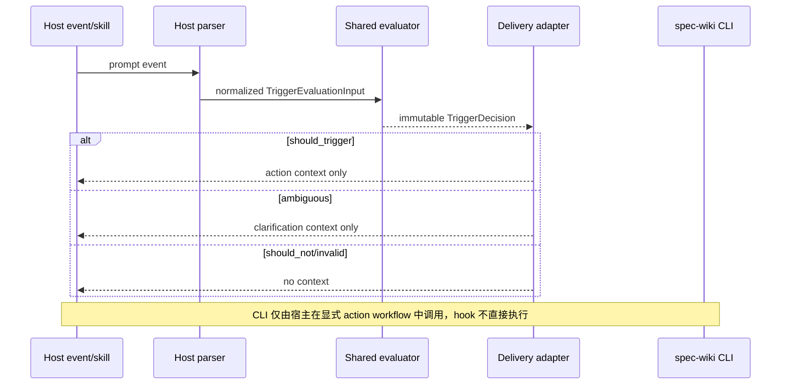

# close-specwiki-3-0-design-baseline-host-trigger-contract 设计方案

## 方案概述

本方案采用 Codex-first：Codex 的 repo-local `SKILL.md`、native skill discovery 和 query/status guidance 是 host-trigger 合同的 reference projection。`packages/spec-wiki` 宿主公共层新增确定性的 host-trigger kernel，共享 policy/rules 把用户 prompt 归约为闭集 `TriggerDecision`；Claude 与 CodeBuddy 在 reference contract 之后提供兼容投影，不得反向决定共享对象语言或规则形态。CodeBuddy 可继续利用 prompt hook 做结构化事件解析和 context delivery，但该机制是次级适配能力，不是总体架构前提。

设计保持 Runtime Query 为唯一业务 authority，不增加 CLI、Runtime DTO 或 richer query。query/status 可以 semantic-or-explicit；init/update/sync/rebuild 必须 explicit-only。所有 ambiguous、negative、invalid input 均不得直接执行 CLI。host trigger、已有基础 bridge transport / 尚未启用的 production research bridge 与 provider research session 分别属于 action selection、transport 和 request-local model execution 三层，不共享 session 或 persistence 字段。Codex reference path 完成并通过后，再验证 Claude 与 CodeBuddy 的兼容投影；次级宿主的专属机制不得阻塞共享 kernel 与 Codex 主路径的设计成立。

### 方案范围

- 覆盖：trigger 对象语言、action policy、deterministic evaluator、Codex reference skill projection、capability/compatibility matrix、shared corpus、Claude/CodeBuddy 兼容 guidance、次级 CodeBuddy parser/hook delivery、资产一致性验证和直接相关 Wiki 合同。
- 不覆盖：完整 HostAdapter 重构、Runtime query 协议、richer intent、外部宿主模型准确率、新宿主、bridge/provider 行为扩展和无关全库文档收口。
- 设计边界：v1 只承诺 corpus 覆盖的中英文请求语义和 fail-closed 行为，不承诺开放域 NLU。

### 核心设计思路

1. 先定义 Codex reference projection：repo-local skills、description/When To Use、explicit-only guardrails 和 canonical query fields 是其它宿主兼容的基准。
2. 用共享纯 reducer 形成唯一 decision authority，输入不含 host id，输出不含 query 私参或 session state。
3. 用 policy 将 query/status 与 mutation actions分开，固定冲突、opt-out、显式 action、semantic match 和 no-match 的优先级。
4. 用 `HostCompatibilityRole` 与 `HostTriggerCapabilities` 分别表达参考优先级和 delivery mechanism，并在实际 assets 构建后做一致性校验。
5. 先用版本化 corpus 验证 Codex reference guidance 与共享语义，再验证 Claude 投影和 CodeBuddy hook；生成的 CodeBuddy hook 仍需与库 evaluator 全量对拍。
6. 复用现有 workflow semantics、query canonical fields、bootstrap ownership 和测试框架，不引入新的 runtime/service。

## 架构分析

### 现有架构与增量组件

| 层级 | 现有组件 | 本次设计 |
| --- | --- | --- |
| 公开 action | `wikiActions.ts` | 继续作为 `PublicWikiAction` 唯一闭集，不复制 enum |
| workflow semantics | `agents/shared/workflowSemantics.ts` | 继续负责 CLI/action 语义；trigger policy 引用公开 action |
| trigger kernel | 无 | 新增 `agents/shared/triggerContract.ts`，承载 schema、policy、rules、normalization、reducer 和 invariant validation |
| trigger guidance | 分散在 `commandAssets.ts` 与 CodeBuddy context | 从 trigger contract 派生 descriptions/When To Use/clarification guidance |
| host registry | `agents/shared/hosts.ts` | 为每个 `HostDefinition` 增加 required `compatibilityRole` 与 `triggerCapabilities`；Codex 唯一为 reference |
| asset planner | `agents/shared/hostAssets.ts` switch | 保留 switch；新增 `validateHostAssetsAgainstCapabilities`，返回前 fail closed |
| Codex delivery | repo-local skills | 作为 reference projection，先固定路径、frontmatter、trigger guidance、guardrails 和 query canonical fields |
| Claude delivery | repo-local skills | 从 Codex reference/shared renderer 派生兼容投影，不新增宿主私有 taxonomy |
| CodeBuddy delivery | skills + hooks + settings | 在 Codex reference/shared kernel 之后增加兼容 skill、结构化 event parser、decision delivery 和受管 hook |
| verification | Vitest 字符串/路径测试 | 分层新增 Codex reference、shared corpus、capability drift、Claude parity 与 CodeBuddy executable hook tests |

### 依赖关系

| 依赖项 | 类型 | 用途 | 来源 / 文档 | 备注 |
| --- | --- | --- | --- | --- |
| `PublicWikiAction` | package type | target action 闭集 | `wikiActions.ts` | 不新增 action |
| Runtime Query canonical fields | 跨层合同 | query skill 消费边界 | `.wiki/06-设计文档/06-Runtime查询合同.md` | 宿主只薄消费 |
| Host bootstrap ownership | package workflow | 覆盖受管 hook、保留用户资产 | `runInit`/writer/settings | 不新增迁移命令 |
| Vitest + Node child process | 测试工具 | corpus 与可执行 `.mjs` 验证 | package 现有工具链 | 无浏览器依赖 |
| provider session boundary | runtime 合同 | 禁止 trigger/session 混层 | reliability lifecycle archive | request-local、persistence forbidden |

### 架构设计图

## 功能设计

### Codex reference projection

Codex 是 v1 首要兼容目标，reference asset 固定为 repo-local `.codex/skills/wiki-<action>/SKILL.md`，不依赖 `<CODEX_HOME>/prompts`、prompt hook 或全局安装状态。Reference projection 必须先满足：

- 六个公开 action 均生成稳定 frontmatter、When To Use、执行步骤、结果解释和 guardrails。
- query/status guidance 由共享 trigger policy 生成；query 只消费 Runtime canonical fields，并提醒精确实现仍需读取 source refs。
- init/update/sync/rebuild 明确 explicit-only，skill description 不得暗示模糊请求可自动执行。
- `should_not_trigger / ambiguous` guidance 只说明不触发或需要澄清，不模拟 Runtime intent 参数。
- Codex bootstrap、幂等刷新、legacy repo skill 清理和 distribution snapshot 先通过，再以同一共享 projection 生成 Claude/CodeBuddy 兼容资产。

Codex 没有项目可控的 prompt hook，因此 reference conformance 不声称观测外部模型的实际 skill selection；它验证的是项目拥有的 skill assets、taxonomy projection、显式调用边界和 corpus 期望。

### 共享 trigger kernel

新增 `agents/shared/triggerContract.ts`，导出合同版本、闭集常量、类型、policy 查询和纯 evaluator。它不得导入 host-specific 模块，也不得执行 I/O。

处理步骤固定为：

1. 校验 `TriggerEvaluationInput.kind === "user_prompt"` 且 `text` 为非空 string。
2. 对文本执行 NFKC、trim、lowercase 和连续空白折叠；不保存原始 prompt。
3. 按规则声明顺序收集 opt-out、explicit action、semantic query/status、mutation guard 和 conflict evidence。
4. 使用固定 precedence reducer 生成单一 decision。
5. 校验 decision invariant，稳定排序并去重 evidence，冻结结果。

英文规则使用词边界或完整短语，避免 `classpath`、`module.exports`、`status quo` 等 substring 近碰撞；中文规则使用带请求语义的短语组合，不以“结构/模块/文件/wiki”等裸词直接触发。

### Action policy 与 reducer precedence

| Action | Policy | 隐式语义允许 | 直接执行边界 |
| --- | --- | --- | --- |
| `query` | `semantic_or_explicit` | 是；必须能形成非空 subject/term | evaluator 只建议，不执行 |
| `status` | `semantic_or_explicit` | 是；仅 runtime readiness/state 问题 | evaluator 只建议，不执行 |
| `init` | `explicit_only` | 否 | 必须有明确执行请求 |
| `update` | `explicit_only` | 否 | 必须有明确执行请求 |
| `sync` | `explicit_only` | 否 | 必须有明确执行请求 |
| `rebuild` | `explicit_only` | 否 | 必须有明确执行请求 |

Reducer 优先级：

1. 非法输入：`ambiguous / invalid_input / target=null`，delivery none。
2. 正向请求与明确 opt-out 并存：`ambiguous / conflicting_intent`。
3. 只有全局 opt-out：`should_not_trigger / explicit_opt_out`。
4. 多个显式 action：`ambiguous / conflicting_intent`。
5. 单个显式 action：query 缺 term 时 `ambiguous / missing_query_term / target=query`；其余为 `should_trigger / explicit_action_request`。
6. mutation 只有讨论/询问而无执行动词：`should_not_trigger / mutation_requires_explicit_request`。
7. query 与 status 语义同时命中：`ambiguous / conflicting_intent`。
8. 单一 repo map 需求：`should_trigger / semantic_query_request`。
9. 单一 runtime readiness/state 需求：`should_trigger / semantic_status_request`。
10. 只有裸 Wiki 提示：`ambiguous / insufficient_context`。
11. 其余：`should_not_trigger / no_supported_intent`。

### 宿主 capability matrix

在 `HostDefinition` 中增加 required `compatibilityRole` 与 `triggerCapabilities`。`compatibilityRole` 闭集为 `reference / compatible`：Codex 是 v1 唯一 reference，Claude 与 CodeBuddy 为 compatible。Registry 顺序、共享 guidance、测试分层和后续新增宿主都必须消费该字段，不能用文件顺序或文档措辞隐式表达优先级。

| 字段 / Capability | Codex | Claude | CodeBuddy |
| --- | --- | --- | --- |
| `compatibilityRole` | reference | compatible | compatible |
| `nativeSkillDiscovery` | supported | supported | supported |
| `promptInspection` | none | none | user_prompt_submit |
| `sessionStartContext` | none | none | orientation |
| `settingsIntegration` | none | none | managed_settings |
| `deterministicDelivery` | skill_guidance | skill_guidance | generated_hook |

`buildHostBootstrapAssets` 完成后调用公共 validator：

- Registry 必须恰有一个 reference host，且当前固定为 Codex。
- 所有宿主必须按 action policy 生成 skills。
- 声明 `generated_hook` 必须存在受管 UserPromptSubmit hook。
- 声明 `orientation` 必须存在 SessionStart hook。
- 声明 `managed_settings` 必须存在 settings asset 并注册对应 hook command。
- 声明 none 时不得生成相关受管 asset。

Validator 失败属于开发/分发合同错误，bootstrap 对该宿主 fail closed，不写出与声明矛盾的 plan。

### Shared guidance 与 thin query consumption

`commandAssets.ts` 不再维护独立 trigger 关键词。Codex `wiki-*` skills 是共享 guidance 的 reference snapshot：query/status 的 description、When To Use 和 ambiguity guidance 从 trigger policy/rules 的稳定 projection 生成，mutation skills 明确 `explicit-only`。Claude 与 CodeBuddy skill renderer 必须复用同一 projection；兼容宿主可以改变合法 frontmatter/asset wrapper，但不能改变 trigger decision、target action、guardrail 或 query fields。

query 的执行与输出解释继续只引用：`readiness / query_mode / query_trust / recommended_action / governance / route_groups / answer`。trigger 模块不得引用 `matched_pages / provenance_summary`、跨 route score、owner/entrypoint/impact 或私有 intent 字段。

### 次级 CodeBuddy event 与 delivery

在 Codex reference path 和 shared kernel 成立后，CodeBuddy 兼容层增加宿主专属 `parseUserPromptSubmitEvent(raw)`。该 parser/hook 不参与 reference schema 选择，也不改变 shared reducer precedence：

- 只解析 JSON object 和已由真实 fixture 证明的 prompt 字段。
- 不扫描 raw serialized JSON，不递归搜索任意 string 字段，不维护多字段猜测 fallback。
- 非法 JSON、数组、缺字段、非 string、null 或空白统一映射 `invalid_input`。

`UserPromptSubmit` delivery：

| Decision | Delivery | 行为 |
| --- | --- | --- |
| should_trigger | action_context | 注入目标 skill、reason 和 thin-boundary guidance；不执行 CLI |
| ambiguous（可澄清） | clarification_context | 提示补 term、选择单一 action 或显式请求；不执行 CLI |
| should_not_trigger | none | 仅返回 `{continue:true}` |
| invalid_input | none | 仅返回 `{continue:true}` |

SessionStart 不调用 evaluator，只输出 orientation context，说明仓库有 spec-wiki 及显式 skills；内容不得声称已选择/执行 action，也不得包含 session identity。

生成的 CodeBuddy `.mjs` 由共享 contract/rules 序列化。若生成脚本需要小型 interpreter，必须以 semantic corpus 对库 evaluator 和真实脚本逐例对拍，禁止出现第二份宿主私有规则表。

### 异常处理设计

| 异常场景 | 处理策略 | 系统行为 |
| --- | --- | --- |
| 非 string/空白 prompt | invalid_input | ambiguous decision，CodeBuddy delivery none |
| CodeBuddy malformed envelope | parser fail closed | 输出唯一 `{continue:true}`，不抛出宿主阻断错误 |
| opt-out 与正向意图冲突 | conflicting_intent | clarification only |
| 多个 action 冲突 | conflicting_intent | 不选择 action，不执行 |
| query 显式请求缺 term | missing_query_term | target=query，要求补 term |
| 只有 mutation 讨论信号 | mutation guard | should_not_trigger |
| capability 与 assets 不一致 | contract error | 中止该宿主 bootstrap plan，报告明确错误 |
| corpus schema/version 不匹配 | test/contract error | fail test，不静默忽略 case |

## 数据设计

### Trigger 对象语言

| 字段 / 实体 | 类型 | 必填 | 语义与约束 |
| --- | --- | --- | --- |
| `contractVersion` | `"host-trigger/v1"` | 是 | taxonomy/precedence identity |
| `decision` | `should_trigger / should_not_trigger / ambiguous` | 是 | 唯一三态结果 |
| `targetAction` | `PublicWikiAction \| null` | 是 | should_trigger 必须唯一非空；negative 必须 null；ambiguous 仅缺 query term 可为 query |
| `reason` | closed `TriggerReason` | 是 | 稳定业务原因，不使用自由文本 |
| `evidence` | readonly `TriggerEvidence[]` | 是 | `kind + ruleId`，稳定排序去重，不包含原始 prompt |
| `TriggerActionPolicy` | action -> policy | 是 | query/status semantic-or-explicit，其余 explicit-only |
| `HostCompatibilityRole` | `reference / compatible` | 是 | Codex 唯一 reference；其它宿主不得反向定义共享合同 |
| `HostTriggerCapabilities` | closed capability object | 是 | 每个 HostDefinition 编译期必填 |

Reason v1 闭集：`explicit_action_request / semantic_query_request / semantic_status_request / explicit_opt_out / mutation_requires_explicit_request / no_supported_intent / insufficient_context / missing_query_term / conflicting_intent / invalid_input`。

Evidence kind v1 闭集：`explicit_action / semantic_intent / negation / mutation_guard / conflict / input_validation / no_match`。`ruleId` 是版本内稳定规则标识，不要求所有普通 corpus case 固定内部细节。

### Corpus schema 与保留策略

新增 `packages/spec-wiki/tests/fixtures/host-trigger-corpus.v1.json`：

- `$schema: "spec-wiki/host-trigger-corpus/v1"`
- `contractVersion: "host-trigger/v1"`
- `revision: number`
- `semanticCases[]`：id、locale、tags、input、expected decision。
- `adapterCases[]`：host、event、stdin fixture、expected decision、expected delivery。

Schema major 只随结构不兼容变化；taxonomy/precedence 或既有期望变化升级 contract version；只增加覆盖样例递增 revision。初始 locale 为 `zh-CN / en`。Corpus 是测试 fixture，不写入用户仓库、不进入 runtime cache、不记录真实 prompt。

### 数据流向

### 存储与迁移

- 无数据库、Runtime artifact 或 durable state 变化。
- Codex repo-local skills 先按 reference contract 更新并通过 conformance；这一步不依赖 CodeBuddy event schema。
- 旧 CodeBuddy 关键词 hook 是 `spec-wiki` 受管资产；在次级兼容阶段由下一次 `spec-wiki init` 使用现有 ownership 规则覆盖，不保留旧 fallback。
- Corpus 只进入源码和测试，不随 bootstrap 写入目标仓库。
- Trigger decision 不持久化，不进入 provider request/session、checkpoint、cache 或 bridge event。

## 接口设计

### 内部接口概览

| 接口 | 所属模块 | 输入 | 输出 / 责任 |
| --- | --- | --- | --- |
| `evaluateHostTrigger` | shared trigger kernel | `TriggerEvaluationInput` | 纯 `TriggerDecision`，无 I/O |
| `getTriggerActionPolicy` | shared trigger kernel | `PublicWikiAction` | policy 与 guidance projection |
| `validateTriggerDecision` | shared trigger kernel | decision | invariant validation，非法构造抛 contract error |
| `parseUserPromptSubmitEvent` | CodeBuddy adapter | raw stdin | prompt input 或 invalid_input |
| `renderCodeBuddyTriggerDelivery` | CodeBuddy adapter | decision | `{continue, additionalContext?}` JSON |
| `validateHostAssetsAgainstCapabilities` | shared host assets | host definition + assets | 确认 compatibility role、capability 与 asset parity |
| `parseHostTriggerCorpus` | test support | unknown JSON | 严格校验 schema/version/cases |

这些接口属于 `packages/spec-wiki` 内部宿主层，不新增公开 CLI flag、command、Runtime request 或 IPC 字段。现有 `spec-wiki query <term>` 和其他 action 入口不变。

### Decision invariant

- `should_trigger`：targetAction 非空，reason 只能是 explicit/semantic trigger reason，evidence 非空。
- `should_not_trigger`：targetAction 必须 null，不产生 action delivery。
- `ambiguous`：只有 `missing_query_term` 可以保留 targetAction=query；其它 ambiguous target 为 null。
- evidence 只含闭集 kind 与稳定 ruleId，按规则顺序输出；不得含 raw prompt、session 或 tool refs。
- evaluator 返回对象冻结或按 readonly contract 暴露，宿主不得改写后再投递。

### Runtime 与 bridge 边界

- Trigger 层只选择/建议公开 action；不构造 Runtime richer query，也不读取 query response。
- Query skill 运行后才薄消费 Runtime canonical DTO；trigger reason 不能覆盖 Runtime `recommended_action` 或 `answer`。
- `--bridge-stdio` 与 LLM event stream 属于 transport；不接收 TriggerDecision。
- 基础 `--bridge-stdio` 与 `llm_request -> llm_response/llm_unavailable` forwarding 已存在；production `research_page` bridge 与多轮 agent-session bridge 尚未启用，本 change 不扩展它们。
- Provider research session 属于单次 `research_page` 调用，内部可以包含多次 provider/model/tool turn；trigger 接口禁止 `session_id / session_summary / recent_turns / tool_artifact_refs`。

## 非功能性设计

### 可靠性与安全

- Evaluator 纯函数、规则顺序固定、输出稳定，无时间、网络、文件系统或宿主模型依赖。
- Malformed/unknown input fail closed；hook 始终输出一个合法 JSON envelope，不因分类失败阻断宿主会话。
- Hook 不执行 CLI，避免 prompt injection 自动触发修改仓库或高成本 action。
- 原始 prompt 不进入 evidence、日志、cache 或持久化对象；测试只使用人工 fixture。
- 生成脚本与库 evaluator 全 corpus 对拍，防止 renderer/interpreter 漂移。

### 可维护性

| 设计维度 | 实现方案 |
| --- | --- |
| 单一 authority | policy、reason/evidence 和 rules 集中在 trigger contract；宿主只投影 |
| Reference host | Codex `SKILL.md` snapshot 和 registry role 是优先兼容基准；共享变更先通过 Codex conformance |
| 新增宿主 | `HostDefinition` 必须声明 compatibility role 与 capabilities，随后运行全 semantic corpus 与 asset validator |
| 规则演进 | contractVersion/revision 明确区分语义变化与覆盖扩展 |
| 注释 | 新增导出类型、字段、函数按项目 TypeScript JSDoc 规范说明语义、空值和副作用 |
| 兼容 | 当前测试开发阶段不保留旧关键词 fallback；受管资产由 init 覆盖 |

### 验证思路

后续 planning 应覆盖：

- reducer precedence、decision invariant、normalization、词边界、中文请求短语、近碰撞和 conflict。
- Codex repo-local skills 的路径、frontmatter、native discovery guidance、explicit-only guardrails 和 canonical query fields reference contract。
- semantic corpus 先对 Codex reference projection验证 decision/action/reason，再对所有 SupportedHost 验证兼容投影一致性。
- capability matrix 与每个宿主实际 bootstrap assets 的 drift check。
- Claude/CodeBuddy skill guidance 来自 Codex reference/shared policy，query canonical fields 与禁用旧字段保持一致。
- 次级 CodeBuddy 真实 event fixture、malformed envelope、SessionStart orientation 和 generated `.mjs` 子进程执行；该组失败不改变 reference schema，但在本 change 最终通过前仍需修复。
- should_not/ambiguous/invalid 与所有 mutation implicit cases不调用 CLI。
- 静态/存储守卫确认 trigger/bridge/provider session 不混层。
- package Vitest、workspace scripts contract、lint/build/distribution 和 UniSpec validate 全量门禁。

## 资源评估

无新增服务、网络、数据库或 runtime 存储要求。Codex reference path 只生成现有 repo-local skills，不增加常驻进程。Evaluator 只对单条 prompt 执行有限规则匹配，规则和 corpus 均为有界静态数据；CodeBuddy 兼容 hook 的体积增量应保持在单个小型脚本量级，其 Node 子进程只用于次级 package test，不进入生产常驻路径。

## 风险与对策

| 风险 | 影响 | 对策 |
| --- | --- | --- |
| Codex native skill selection 不可由项目直接观测 | 容易把生成资产 conformance 误报为模型准确率 | Reference 验收限定为 repo-local skills、guidance、corpus projection 和显式调用边界，不承诺控制外部模型 |
| 把固定规则误解为开放域 NLU | 产生虚假准确率承诺 | 文档与输出只承诺 v1 corpus、稳定规则和 fail-closed |
| CodeBuddy 官方包络后续演进 | 次级 hook 可能无法提取 prompt | v1 只接受官方资料已证明的 `user_prompt` 字段；未知输入 none delivery，schema 变化通过独立 fixture/version 更新 |
| CodeBuddy generated interpreter 漂移 | 单宿主 decision 不一致 | 全 corpus 对拍库 evaluator与实际生成脚本 |
| Capability 声明和资产分叉 | matrix 失真 | production asset validator + registry 全覆盖测试 |
| Corpus evidence 过度绑定 ruleId | 正常规则重排导致脆弱测试 | 普通 case 断言 decision/action/reason；边界 case 才断言具体 evidence |
| Trigger guidance 与 Runtime Query 再次漂移 | 宿主消费旧字段或重建状态 | 保留 canonical field contract tests，并新增固定路径 Wiki/asset drift test |
| 全量 HostAdapter 重构诱发范围扩张 | 延误且增加回归面 | 本 change 只扩展 HostDefinition capabilities，保留 build switch |
| 历史 session/bridge 文档过度承诺 | 三层边界再次混淆 | 更新直接相关 Agents/capability 页面；剩余全库迁移交给 documentation-closure |

## 设计决策

- 采用 Codex-first：Codex 是唯一 reference host，repo-local skills 和 native discovery guidance 优先；Claude、CodeBuddy 是 compatible host。
- `HostDefinition` 显式增加 `compatibilityRole`，不以 registry 顺序或 CodeBuddy hook 能力隐式决定总体架构。
- 采用共享纯 evaluator + 宿主 delivery adapter；decision identity 不含 host。
- `TriggerDecision` 使用三态、单 target、闭集 reason/evidence；不返回 raw prompt 或 query 私参。
- query/status 为 semantic-or-explicit，init/update/sync/rebuild 为 explicit-only。
- ambiguous/negative/invalid 永不直接执行 CLI；Codex guidance 先固定该边界，CodeBuddy 兼容 hook 只注入 context 或不注入。
- 不补齐完整 HostAdapter；为现有 HostDefinition 增加 required capabilities，并在 assets 构建后验证。
- Corpus 使用版本化 JSON，semantic cases 与 adapter cases 分区。
- CodeBuddy parser 只接受真实 fixture 证明的结构化字段，删除 raw JSON substring 和多字段猜测 fallback；该 adapter 不反向塑造 reference contract。
- SessionStart orientation 与 UserPromptSubmit decision 分离。
- 不新增 CLI、Runtime DTO，不扩展 bridge，也不增加 durable session state。
- 历史宿主实现只改写借鉴共享 renderer/ownership，不直接迁移旧字段和 action 口径；未使用 upstream。

## 待确认问题

- Codex reference role 已由用户确认；planning 应把 Codex skill/corpus/conformance 放在 shared kernel 之后的首个宿主验收块，Claude 与 CodeBuddy 兼容任务排在其后。
- CodeBuddy 当前受支持的 UserPromptSubmit 事件包络已由本机官方插件开发资料确认使用唯一 `user_prompt` 字段；实现只接受该字段并以真实可执行 fixture 固定，不设计多字段 fallback。
- 初始 v1 corpus 的具体 case 数量由 planning 按成功标准拆分，但必须同时覆盖 zh-CN/en、三态、近碰撞、冲突和 malformed adapter cases。
- 本 change 直接同步当前 authority 链：产品基线、总体设计、Agents 设计、host-trigger capability、CodeBuddy 兼容页、bridge/provider session 边界，以及直接依赖这些口径的快速上手、CLI 和模块入口；历史 archive 与无关 roadmap 漂移仍由 documentation-closure 处理。

## 参考资料

- [proposal.md](./proposal.md)：来源为用户已确认 proposal；目标落点是设计目标、边界和成功标准；采用方式为直接约束。
- [宿主触发合同现状审计](./research/host-trigger-contract-audit.md)：来源为 proposal 阶段代码/Wiki/历史审计；目标落点是现状、范围和风险；采用方式为改写提炼。
- [宿主触发合同技术设计调研](./research/host-trigger-technical-design.md)：来源为 design 阶段模块、接口、数据、迁移与测试调研；目标落点是本设计方案；采用方式为直接设计输入。
- `../../../.wiki/06-设计文档/06-Runtime查询合同.md`：来源为当前 Runtime Query authority；目标落点是 term-only、canonical fields 与宿主 thin-consumption；采用方式为直接约束。
- `../../../.wiki/06-设计文档/02-Agents设计.md`：来源为当前 Agents 设计；目标落点是公共内核、宿主差异和 capability 方向；采用方式为改写借鉴，不直接迁移完整 HostAdapter 代码。
- `../../../packages/spec-wiki/src/wikiActions.ts`、`agents/shared/workflowSemantics.ts`、`hosts.ts`、`hostAssets.ts`、`commandAssets.ts` 与三个宿主 `assets.ts`：来源为当前代码事实；目标落点是模块接口、数据流、最小迁移面和验证方向；采用方式为事实核对。
- `../../archive/2026-03-30-iteration-11-8-codebuddy-skill-hook-template-reuse/`、`2026-03-30-iteration-11-10-codebuddy-skill-conformance/`、`2026-03-30-iteration-11-11-codex-claude-host-conformance/`：来源为历史宿主 changes；目标落点是共享 renderer、受管 hook、asset ownership 和 skill conformance 经验；采用方式为改写借鉴，不沿用旧字段或 action 口径。
- `../../archive/2026-07-16-close-specwiki-3-0-design-baseline-reliability-lifecycle/`：来源为已归档 reliability lifecycle；目标落点是 request-local provider session 与 persistence forbidden；采用方式为直接约束。
- `C:/Users/baiyucraft/.codebuddy/plugins/marketplaces/codebuddy-plugins-official/plugins/plugin-dev/skills/hook-development/SKILL.md` 与配套 `scripts/test-hook.sh`：来源为本机 CodeBuddy 官方插件开发资料；目标落点是 `UserPromptSubmit.user_prompt` v1 包络 fixture；采用方式为事实核对与改写验证，不直接迁移实现。
- 本设计未使用 upstream；不存在外部实现的直接迁移、改写或仅借鉴。
