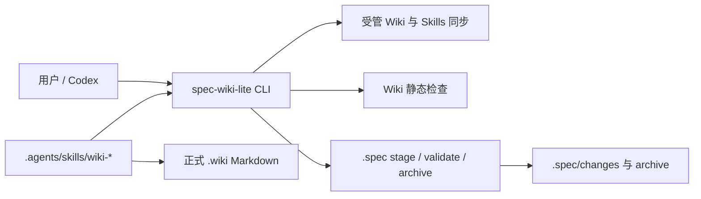

# build-specwiki-lite 设计方案

## 方案概述

把当前 Node wrapper + Rust runtime 架构替换为单一 TypeScript package。`spec-wiki-lite` 只负责三类确定性行为：同步受管 `.wiki`/Skills 资产、检查 Wiki 静态结构、管理 `.spec` stage/artifact。Agent 通过 `wiki-*` Skills 按需读取源码并直接编辑正式 Markdown，不建立持久化代码索引或 knowledge 中间层。

所有公开身份从 `spec-wiki` 切换为 `spec-wiki-lite@0.1.0`，不保留别名。历史 `.spec/archive/**` 不参与当前合同扫描，也不做迁移。

## 架构分析

### 目标结构



### 模块边界

| 模块 | 职责 | 明确不负责 |
| --- | --- | --- |
| `cli` | 参数解析、help、human/JSON 输出、退出码 | 文档业务判断和文件解析 |
| `core/assets` | package assets registry、ownership、init/update | 覆盖未登记用户页面 |
| `core/wiki` | frontmatter、INDEX、链接、orphan、SSOT 静态检查 | 源码 freshness、语义 query |
| `core/change` | metadata、stage、artifact、show/validate/archive | 实现或 review change 内容 |
| `core/path` | canonical id/path、repo containment、symlink guard | 自动修复非法路径 |

`packages/spec-wiki-lite/assets/wiki/**` 和 `assets/skills/wiki-*/**` 是发布资产真相。构建只生成 ESM JavaScript；staged package 不再携带 `lib/x64-win32`。

## 功能设计

### Init 与 Update

- `init [path]` 创建 `.wiki`、`.spec/changes`、`.spec/archive` 和 `.agents/skills`，默认 host 为 `codex`。
- `--host` 只接受 `codex`；其他值是 usage error。
- asset registry 为每个文件声明 `managed` 或 `scaffold`：
  - Skills 每次同步为 package 当前版本。
  - managed baseline 默认只补缺失，`--force` 才覆盖。
  - scaffold 和用户自有 `.wiki` 页面永不覆盖。
- `update` 在当前目录执行同一同步器，不创建第二套逻辑。
- 每次操作返回 created/updated/unchanged/preserved 列表；写入前做 repo containment 检查。

### Wiki Status

Wiki inspector 只扫描 `.wiki/**/*.md`，排除 `.wiki/.knowledge`、`.wiki/.cache`、`.wiki/pages` 等旧目录。它返回：

- 根 `.wiki/INDEX.md` 是否存在；
- 每个包含 Markdown 的目录是否有 `INDEX.md`；
- frontmatter 是否为 YAML object，且包含 `title/description/updated/owner`；
- 相对 Markdown 链接是否指向存在且仍位于 `.wiki` 的文件或目录；
- 非 INDEX 页面是否从某个 Wiki 页面可达；
- 非空 `source_of_truth` 是否被多个页面重复声明。

`status` 还聚合 Skills 文件存在性和 active changes，但不修改任何文件。健康问题进入结构化 `issues`；I/O 或解析失败才是 command failure。

### `.spec` Workflow

内置 stage 闭集沿用当前验证过的对象语言：`exploration/proposal/delivery/design/cases/tasks/implementation/review/verification`。required artifacts 按 stage 单调增加：

```text
proposal -> design -> system-tests -> tasks -> review-report + test-report
```

- `status` 列出 active changes、metadata、artifact presence 和 blocking issues。
- `show <id>` 返回 change 摘要；`--artifact` 只允许登记 artifact id，并读取固定文件名。
- `validate <id>` 校验 canonical id、metadata、stage required artifacts、parent/child consistency，以及 verification 的 full/pass 报告证据。
- `archive <id>` 只接受无 blocking issue 的 change。目标为 `.spec/archive/YYYY-MM-DD-<id>`，已存在即失败；普通/child 要求 verification full/pass，parent 要求全部 child 已实际归档。
- child 归档后用 YAML document API 更新 active parent metadata，并更新 split marker；任何不一致均 fail closed。

### Skills

发布八个 Codex Skills：`wiki-continue/explore/propose/design/plan/apply/review/archive`。Skills 消费同一 CLI，不复制 metadata schema；它们的职责边界与 UniSpec 阶段一致，但内容聚焦 Wiki 信息架构、证据、页面编辑和文档验证。

## 数据设计

- `.wiki/**`：唯一正式产品内容；不生成 metadata mirror、cache、knowledge 或 pages projection。
- `.spec/changes/<id>/**`：active workflow evidence。
- `.spec/archive/YYYY-MM-DD-<id>/**`：不可覆盖的历史 evidence。
- `.spec/config.yaml`：可为空，不作为运行依赖；保留扩展落点。
- `meta.yaml` 使用 YAML parser 读取，并保留未知字段；不使用字符串拼接解析结构化数据。

## 接口设计

### CLI

| 命令 | 核心输入 | 输出 |
| --- | --- | --- |
| `init` | optional path、`--host codex`、`--force` | asset sync + project status |
| `update` | `--force`、`--json` | asset sync report |
| `status` | `--json` | wiki/skills/changes 聚合状态 |
| `show` | canonical change id、optional artifact | summary 或 artifact text |
| `validate` | canonical change id、`--strict` | valid + issues |
| `archive` | canonical change id | archived target |

退出码固定为：成功 `0`，validation/not-ready `2`，I/O/domain failure `1`，usage error `64`。JSON 输出只写 stdout；human error 写 stderr。

### Package

- npm identity：`spec-wiki-lite@0.1.0`。
- bin：`spec-wiki-lite -> bin/spec-wiki-lite.js`。
- public library 只导出 `runBin`、`runCli` 和纯 TS project operations；删除 runtime invoker、binary resolver、query DTO 和 `tools`。
- `files` 只包含 `bin/**`、`dist/**`、`assets/**`。

## 非功能性设计

- 路径安全：change id 必须匹配 kebab-case；所有目标做 lexical containment，存在路径额外做 realpath containment；拒绝绝对路径、`..`、drive/UNC escape 和 symlink escape。
- 原子性：单文件写入使用同目录临时文件 + rename；archive 使用同文件系统 rename，目标冲突不覆盖。
- 可移植性：只依赖 Node.js `>=20.19.0` 和 `yaml`，manifest 不声明 `os/cpu`。
- 兼容性：这是 breaking redesign，不保留旧命令、包名和 runtime artifact。

## 资源评估

移除 Rust 编译、native binary、SQLite 和 runtime cache 后，不再新增运行资源；package 只包含 JavaScript、Markdown 和少量 YAML parsing 依赖。

## 风险与对策

| 风险 | 对策 |
| --- | --- |
| 大规模删除遗漏公开引用 | 新 current-surface contract test 扫描源码、README、Wiki；排除 archive |
| ownership 错误覆盖用户页面 | registry 显式分类，默认 preserve，force 仅覆盖 managed baseline |
| `.spec` 路径逃逸或错误归档 | canonical id + containment + realpath guard + collision tests |
| 内置阶段与 UniSpec 漂移 | 只借鉴对象语言和职责边界；SpecWiki 自有 TS schema/Skills/CLI 为唯一产品 authority |
| npm 名称状态变化 | 发布前重新查询；本 change 不执行 publish |

## 设计决策

- 使用 package assets 文件树而不是把长 Markdown 模板内嵌进 TypeScript。
- 使用单一 package 和单一 CLI，不保留 Rust governance 子集。
- 只支持 Codex，删除所有 compatible host 投影和 hook。
- `.spec` 是 Lite 用户的正式阶段状态，不创建 `.wiki/.changes`。
- 保留导航语义的 `INDEX.md`，删除索引引擎语义的 index。
- 新包从 `0.1.0` 开始，旧 `spec-wiki@0.2.0` 不提供兼容入口。

## 待确认问题

- 无；用户已确认包名、CLI 名、Codex-only、`.spec` 内置阶段和最终合并方向。

## 参考资料

- `proposal.md`
- `packages/spec-wiki/src/**` 当前 CLI、bootstrap 和 runtime forwarding 实现
- `scripts/run-tests.mjs` 与现有 distribution tests
- 来源：`@uni-sw/unispec@0.1.0` 的 stage、asset ownership 和 Skill 分层；目标落点：本设计的 `core/change`、`core/assets` 与 `wiki-*` Skills；采用方式：改写借鉴，不直接迁移实现或模板正文。
