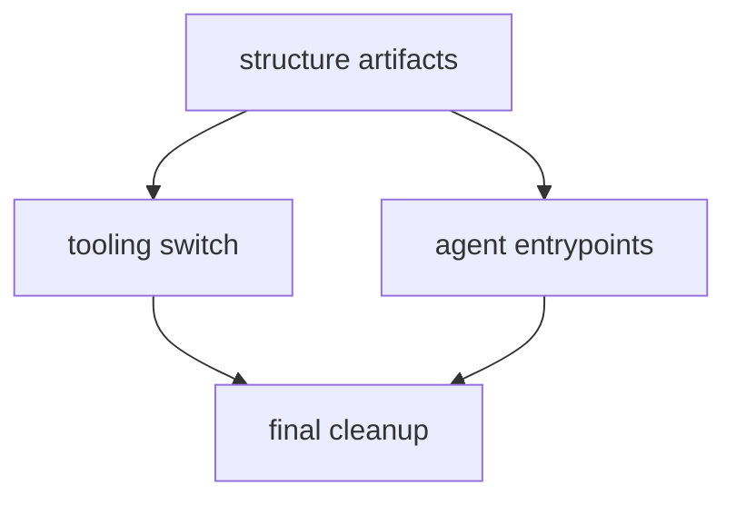

# migrate-project-governance-to-unispec 拆分方案

## 拆分原则

本 parent change 只承载治理体系迁移的 program 边界、顺序和依赖。每个 child 必须是可独立验收的 UniSpec single-change，不嵌套在 parent 目录下。

## Children

### 1. migrate-project-governance-to-unispec-structure-artifacts

- 目标: 建立 .spec 控制面，迁移 active / archive artifacts，并把稳定 capability baseline 沉淀到 .wiki。
- 依赖: 无。
- 归档状态: [ ] pending

### 2. migrate-project-governance-to-unispec-tooling-switch

- 目标: 将脚本、测试、lint ignore、scanner noise filter、runtime context filter 和 reference report 输出切换到 .spec / .wiki。
- 依赖: migrate-project-governance-to-unispec-structure-artifacts。
- 归档状态: [ ] pending

### 3. migrate-project-governance-to-unispec-agent-entrypoints

- 目标: 引入 UniSpec skills、reviewer agents 和必要的 Codex wrapper，移除旧 workflow 入口。
- 依赖: migrate-project-governance-to-unispec-structure-artifacts。
- 归档状态: [ ] pending

### 4. migrate-project-governance-to-unispec-final-cleanup

- 目标: 清理旧参考、旧术语和旧文件名，跑完整验证并形成迁移关闭证据。
- 依赖: migrate-project-governance-to-unispec-tooling-switch、migrate-project-governance-to-unispec-agent-entrypoints。
- 归档状态: [ ] pending

## Mermaid

