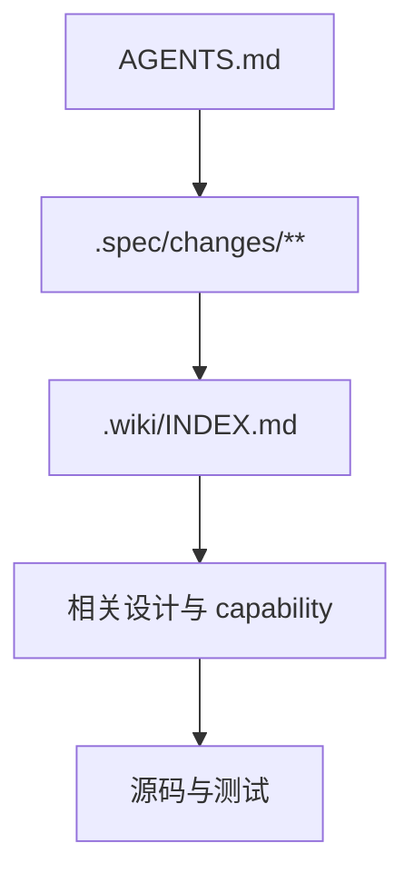

# Agent 协作入口

`AGENTS.md` 保存仓库执行约束，`.agents/skills/wiki-*` 保存阶段工作流，`.wiki/` 保存长期知识，`.spec/` 保存变更过程证据。四者不得互相复制正文。

## 进入顺序

1. 读取 `AGENTS.md` 的强约束。
2. 用 `spec-wiki-lite status` 确认 active change 和 Wiki 健康。
3. 使用 `wiki-continue` 按 stage 路由到对应 `wiki-*` Skill。
4. 从 [.wiki/INDEX.md](../INDEX.md) 读取稳定上下文，再核对源码与测试事实。

## 协作规则

- 需求或设计变化先写入 active change artifact。
- 实现阶段按 tasks 与测试证据推进，不跳过 required artifact。
- review 只有在完整门禁通过后才能写 full/pass。
- archive 前执行 strict validate；归档后只把仍长期有效的结论沉淀到 Wiki。
- upstream 引用必须声明来源、目标落点和采用方式。

Skills 的阶段与输入输出合同见 [Agents 设计](../06-设计文档/02-Agents设计.md)。
