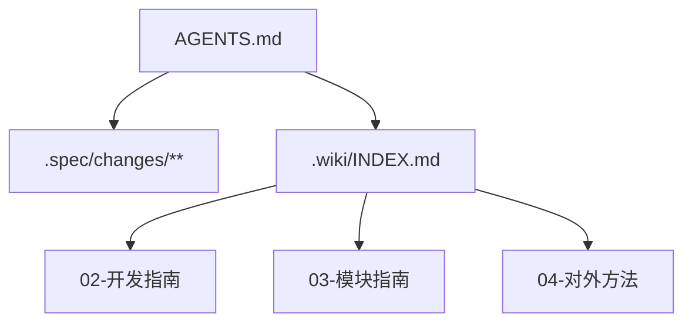

# Agent 协作入口

## 定位

`AGENTS.md` 是执行入口和强约束入口，适合放工作协议、必须遵守的规则和关键导航。

`.wiki/` 是长期项目知识入口，适合放稳定项目说明、开发约定、模块指南、对外契约索引和文档治理规则。

本页只说明二者如何配合，不复制 `AGENTS.md` 的强约束正文。执行时若本页与 `AGENTS.md` 冲突，以 `AGENTS.md` 为准。

## 进入项目时的阅读顺序

1. 先读 `AGENTS.md`，确认沟通、确认、reviewer、upstream 引用和图示规则。
2. 再看 `.spec/changes/**`，确认当前是否有 active change 需要优先遵守。
3. 需要项目长期知识时，从 [.wiki/INDEX.md](../INDEX.md) 进入。
4. 需要测试、脚本或参考实现边界时，进入 [02-开发指南](../02-开发指南/INDEX.md)。
5. 需要模块职责时，进入 [03-模块指南](../03-模块指南/INDEX.md)。
6. 需要 CLI、配置或运行时产物边界时，进入 [04-对外方法](../04-对外方法/INDEX.md)。

## 信息分流

| 信息类型 | 维护位置 |
| --- | --- |
| 强制执行协议 | `AGENTS.md` |
| active change 的 proposal / design / tests / tasks | `.spec/changes/**` |
| 已完成 change 的历史记录 | `.spec/archive/**` |
| 项目长期知识和导航 | `.wiki/**` |
| 代码、配置、测试事实 | 源码、配置、测试 |
| 阶段性设计稿和调研记录 | `.docs/**` |

## 协作边界

- 方案讨论先沉淀为明确落点，再决定是否修改文件。
- 涉及具体改动方案时，先经过 reviewer 审核。
- 引用 upstream 时必须标明来源、目标落点和采用方式。
- Wiki 页面只承接稳定结论；不把过程报告、review 明细或一次性调研原文搬入长期正文。
