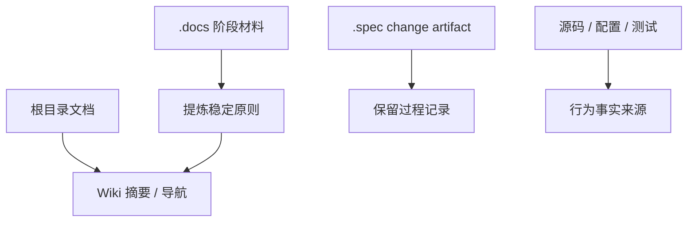

# 文档盘点与沉淀规则

## 分类原则

`.wiki/` 只承接长期稳定知识、入口导航和维护规则。其它文档如果已经是 SSOT，就保留原位；Wiki 只做摘要、链接和阅读路径。

## 根目录文档

| 文档 | 类型 | 处理方式 |
| --- | --- | --- |
| `AGENTS.md` | 执行入口和强约束 | 保留入口；后半段压缩为链接导航 |
| `README.md` | 英文产品入口 | 保留原位；Wiki 只在快速上手和 CLI 页摘要 |
| `README-CN.md` | 中文产品入口 | 保留原位；Wiki 只在快速上手和 CLI 页摘要 |
| `DESIGN-3.0.md` | 总体设计 SSOT | 保留原位；Wiki 只做模块与架构摘要 |
| `DESIGN-RUNTIME.md` | runtime 设计 SSOT | 保留原位；Wiki 只做 runtime 分层和产物摘要 |
| `DESIGN-AGENTS.md` | Agents 设计 SSOT | 保留原位；Wiki 只做宿主接入入口摘要 |
| `SCENE-1.md` / `SCENE-2.md` | 场景边界 | 保留原位；稳定场景可提炼到快速上手或对外方法 |
| `COMMENTING.md` | 注释规范 SSOT | 保留原位；Wiki 注释页只做摘要和入口 |
| `RELEASE-v0.2.0.md` | 版本发布说明 | 保留原位；只提炼稳定公开 surface 到对外方法 |

## `.docs` 文档

| 文档 | 类型 | 处理方式 |
| --- | --- | --- |
| `.docs/implementation-roadmap.md` | 迭代规划和历史路径 | 保留为阶段材料；稳定测试项目集信息可被测试页链接 |
| `.docs/graph-first-knowledge-runtime-redesign.md` | graph-first / knowledge-first 重设计草案 | 保留为未实现设计稿；采纳前先进入 UniSpec change artifact，不直接沉淀为稳定 Wiki |
| `.docs/knowledge-quality-gates-acceptance.md` | 质量门禁验收分析 | 提炼长期 gate 原则到测试验收和 capability 导航 |
| `.docs/karpathy-llm-wiki-analysis.md` | 外部理念分析 | 提炼理念和不采用边界到相关 capability 导航 |
| `.docs/knowledge-system-completeness-roadmap.md` | roadmap / program 材料 | 保留原位；不全文沉淀 |
| `.docs/v0-2-0-knowledge-runtime-gaps.md` | 缺口分析 | 保留原位；不全文沉淀 |
| `.docs/v0-2-0-release-gap-closure.md` | 发布收口过程 | 保留原位；不全文沉淀 |

## 包级与脚本文档

| 文档 | 类型 | 处理方式 |
| --- | --- | --- |
| `scripts/README.md` | 脚本布局和 gate 说明 | 保留原位；Wiki 脚本页只做长期语义摘要 |
| `crates/wiki-runtime/tests/README.md` | runtime test suite 说明 | 保留原位；摘要并入 runtime 模块页 |

## `.spec` 与 `.upstream`

| 区域 | 类型 | 处理方式 |
| --- | --- | --- |
| `.spec/changes/**` | active change artifact | 不搬入 Wiki；只在归档后提炼长期结论 |
| `.spec/archive/**` | archived change artifact | 保留历史记录；不复制报告原文 |
| `.upstream/**` | 本地参考实现 | 不作为当前项目正文；引用时必须标明来源、目标落点和采用方式 |
| `crates/**/fixtures/**/.wiki/**` | 测试 fixture | 不沉淀到项目 Wiki |

## 沉淀检查

新增或移动文档前，先回答：

1. 这是不是长期稳定知识？
2. 它的事实来源是不是源码、测试、配置、设计 SSOT 或 spec artifact？
3. 如果进入 Wiki，是写正文、摘要，还是只加链接？
4. 是否会和现有 README、DESIGN、COMMENTING、scripts README 或 `.spec` 形成双写？

无法确认时，先保留原位，不把推测写入长期 Wiki。
