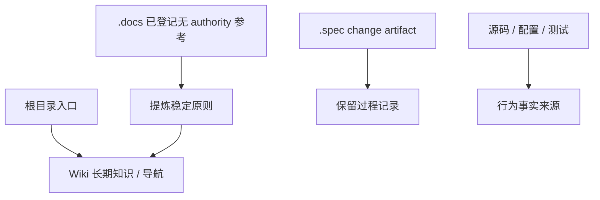

# 文档盘点与沉淀规则

## 分类原则

`.wiki/` 承接长期稳定知识、入口导航、设计 SSOT 和维护规则。根目录只保留产品入口与 Agent / 宿主入口；change 决策、设计和验证 artifact 留在 `.spec/`；`.docs/` 只保留由 inventory 显式登记且声明 `authority: none` 的外部理念或阶段参考。

## 根目录入口

| 文档 | 类型 | 处理方式 |
| --- | --- | --- |
| `AGENTS.md` | 执行入口和强约束 | 保留入口；后半段压缩为链接导航 |
| `CLAUDE.md` | Claude 宿主入口 | 保留为指向 `AGENTS.md` 的 symlink |
| `README.md` | 英文产品入口 | 保留原位；Wiki 只在快速上手和 CLI 页摘要 |
| `README-CN.md` | 中文产品入口 | 保留原位；Wiki 只在快速上手和 CLI 页摘要 |

## `.wiki` 长期文档

| 文档 | 类型 | 处理方式 |
| --- | --- | --- |
| `.wiki/06-设计文档/00-总体设计.md` | 总体设计 SSOT | 保留原位；Wiki 只做模块与架构摘要 |
| `.wiki/06-设计文档/01-Runtime设计.md` | runtime 设计 SSOT | 保留原位；Wiki 只做 runtime 分层和产物摘要 |
| `.wiki/06-设计文档/02-Agents设计.md` | Agents 设计 SSOT | 保留原位；Wiki 只做宿主接入入口摘要 |
| `.wiki/06-设计文档/03-核心场景.md` / `.wiki/06-设计文档/04-扩展场景.md` | 场景边界 | 保留原位；稳定场景可提炼到快速上手或对外方法 |
| `.wiki/02-开发指南/00-代码注释规范.md` | 注释规范 SSOT | 保留原位；Wiki 注释页只做摘要和入口 |

## `.docs` 文档

| 文档 | 类型 | 处理方式 |
| --- | --- | --- |
| `.docs/INDEX.md` | reference inventory | 唯一登记入口；不替代 `.wiki/` 或 `.spec` |
| `.docs/research/karpathy-llm-wiki-analysis.md` | 外部理念 reference | 声明 `authority: none`；只提炼理念和不采用边界到相关长期页面 |

当前除上表外没有 `.docs` survivor。新增 reference 必须同步更新 `.docs/INDEX.md` 并声明 `authority: none`；已迁移设计、已完成 roadmap、release/gap 材料和质量分析不保留重复文件或迁移存根。

## 代码目录 Markdown 边界

| 区域 | 类型 | 处理方式 |
| --- | --- | --- |
| `scripts/**` | 可执行脚本与内部模板 | 不保留局部 README；脚本说明沉淀到 [02-脚本与工作流](../02-开发指南/02-脚本与工作流.md) |
| `crates/**/tests/**` | 测试代码与 fixture | 不保留局部 README；测试说明沉淀到 [01-测试与验收](../02-开发指南/01-测试与验收.md) 或对应模块页 |
| `crates/**/fixtures/**/.wiki/**` / `crates/**/fixtures/**/.spec/**` | 测试 fixture | 保留为测试输入，不沉淀到项目 Wiki |

## Agent / Skill 资产

| 区域 | 类型 | 处理方式 |
| --- | --- | --- |
| `.agents/agents/*.md` | Agent reviewer / verifier 资产 | 保留原位；作为宿主可发现资产，不迁入 Wiki 正文 |
| `.agents/skills/**/SKILL.md` / `.agents/skills/**/references/*.md` | Agent skill 与模板资产 | 保留原位；长期协作规则只在 [03-Agent协作入口](./03-Agent协作入口.md) 摘要 |
| `.codex/skills/**/SKILL.md` / `.codex/skills/**/references/*.md` | Codex skill wrapper 与模板资产 | 保留原位；作为当前宿主入口资产，不迁入 Wiki 正文 |

## `.spec` 与 `.upstream`

| 区域 | 类型 | 处理方式 |
| --- | --- | --- |
| `.spec/changes/**` | active change artifact | 不搬入 Wiki；只在归档后提炼长期结论 |
| `.spec/archive/**` | archived change artifact | 保留历史记录；不复制报告原文 |
| `.upstream/**` | 本地参考实现 | 不作为当前项目正文；引用时必须标明来源、目标落点和采用方式 |
| `crates/**/fixtures/**/.wiki/**` / `crates/**/fixtures/**/.spec/**` | 测试 fixture | 不沉淀到项目 Wiki |

## 沉淀检查

新增或移动文档前，先回答：

1. 这是不是长期稳定知识？
2. 它的事实来源是不是源码、测试、配置、设计 SSOT 或 spec artifact？
3. 如果进入 Wiki，是写正文、摘要，还是只加链接？
4. 是否会和现有 README、`.wiki/06-设计文档/**`、`.wiki/02-开发指南/00-代码注释规范.md` 或 `.spec` 形成双写？

无法确认时，先保留原位，不把推测写入长期 Wiki。
