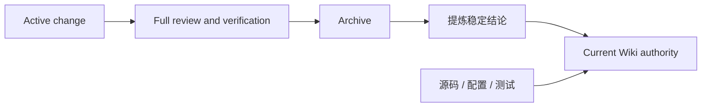

# 文档盘点与沉淀规则

## 当前 authority

| 范围 | 角色 | 维护规则 |
| --- | --- | --- |
| `README.md` / `README-CN.md` | 安装和公开使用入口 | 与 CLI help、package manifest 和发布合同一致 |
| `AGENTS.md` | 仓库执行约束 | 保持精简，详细知识链接到 Wiki |
| `.wiki/06-设计文档/**` | 当前稳定设计 | 不保存一次性报告或未采纳草案 |
| `.wiki/05-规格基线/**` | 当前 capability requirement | INDEX 与 capability 目录一致 |
| `.wiki/04-对外方法/**` | CLI、目录和发布合同 | 只描述用户可见行为 |
| `.agents/skills/wiki-*` | Codex 阶段工作流 | 源资产在 package，安装副本由同步器维护 |
| `.spec/changes/**` | active change artifact | 不复制到 Wiki |
| `.spec/archive/**` | 历史证据 | 默认只读，不作为当前 authority |

## 沉淀流程

- change 内的 proposal、design、tasks 和报告保留原位，不搬运全文。
- 只有已验证且仍具长期价值的结论进入 Wiki。
- `.docs/` 只保存显式登记为 `authority: none` 的参考材料；完成迁移的草稿应删除。
- `.tmp/` 保存本地 smoke、pack 和调试输出，不提交为产品文档。

## 检查清单

1. 目标内容是否稳定且值得长期维护？
2. 是否已有源码、测试、配置或 Wiki authority 可链接？
3. 新页面是否进入对应 `INDEX.md`，且没有形成重复 SSOT？
4. README、CLI、Skills 和发布合同是否仍指向同一产品身份？
5. `spec-wiki-lite status` 是否报告 Wiki ready？
