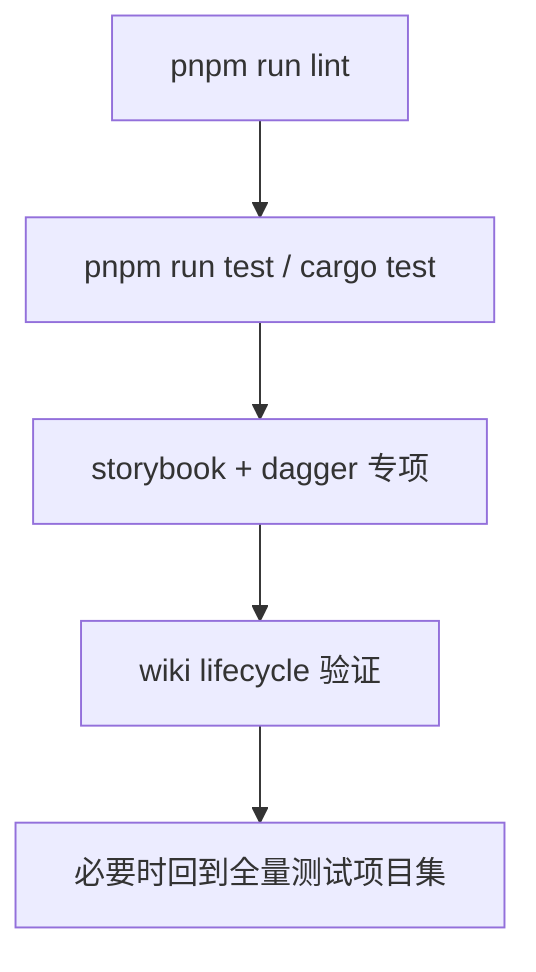

# 测试与验收

## 测试层级

| 层级 | 位置 | 用途 |
| --- | --- | --- |
| Rust crate 测试 | `crates/*/tests/` | core、runtime、scanner、query 和 storage 行为 |
| Agent 测试 | `agents/*/src/*.test.ts` | 宿主接入、参数收集、binary 调用和结果解析 |
| 工作区测试 | `scripts/tests/*.test.ts` | 跨包、staging、e2e 和工作区级检查 |
| 脚本级验证 | `scripts/*.mjs` | 发布、项目集验证、生命周期验证和报告收集 |

行为变化应补对应层级测试；不把样本项目名称、reference 标题或固定目录结构硬编码进 core 逻辑。

## 推荐验证顺序

| 命令 | 用途 |
| --- | --- |
| `pnpm run lint` | TypeScript / Markdown / workspace lint gate |
| `pnpm run test` | 工作区综合测试入口 |
| `cargo test` | Rust workspace 全量测试 |
| `node scripts/run-test-projects.mjs storybook dagger` | 页面质量和结构专项样本 |
| `node scripts/run-test-projects.mjs` | 批量测试项目 `init` baseline guard |
| `node scripts/test-wiki-lifecycle.mjs` | init / status / sync / query / update / rebuild 生命周期验证 |

## 当前专项样本

`storybook` 和 `dagger` 是页面质量专项验收样本，用于验证 core 抽象是否正确。

从样本仓库得到的结论应沉淀为通用规则，例如：

- `repo_archetype_signals`
- `knowledge domain`
- `knowledge unit`
- `leaf decomposition policy`
- `citation / diagram / compose policy`

## 报告落点

| 报告 | 落点 |
| --- | --- |
| active change 测试报告 | `.spec/changes/<change-id>/reference-project-reports/*.md` |
| archived change 测试报告 | `.spec/archive/<date-change-id>/reference-project-reports/*.md` |
| 脚本说明 | [02-脚本与工作流](./02-脚本与工作流.md) |
| 长期测试规则摘要 | 本页 |

测试报告、debug trace、review 明细和一次性分析不复制进 Wiki；归档后只沉淀仍然稳定的规则。

## 注释检查

每轮 UniSpec tasks 设计或测试阶段，都应单独检查注释是否符合 [00-代码注释规范](./00-代码注释规范.md)。本页是当前项目的注释规范 SSOT。
