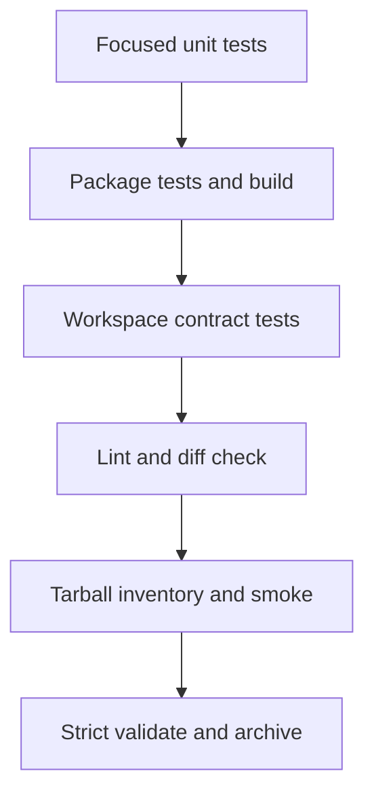

# 测试与验收

## 测试层级

| 层级 | 位置 | 用途 |
| --- | --- | --- |
| Core unit | `packages/spec-wiki-lite/src/core/**/*.test.ts` | assets、Wiki、change 和路径安全 |
| CLI/package | `packages/spec-wiki-lite/src/*.test.ts` | 命令闭集、参数、输出和退出码 |
| Workspace contract | `scripts/tests/*.test.ts` | current surface、分发清单和 tarball smoke |
| Self-host verification | `.spec/changes/<change-id>/` | 用新 CLI validate/archive 当前 change |

核心行为采用 TDD。每个 UT 对应 `tasks.md` 中的 Red、Green、Refactor 小任务：

1. Red 必须因目标行为缺失而失败，不能是语法、导入或环境错误。
2. Green 只实现使目标测试通过的最小行为。
3. Refactor 不增加新行为，并保持相关测试通过。

## 必测合同

- 默认中文、显式英文、配置失败关闭与未知字段保留；
- `init/update` 幂等、force ownership、自定义页面保留和 Codex-only；
- 当前双向语言迁移、旧英文 scaffold 升级、冲突预检和操作回滚；
- Wiki 根与栏目 `INDEX.md`、frontmatter、相对链接、orphan 和重复 SSOT；
- bootstrap marker、`wiki.ready` 与项目级 `ready` 的独立语义；
- stage 闭集、required artifacts、无效 YAML 与缺失 artifact；
- verification 的 review/test 报告必须为 full/pass；
- archive 目标冲突、parent/child 同步和失败回滚；
- traversal、绝对路径、非法 change id 与 symlink escape；
- tarball 安装后分别执行默认中文和显式英文 `init -> status`，并验证 bootstrap 完成；change 自举继续执行 `validate -> archive`。

## 推荐验证顺序

| 命令 | 用途 |
| --- | --- |
| `pnpm --dir packages/spec-wiki-lite run test` | package 全量单元测试 |
| `pnpm --dir packages/spec-wiki-lite run build` | package 编译验证 |
| `pnpm run test` | workspace 综合测试 |
| `pnpm run lint` | 静态质量检查 |
| `pnpm run build` / `pnpm run pack` | staging 与 tarball 验证 |
| `spec-wiki-lite validate <change-id> --strict` | change 自举校验 |
| `git diff --check` | 补丁格式检查 |

## 报告边界

- active change 的 `review-report.md` 与 `test-report.md` 只放在 `.spec/changes/<change-id>/`。
- 两份报告都必须使用 YAML frontmatter，归档证据要求 `scope: full` 且结果为 pass。
- `.wiki/` 只沉淀稳定规则和当前入口，不复制一次性日志、断言清单或完整报告。
- 历史 archive 只读，不因产品改名批量改写。
