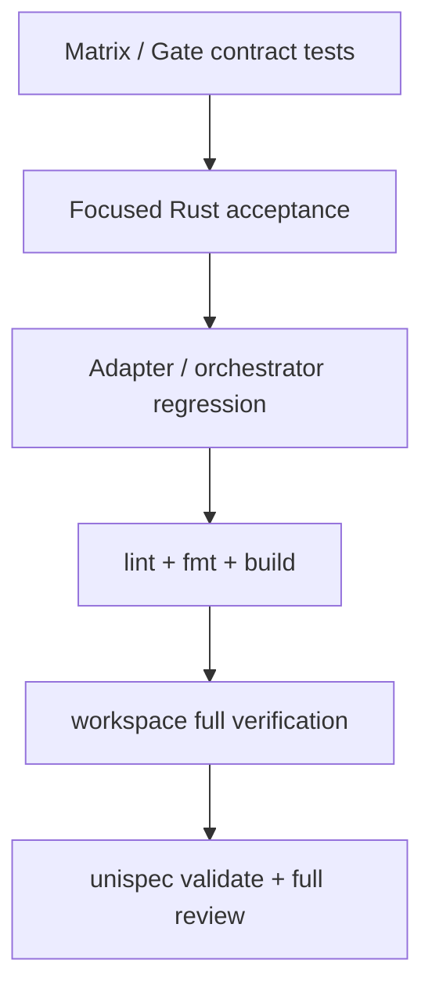

# 测试与验收

## 测试层级

| 层级 | 位置 | 用途 |
| --- | --- | --- |
| Rust crate/acceptance | `crates/*/tests/` | runtime、scanner、query、storage 与核心场景行为 |
| Package/Agent | `packages/*/src/*.test.ts`、`agents/*/src/*.test.ts` | CLI、宿主 adapter 和结果解析 |
| Workspace contract | `scripts/tests/*.test.ts` | 跨包、分发、gate、核心场景与文档合同 |
| Script adapter | `scripts/*.mjs` | lifecycle、project-set、reference input 和最终编排 |

行为变化必须补对应层级测试。核心场景实现采用 TDD，按 Red -> Green -> Refactor 记录小任务证据。

## Gate Authority

当前唯一合同是 `knowledge-quality-gates.v2`：

- gate decision：`pass / blocker / not_covered`。
- overall decision：`pass / blocker / incomplete / diagnostic`。
- required gate/primary/guard 未覆盖时为 `incomplete`，不得伪装成 pass。
- 一个 failure 只有一个 formal/primary owner；baseline guard 只保留 `failure_refs`。
- diagnostic 是 observation，不拥有 formal blocker。

默认退出策略为 `pass=0`、`blocker=1`、`incomplete/diagnostic=2`。显式 `report-only` 只把进程退出改为 0，JSON summary 中的真实 decision 不变。

Acceptance Plan 必须显式声明：

- `primary_fixtures`
- `required_primary_gates`
- `required_gates`
- `required_guards`
- `report_only`

样本名称和 companion gates 由每次 plan 注入，不在共享内核中固定。

## 推荐验证顺序

| 命令 | 用途 |
| --- | --- |
| `pnpm exec vitest run --config vitest.config.mjs scripts/tests/core-scenario-*.test.ts scripts/tests/quality-gates-contract.test.ts` | matrix、gate、orchestrator 与 Wiki 合同 |
| `cargo test -p wiki-runtime --test acceptance core_scenario_acceptance` | 9 场景 Rust 聚合证据 |
| `node scripts/run-core-scenario-acceptance.mjs --fixture-plan <path> --json` | 离线 acceptance 编排与统一退出 |
| `pnpm run lint` / `cargo fmt --all -- --check` | 静态质量与格式 |
| `pnpm run test` / `cargo test --workspace` | 最终全量回归 |

## 报告边界

- active change 的 review/test 报告只放 `.spec/changes/<change-id>/`。
- 归档报告只放 `.spec/archive/<date-change-id>/`。
- `.wiki/` 只保留稳定测试规则和当前入口，不复制一次性运行日志或报告正文。
- 每轮收口单独检查 [代码注释规范](./00-代码注释规范.md)。
