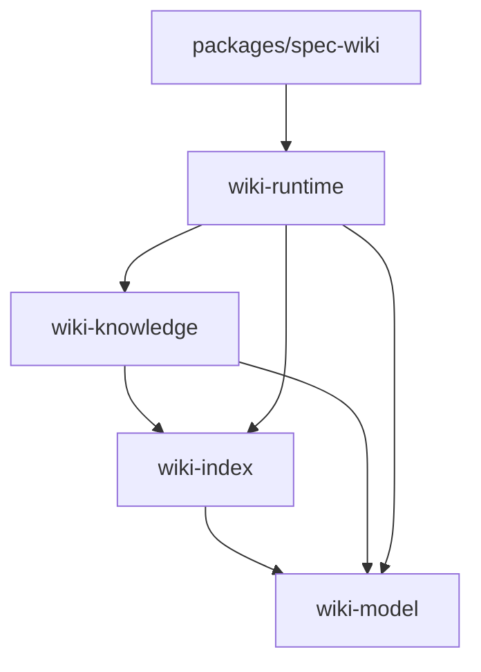

# 工作区总览

## KnowledgeDomain / KnowledgeUnit

| 项 | 内容 |
| --- | --- |
| KnowledgeDomain | workspace boundaries |
| KnowledgeUnit | package dependency map / runtime surface map |
| 输出层 | 项目级导航，支撑模块页阅读顺序 |

## 分层

## 事实来源

| 路径 | 用途 |
| --- | --- |
| `Cargo.toml` | Rust workspace 成员和依赖方向 |
| `pnpm-workspace.yaml` | JS workspace 包边界 |
| `package.json` | 根级构建、lint、test、publish 入口 |
| `packages/spec-wiki/package.json` | CLI 包名、bin、发布目标和局部脚本 |
| `.wiki/06-设计文档/00-总体设计.md` | 总体设计、四包架构和项目阶段约束 |
| `.wiki/06-设计文档/01-Runtime设计.md` | runtime 主路径、`.wiki/` 分层和生命周期 |
| `.wiki/06-设计文档/02-Agents设计.md` | 宿主接入、bootstrap、资产模型和扩展适配 |

## 目录职责

| 路径 | 职责 |
| --- | --- |
| `crates/wiki-model/**` | 共享模型、正式状态和跨 crate DTO |
| `crates/wiki-index/**` | facts / scanner / symbol / index 层 |
| `crates/wiki-knowledge/**` | KnowledgeUnit 主线上的 planning / research / compose 合同 |
| `crates/wiki-runtime/**` | workflow orchestration、projection、storage、transport、query route 和 `.wiki` 生命周期 |
| `agents/*` | 宿主接入层，只做参数收集、binary 调用、结果解析 |
| `scripts/*.mjs` | 根级 build / test / publish / dist 编排 |
| `scripts/tests/*.test.ts` | 跨包、staging、e2e、工作区级检查 |
| `dist/**` | 发布产物目录，不写业务逻辑 |
| `*.config.mjs` / `tsconfig*.json` | 共享工具链配置 |

本节是对当前工作区边界的归纳，不替代设计文档、源码、配置和测试。行为事实仍以源码和测试为准，架构边界仍以上方事实来源为准。

## 维护边界

- Rust core 分为 `wiki-model / wiki-index / wiki-knowledge / wiki-runtime` 四层。
- TypeScript CLI 不承载 Wiki 业务规则，只做宿主 bootstrap、命令解析、runtime forwarding 和结果解析。
- 新增模块页前先说明 KnowledgeDomain / KnowledgeUnit，不按目录机械扩张 Wiki。
- 新实现应沿 `Facts -> Knowledge Planning -> Research -> Compose -> Assemble` 主链推进。
- `PageContext`、`PlannedPage` 和 renderer 应服务于 KnowledgeUnit 主线，避免重新长出独立页面语义层。
