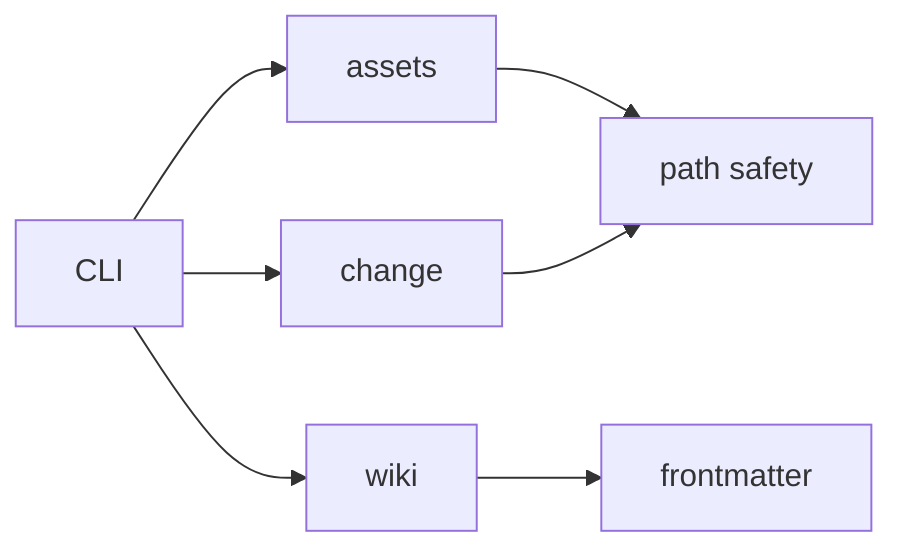

# 03-模块指南

本栏目按稳定职责说明 SpecWiki Lite 的实现。产品只有一个 TypeScript 包，模块之间通过普通函数和结构化返回值协作，不依赖本地服务或平台专属二进制。

## 模块总览

| 模块 | 稳定职责 | 事实来源 |
| --- | --- | --- |
| [00-工作区总览](./00-工作区总览.md) | 包边界、依赖方向和测试入口 | workspace manifests、根脚本 |
| [01-assets](./01-assets.md) | 项目目录、模板、Codex Skills 与资产所有权 | `core/assets/**`、`assets/**` |
| [02-wiki](./02-wiki.md) | `.wiki` Markdown、frontmatter、链接和导航检查 | `core/wiki/**`、`core/markdown/**` |
| [03-change](./03-change.md) | `.spec` stage、artifact、show、validate 与 archive | `core/change/**` |
| [04-CLI](./04-CLI.md) | 六个公开命令、输出和退出码 | `cli.ts`、`index.ts`、`bin.ts` |

## 依赖方向

## 维护要求

- 行为事实以 `packages/spec-wiki-lite/src/**` 和测试为准。
- 公开命令、参数和产物变化同步更新[对外方法](../04-对外方法/INDEX.md)。
- 长期设计边界回链到[总体设计](../06-设计文档/00-总体设计.md)和[Lite 内核设计](../06-设计文档/01-Lite内核设计.md)。
- `.wiki` 保存正式页面，`.spec` 保存 change 过程；模块实现不得创造第三套项目状态。
