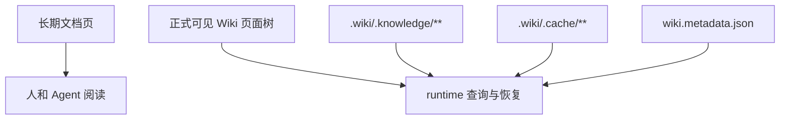

# 配置与运行时产物

## 适用场景

本页用于区分项目长期文档、UniSpec change artifact、runtime 产物和本地调试配置。

## 目录与文件边界

| 路径 | 用途 | 维护者 |
| --- | --- | --- |
| `.wiki/INDEX.md`、栏目 `INDEX.md` 与 `NN-主题.md` | 正式可见 Wiki 页面树 | 文档维护者 / `wiki-runtime` |
| `.wiki/.knowledge/**` | formal knowledge artifacts | `wiki-runtime` |
| `.wiki/wiki.metadata.json` | runtime metadata | `wiki-runtime` |
| `.wiki/.cache/**` | 可重建 cache | `wiki-runtime` |
| `.spec/changes/**` | active change artifact；治理 evidence truth | UniSpec workflow |
| `.spec/archive/**` | archived change artifact；治理 evidence truth | UniSpec workflow |
| `wiki.dev.yaml` | 本地 provider / retry / timeout / backoff 调试配置 | 本地开发者 |

## 文档整理与 runtime 产物的区别

docs-only 文档整理只更新长期文档页，不等同于 SpecWiki 初始化。完整 runtime 初始构建统一通过 `spec-wiki init` 的内部阶段完成，后续维护再使用 `update / sync / rebuild` 等动作。

## 公开产物边界

| 产物 | 是否应提交 | 说明 |
| --- | --- | --- |
| `.wiki/INDEX.md`、栏目 `INDEX.md` 与 `NN-主题.md` | 是 | 正式可见 Wiki 页面树 |
| `.wiki/.knowledge/**` | 按 runtime 规则 | formal knowledge artifacts |
| `.wiki/wiki.metadata.json` | 按 runtime 规则 | runtime metadata |
| `.wiki/.cache/**` | 否或可重建 | runtime cache |
| `.spec/changes/**` | 是 | active change artifact |
| `.spec/archive/**` | 是 | archived change artifact |

版本发布说明、gap closure 和已完成路线图不保留为 `.docs` 当前材料；稳定版本边界以 [v0.2.0 发布合同](./02-v0.2.0发布合同.md) 为 authority。`.docs` survivor 必须在 [.docs inventory](../../.docs/INDEX.md) 显式登记并声明 `authority: none`，只作为外部理念或阶段参考，不构成发布、设计或 backlog authority。

## 配置事实来源

- CLI 参数和行为以 `packages/spec-wiki/src/**`、`packages/spec-wiki/package.json` 和相关测试为准。
- Rust runtime 行为以 `crates/wiki-runtime/**` 和 `crates/wiki-runtime/tests/**` 为准。
- UniSpec change 结构以 `.spec/config.yaml`、`.spec/changes/**` 和 UniSpec 规范页为准。

## 维护要求

- 不把 `.spec/changes/**` 的 proposal / design / report 原文复制进长期 Wiki。
- 不手写 runtime cache。
- governance SQLite 表是 fingerprint 绑定的可重建摘要，不保存 `.spec` 正文，也不能作为治理 evidence truth。
- 修改公开 CLI 或配置行为时，同步检查 [00-CLI](./00-CLI.md) 和本页。
