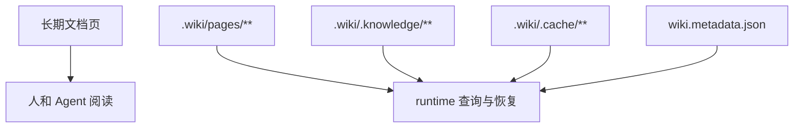

# 配置与运行时产物

## 适用场景

本页用于区分项目长期文档、UniSpec change artifact、runtime 产物和本地调试配置。

## 目录与文件边界

| 路径 | 用途 | 维护者 |
| --- | --- | --- |
| `.wiki/INDEX.md` 与栏目页 | 长期项目知识入口 | 文档维护者 |
| `.wiki/.knowledge/**` | formal knowledge artifacts | `wiki-runtime` |
| `.wiki/pages/**` | runtime 页面投影 | `wiki-runtime` |
| `.wiki/wiki.metadata.json` | runtime metadata | `wiki-runtime` |
| `.wiki/.cache/**` | 可重建 cache | `wiki-runtime` |
| `.spec/changes/**` | active change artifact | UniSpec workflow |
| `.spec/archive/**` | archived change artifact | UniSpec workflow |
| `wiki.dev.yaml` | 本地 provider / retry / timeout / backoff 调试配置 | 本地开发者 |

## `.wiki` docs-only 与 runtime 的区别

docs-only 初始化只更新长期文档页；runtime 初始化必须通过 `spec-wiki wiki init` 或后续 lifecycle 命令完成。

## 公开产物边界

| 产物 | 是否应提交 | 说明 |
| --- | --- | --- |
| `.wiki/INDEX.md` 与栏目页 | 是 | 长期项目知识入口 |
| `.wiki/.knowledge/**` | 按 runtime 规则 | formal knowledge artifacts |
| `.wiki/pages/**` | 按 runtime 规则 | runtime 页面投影 |
| `.wiki/wiki.metadata.json` | 按 runtime 规则 | runtime metadata |
| `.wiki/.cache/**` | 否或可重建 | runtime cache |
| `.spec/changes/**` | 是 | active change artifact |
| `.spec/archive/**` | 是 | archived change artifact |

版本发布说明、gap closure、路线图和一次性调研记录不属于公开产物合同本身；这些原文保留在根目录或 `.docs/**`，Wiki 只提炼长期稳定边界。

## 配置事实来源

- CLI 参数和行为以 `packages/spec-wiki/src/**`、`packages/spec-wiki/package.json` 和相关测试为准。
- Rust runtime 行为以 `crates/wiki-runtime/**` 和 `crates/wiki-runtime/tests/**` 为准。
- UniSpec change 结构以 `.spec/config.yaml`、`.spec/changes/**` 和 UniSpec 规范页为准。

## 维护要求

- 不把 `.spec/changes/**` 的 proposal / design / report 原文复制进长期 Wiki。
- 不手写 runtime cache。
- 修改公开 CLI 或配置行为时，同步检查 [00-CLI](./00-CLI.md) 和本页。
