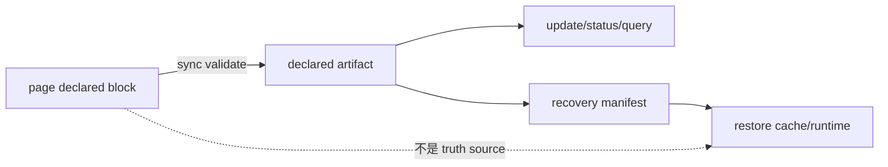

# Repo Wiki Runtime Design

## 文档定位

本文档描述的是整个 wiki 系统如何运行，而不只是 `wiki-runtime` 这个 crate。

它回答五类问题：

- 四个 crate 如何协作
- `.wiki/` 内部到底放什么
- query 是怎么走的
- `init / update / sync / rebuild / status / query` 的状态如何流转
- A 用户提交后，B 用户如何基于上库产物恢复本地 runtime

宿主接入、bootstrap、全局 CLI 与多宿主扩展模型不在本文档展开，单独见 [02-Agents设计](./02-Agents设计.md)。Query 的稳定输入输出、route-local ranking、状态、错误与延期能力由 [06-Runtime查询合同](./06-Runtime查询合同.md) 唯一定义。

## 参考实现边界

本文档允许在实现细节上借鉴本地参考仓库，但这些参考不直接构成当前 runtime 的真相来源。

当前原则：

- runtime 设计以本仓库的 3.0 思想、场景文档和当前代码演化目标为准
- 参考仓库必须以实际源码实现为依据，而不是只参考文档说明
- 如果旧设计里某条“参考结论”没有被重新验证到真实源码，可以推翻
- 参考仓库只用于帮助判断具体实现策略，例如索引、研究、投影、查询和消费层做法
- 参考仓库不直接决定 `.wiki/` 结构、知识分层或包边界

## 源码核实后的实现参考矩阵

这个矩阵只回答“某一层实现手法优先看哪个参考仓库”，不反向定义当前系统的设计边界。

| 参考仓库 | 参考层 | 源码证据 | 可采纳结论 |
| --- | --- | --- | --- |
| `deepwiki-rs` | `wiki-knowledge` 的 `research / compose orchestration` | [.upstream/deepwiki-rs/src/generator/workflow.rs](E:/project/!byAI/spec-wiki/.upstream/deepwiki-rs/src/generator/workflow.rs) `76-107` 明确分成 `preprocess -> research -> compose` 三段；[.upstream/deepwiki-rs/src/generator/step_forward_agent.rs](E:/project/!byAI/spec-wiki/.upstream/deepwiki-rs/src/generator/step_forward_agent.rs) `34-77` 定义 `DataSource` 与 `AgentDataConfig`；[.upstream/deepwiki-rs/src/generator/compose/agents/overview_editor.rs](E:/project/!byAI/spec-wiki/.upstream/deepwiki-rs/src/generator/compose/agents/overview_editor.rs) `26-35` 直接声明 compose 依赖 research result | 可以参考“先 research，再由 compose 消费 research 产物”的编排方式，也可以参考按 agent 声明输入依赖的 contract 设计 |
| `CodeWiki` | `wiki-knowledge` 的 `leaf-first assembly` | [.upstream/codewiki/codewiki/src/be/documentation_generator.py](E:/project/!byAI/spec-wiki/.upstream/codewiki/codewiki/src/be/documentation_generator.py) `74-85` 先递归处理 children 再处理 parent；同文件 `99-123` 在父级 overview 生成前装入一层子文档；同文件 `201-223` 明确 parent doc 基于 children docs 生成 | 可以参考“叶子先产出，父级再消费子级结果”的装配顺序，适合知识单元投影和稳定 page 的逐层汇总 |
| `GitNexus` | `wiki-index` 的 `index / symbol / graph / resolution substrate` | [.upstream/GitNexus/gitnexus/src/core/ingestion/model/symbol-table.ts](E:/project/!byAI/spec-wiki/.upstream/GitNexus/gitnexus/src/core/ingestion/model/symbol-table.ts) `90-174` 有 `fileIndex / globalIndex / callableIndex / fieldByOwner`；[.upstream/GitNexus/gitnexus/src/core/ingestion/pipeline.ts](E:/project/!byAI/spec-wiki/.upstream/GitNexus/gitnexus/src/core/ingestion/pipeline.ts) `97-99` 定义 `20MB` chunk budget，`479-488` 明确 parse / import / call / heritage 分阶段 loop，`254-281` 有跨文件绑定传播，`672-678` 在 call resolution 前做 wildcard import synthesis 与 type seeding；[.upstream/GitNexus/ARCHITECTURE.md](E:/project/!byAI/spec-wiki/.upstream/GitNexus/ARCHITECTURE.md) `19` 明确 ingestion pipeline 是 phase DAG，`66-67` 给出 `scan -> structure -> parse -> crossFile -> mro -> communities -> processes`，`82-85` 说明关键阶段的依赖与职责 | 可以从三层参考它：一是“厚索引底座”，让 `provider / agent` 先命中 file-symbol-edge 图事实，再做更高层 query；二是 `query / impact / graph consumption` 侧的工具化组织，尤其适合方法定位、调用关系、跨文件解析和 impact analysis；三是 `wiki-index` 内部的 phase DAG 编排与阶段拆层，用于提升索引构建的可演进性与可诊断性，但这不构成 knowledge 主链模板 |
| `deepwiki-open` | `wiki-runtime` 或 query 面的 `session / RAG / consumption layer` | [.upstream/deepwiki-open/api/data_pipeline.py](E:/project/!byAI/spec-wiki/.upstream/deepwiki-open/api/data_pipeline.py) `153-180` 递归读文档，`382-446` 建 `splitter + embedder` pipeline，`831-912` 优先复用本地 DB；[.upstream/deepwiki-open/api/websocket_wiki.py](E:/project/!byAI/spec-wiki/.upstream/deepwiki-open/api/websocket_wiki.py) `88-115` 准备 retriever，`189-242` 以 query 拉取上下文，`268-313` 明确它是面向 query 的多轮研究流程 | 可以参考 query/session 侧如何组织检索上下文、如何复用本地检索库、如何围绕用户问题做消费层编排，但它不是 core 生成主链模板 |

## 运行时总架构

```text
                +------------------+
                |   Scan Code      |
                +------------------+
                         |
                         v
                +------------------+
                |   Build Index    |
                | file symbol edge |
                +------------------+
                         |
                         v
                +------------------+
                |  Plan Knowledge  |
                | unit / domain    |
                +------------------+
                         |
                         v
                +------------------+
                | Research / Merge |
                +------------------+
                         |
                         v
                +------------------+
                | Knowledge Store  |
                +------------------+
                    |          |
           +--------+          +--------+
           |                            |
           v                            v
   +------------------+       +------------------+
   | Query for AI     |       | Page Projection  |
   | fast find path   |       | only if needed   |
   +------------------+       +------------------+
```

对应到四包：

```text
wiki-model
  -> 提供稳定共享对象

wiki-index
  -> 产出 files / symbols / edges / module tree / graph facts

wiki-knowledge
  -> 产出 domains / units / research / records / projections

wiki-runtime
  -> 编排 workflow / query / storage / transport / lifecycle
```

## 双主链

本系统同时存在两条正式主链：

生成链：

```text
Facts -> Knowledge Planning -> Research -> Compose -> Assemble
```

查询链：

```text
symbol -> graph -> declared knowledge -> derived knowledge -> page
```

含义：

- 生成链负责把代码事实组织成知识并落成正式产物
- 查询链负责让人和 Agent 先命中最有效的答案层，而不是默认先翻 page

当前 `v0.2.0` 对这两条主链的公开承诺，已经收稳为 `minimal formal knowledge runtime`：

- 已正式承诺最小 `KnowledgeUnit / declared record / research summary / projection digest / health signal` 合同
- 已正式承诺 `status / query / sync / update / rebuild` 的最小运行语义
- 未承诺完整 knowledge system
- 未承诺 provider-backed 大仓库样本已稳定完成 full compose

## 包边界与依赖合同

### 依赖方向

```text
wiki-model      <- 所有包依赖它
wiki-index      <- 依赖 wiki-model
wiki-knowledge  <- 依赖 wiki-model + wiki-index
wiki-runtime    <- 依赖 wiki-model + wiki-index + wiki-knowledge
```

### 包边界

- `wiki-model`
  - 负责稳定共享模型、公共枚举、query DTO 和正式 state/metadata 对象
  - 不负责 workflow、索引构建、knowledge 生成或运行时落盘
- `wiki-index`
  - 负责 scan、symbols、graph facts、module tree 与 index-first query 底座
  - 不负责 declared knowledge、page projection 或 `.wiki` 生命周期
- `wiki-knowledge`
  - 负责 knowledge planning、research、compose、declared/derived knowledge 与 projection decision
  - 不负责 transport、CLI/IPC、`.cache` 恢复或宿主集成
- `wiki-runtime`
  - 负责 workflow orchestration、query route、storage、transport、`.wiki` 生命周期与恢复
  - 不重新拥有 facts/index 和 knowledge 的主实现，只负责编排它们

### 宿主边界

- `Agents` 只负责宿主接入、参数收集、binary 调用与结果消费
- `Agents` 的公共 bootstrap 内核、资产模型与宿主扩展方式见 [02-Agents设计](./02-Agents设计.md)
- `Agents` 不承载 Wiki 业务规则，不重写知识模型与 query 语义

### 当前阶段明确不拆

- `wiki-page`
- `wiki-storage`
- `wiki-llm`
- `wiki-query`

原因：

- 当前对象模型和知识生命周期仍在演化
- 过早细拆只会放大 DTO、trait 边界和循环依赖成本
- 当前收益最大的边界不是更碎，而是先把四层收稳

## 核心对象分层

### Layer A: Code Facts / Index

回答：

- 代码里有什么
- 方法在哪
- 符号之间如何调用
- 哪些入口和模块最相关

主要对象：

- file
- symbol
- edge
- process
- community
- module tree

特点：

- 可重建
- 确定性优先
- 是 `query` 和 `impact analysis` 的第一入口

### Layer B: Derived Knowledge

回答：

- 系统从 facts 中整理出了什么知识
- 哪些知识域和知识单元成立
- 哪些内容值得做稳定摘要或 page 投影

主要对象：

- `KnowledgeDomain`
- `KnowledgeUnit`
- research packet
- digest / summary
- projection state

特点：

- 来源于 facts，但不是 facts 本身
- 允许持续刷新
- 可能变化快于 declared knowledge

### Layer C: Declared Knowledge

回答：

- 团队明确声明了什么规范、约定、决策、避坑
- 这些知识适用于什么范围
- 当前是生效、冲突、过时还是被替代

主要对象：

- convention
- policy
- guideline
- pitfall
- decision
- workflow rule

特点：

- 需要可审计
- 需要作用范围
- 需要状态与来源
- 既服务人读，也服务 Agent 约束

## `.wiki/` 运行时结构

```text
.wiki/
├─ INDEX.md
├─ <栏目>/
│  ├─ INDEX.md
│  └─ NN-主题.md
├─ .knowledge/
│  ├─ declared/
│  ├─ derived/
│  └─ runtime/
├─ wiki.metadata.json
└─ .cache/
```

### `.wiki/.knowledge/`

这是 Git-tracked 的知识层。

职责：

- 保存正式知识记录
- 保存知识摘要与投影所需的稳定对象
- 为 query、update、rebuild 和协作恢复提供上库基础

建议子层：

- `declared/`
  - 人明确声明的规范、约定、避坑、政策、决策
- `derived/`
  - 系统从 facts 中提炼出的知识摘要、模式和单元级结果
- `runtime/`
  - 需要上库的轻量运行时状态，例如投影绑定、知识版本、恢复锚点

### declared artifact contract

当前 `declared/**` 不再只是最小 writeback 占位，而是正式 truth layer。

最小约束：

- declared record 必须具备稳定 `record_id` 与 `authoring_id`
- scope 必须是 typed scope object，而不是松散字符串
- lifecycle 关系最小只承诺 `deprecated / replaced_by / supersedes`
- page 只是 authoring surface；正式 declared truth 以 `.wiki/.knowledge/declared/**` 为准

恢复前提也要一起成立：

- `wiki.metadata.json` hash 一致
- `.wiki/.knowledge/declared/**` snapshot 一致
- 正式可见 Wiki 页面树当前内容仍与 metadata 记录的 content hash 一致



### 正式可见 Wiki 页面树

这是正式 page 投影层和 authoring surface。

职责：

- 提供面向人阅读的稳定入口
- 为 Agent 提供补充上下文与稳定引用锚点

原则：

- page 是 projection，不是主本体
- 不允许为了“看起来很全”而盲目增殖 page
- 新知识默认先进入记录或摘要层，足够稳定再升级为 page
- 页面路径只允许 `.wiki/INDEX.md`、`.wiki/<栏目路径>/INDEX.md` 和 `.wiki/<栏目路径>/NN-主题.md`
- `.wiki/pages/**` 位于 runtime surface 外，不作为写入、恢复、query 或 status 目标

### `wiki.metadata.json`

这是 Git-tracked 的正式索引层。

职责：

- 保存 page、knowledge、scope、状态、版本和恢复所需的稳定索引
- 为 query route、sync、cache rebuild 提供正式入口

不负责：

- 不承载全部知识正文
- 不替代 `.knowledge`
- 不替代 `.cache`

### `.wiki/.cache/`

这是本地运行时缓存层，不上库。

职责：

- 加速 query、update、rebuild
- 保存可重建的派生运行时结构

原则：

- 不是正式真相源
- 应可由 `.knowledge + 正式可见 Wiki 页面树 + wiki.metadata.json` 重建
- 如果本地代码与上库状态不一致，恢复后应显式标记为 `stale` 或 `needs_update`

### 两级恢复合同

恢复必须区分正式知识/runtime mirror 与本地 code graph，不能把“cache 可重建”解释成所有索引事实都能从 Wiki 恢复：

```text
Level 1: formal knowledge + official page tree + metadata
  -> 校验 committed snapshot manifest
  -> 恢复本地 knowledge/runtime mirror
  -> readiness.restored_level = level1

Level 2: current repository sources
  -> 重新扫描并构建 graph snapshot
  -> 完成 symbol / edge / graph readiness
  -> readiness.restored_level = level2
```

稳定约束：

- Level 1 只消费 `.wiki/.knowledge/**`、正式页面树、`wiki.metadata.json` 与 `.wiki/.knowledge/runtime/snapshots/<snapshot-id>/manifest.yaml`。
- Level 1 不执行 planning、research、compose 或 assemble，也不能从 Markdown 反推 declared/derived truth。
- Code graph 是当前源码的本地可重建 facts；formal knowledge snapshot 不能伪造 graph ready。
- graph 缺失时可以恢复 knowledge/projection 可消费态，但 `readiness.index` 必须保持 `missing / stale / blocked` 等真实状态。
- 只有重新扫描并提交 graph snapshot 后，才可把 index readiness 提升为 ready。

## 什么上库、什么不上库

上库：

- `.wiki/.knowledge/**`
- `.wiki/INDEX.md`、栏目 `INDEX.md` 与 `NN-主题.md`
- `.wiki/wiki.metadata.json`

不上库：

- `.wiki/.cache/**`

理由：

- `.knowledge / 正式可见 Wiki 页面树 / meta` 共同组成可共享、可审计、可恢复的正式产物
- `.cache` 只是本地派生层，应该始终可丢弃、可恢复

## Page Projection 策略

### 投影对象与 ownership

投影链中的对象分工必须明确：

```text
PagePlan / SectionPlan
  -> knowledge planning contract
  -> PageDraft
       -> transient compose/render input
       -> Markdown + SectionBinding
       -> ProjectionDigest
            -> persistent projection recovery anchor
```

- `PagePlan / SectionPlan` 属于 knowledge planning 合同，描述要投影什么，不承载 Markdown 磁盘状态。
- `PageDraft` 是临时 compose/render 输入，不是 truth、snapshot identity 或 restore anchor。
- `SectionBinding` 绑定 `section_id / owner_kind / knowledge_refs / source_refs / input_hash / content_hash / projection_digest_ref`。
- `ProjectionDigest` 持久化页面、section、输入、renderer、内容 digest 和状态原因，是 projection recovery anchor。
- section ownership 闭集为 `declared_managed / derived_managed / projection_static / manual_unmanaged / external_ref`。
- marker v2 必须显式携带稳定 id、owner、version 和 hash/binding 信息；缺失、损坏或 binding 不一致时 fail closed，不按标题猜测旧 managed boundary。

crate 边界：

- `wiki-knowledge` 规划 `PagePlan / SectionPlan` 并校验/规范化 declared record，不解析 marker、不写 Markdown。
- `wiki-runtime` 负责 marker parse、render、merge、文件写入、metadata binding、ProjectionDigest 和 stale/conflict commit。
- `wiki-runtime` 不从 Markdown 反推 derived knowledge；页面只可作为 declared authoring surface。

declared writeback 唯一路径：

```text
runtime extract declared authoring block
  -> wiki-knowledge validate / normalize / merge lifecycle
  -> runtime persist declared artifact
  -> runtime update metadata / projection digest / stale state
```

### 默认策略

新知识产生时，默认先更新：

- 知识记录
- 知识摘要
- 投影状态

不是默认直接长 page。

### 何时升级为 page

满足下列条件时可升级：

- 主题足够稳定
- 适用范围明确
- 被重复查询或重复引用
- 具备长期阅读价值

典型保留 page：

- 项目概览
- 系统架构
- 规范索引
- 故障排查索引
- 少量稳定主题页

## Query Route

Query workflow 把各分层的可用事实、知识、治理和投影交给 Runtime 统一装配，由 Runtime 决定 route、排序、可信度、降级和恢复动作。查询过程在本文中只保留主链责任：

```text
external query
-> runtime fusion and fallback policy
-> canonical response
-> CLI / Agents thin consumption
```

稳定 request/response 字段、route/ref 闭集、route-local ranking、readiness/trust/provenance 矩阵、typed errors 和 richer query 延期边界统一见 [06-Runtime查询合同](./06-Runtime查询合同.md)。本页不再维护第二份字段清单或 route 状态机。

## Governance Runtime 边界

`.spec/changes/**` 与 `.spec/archive/**` 是治理 evidence truth。治理状态不进入 core `RuntimeReadiness`，也不复用 source `ChangeSet`：

```text
.spec evidence
  -> FsGovernanceEvidenceStore
  -> GovernancePolicy
  -> GovernanceSummary / validation result
  -> rebuildable SQLite governance cache
  -> status / query / update composition
```

稳定约束：

- `wiki-model::domain::governance` 定义跨 crate 和 transport 共享的对象语言。
- `GovernancePolicy` 是 required artifact、metadata、review/verification gate 与 parent/child consistency 的唯一产品规则所有者。
- SQLite 只保存 fingerprint、summary、change/artifact/issue refs；cache 可丢弃，不保存 artifact 正文，不替代 `.spec`。
- `status` 读取 live evidence 并只比较 cache freshness，不写 cache。
- `validate` 绕过 cache，对 live evidence 执行只读 policy。
- `update` 独立刷新 governance cache；`.spec`-only 变化不触发 scan、symbol graph、knowledge compose 或页面重写。
- `query` 只消费 fingerprint 一致的 cached refs；blocked 且尚无 cache 时可以从 live blocking issues 返回 diagnostic refs，仍不读取正文。
- 产品 next action 的优先级是 core `init/rebuild` blocker、governance blocker、其它 core maintenance、governance stale。治理 blocker 使用 `review_governance`。

### Archive durable operation

`archive` 是治理写流程，不是 Wiki 生命周期动作：

- 默认模式是 dry-run，只执行 live validate/readiness、生成 manifest 和 precondition digest，不创建 `.spec/.runtime`。
- `--apply` 才创建 immutable `plan.json`、append-only checkpoints、staging 和最终 `result.json`。
- `--resume <operation-id>` 只消费已持久化 plan/staging，并对 source、target、parent 和 result 做 fail-closed reconcile。
- sibling child 共享 parent 时必须使用同一 mutation-set OS advisory lock。
- parent metadata/split、source tree、target absence 和 staging hash 都属于 precondition；未知外部修改不得静默覆盖。
- archive 不调用 Wiki sync/update/rebuild，也不写 `.wiki/**`；Wiki 相关信息只通过 issues/refs 报告。
- 未采用旧草稿中的 `--yes`、强制 wiki-sync、workspace validate、doctor、repair 或 trace 设想。

### Query 实现参考与演进边界

本页前文的参考实现矩阵只能帮助 `wiki-index` 和 Runtime 选择工程手法，不构成 query 合同来源。后续新输入、新 route 或质量信号只有在 [06-Runtime查询合同](./06-Runtime查询合同.md) 的升级条件满足并经独立 change 验证后，才能进入公开合同。

## Workflow 生命周期

### `init`

目标：

- 首次建立 index、knowledge、page projection、metadata 和本地 cache

主路径：

```text
scan
-> build index
-> plan knowledge
-> research
-> compose
-> assemble
-> write .knowledge / official page tree / meta / .cache
```

### `update`

目标：

- 在代码变更后更新相关知识，而不是盲目重写全部 page

主路径：

```text
detect affected facts
-> locate affected knowledge scope
-> refresh derived knowledge
-> merge or append declared/linked records when needed
-> refresh impacted projections
-> update metadata and cache
```

### `sync`

目标：

- 处理人改 page、人声明规则、知识记录变化与 runtime 之间的同步

关注点：

- 记录变化是否需要更新 page
- page 是否与知识记录脱节
- 当前状态是 `ready`、`stale`、`needs_update` 还是 `conflict`

约束：

- 只有合法 `declared_managed` section 或等价结构化 authoring block 可以回写 `.wiki/.knowledge/declared/**`。
- `derived_managed`、`projection_static` 或 marker 被破坏的 section 不得回写 knowledge，只能产生 `illegal_drift`、`metadata_only`、`stale` 或 `conflict`。
- 普通 `manual_unmanaged` section 不被 runtime 覆盖，也不会自动转成 declared knowledge。

### `rebuild`

目标：

- 丢弃本地 cache 或派生层后，从正式产物和当前代码重新构建运行时

### `status`

目标：

- 告知当前 runtime 是否可用、是否过时、是否存在冲突或待同步事项

### `query`

目标：

- 在 facts、knowledge 和 page projection 之间做正式路由，而不是继续 page-first

## 协作恢复场景

对应 [03-核心场景](./03-核心场景.md) 的场景 9。

场景：

- A 用户执行 `init` 或 `update`
- A 用户提交 `.wiki/.knowledge/`、正式可见 Wiki 页面树、`wiki.metadata.json`
- B 用户拉取代码，但本地没有 `.cache`

期望流程：

```text
read .knowledge + official page tree + meta
-> rebuild local .cache
-> verify current repo state
-> mark ready / stale / needs_update
```

约束：

- B 不应被强制重新全量 `init`
- `.cache` 恢复成功后应可直接 `query`
- 如果当前代码比上库 wiki 更新，应允许恢复后进入增量校正

## 主动声明规范与知识生命周期

对应 [03-核心场景](./03-核心场景.md) 的场景 6、7、8。

### 主动新增规范

例如用户主动增加“注释规范”：

```text
declare convention/policy
-> bind scope
-> write declared record
-> refresh summary/projection
-> make query and agent prompt consumable
```

### 规范废弃或替代

不是简单从系统里“物理删除”。

更合理的是：

- 修改记录状态
- 标记为 deprecated / replaced
- 记录替代关系
- 刷新投影与查询结果

当前 authoring 约束也要写死：

- 若同一 section 内需要并存多条同 `kind + scope` 的 declared record，必须显式提供不同 `id`
- `deprecated`、`replaced_by`、`supersedes` 不能随意混用，必须能唯一推导 lifecycle status
- relation target 必须存在于 merged declared snapshot，且保持同 kind、同 canonical scope、无环

### bug 经验升级

bug 修复后默认先沉淀为 pitfall record。

只有当满足下列条件时再升级为 convention 或 policy：

- 被重复验证
- 适用范围清晰
- 不再只是一次性事故

## 冲突治理

当声明型知识与现实代码不一致时，系统不能静默选边。

必须显式暴露：

- 冲突对象
- 事实侧证据
- 规则侧证据
- 当前暂定状态
- 下一步治理建议

## 一句话总结

```text
3.0 的运行时不是“把 Markdown 写进 .wiki”这么简单，
而是让 facts、derived knowledge、declared knowledge、page projection 和 local cache 各归其位，并能被人和 Agent 共同消费。
```
