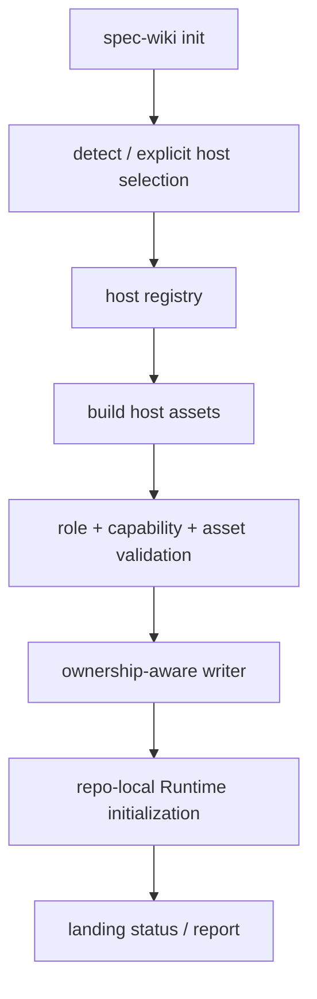
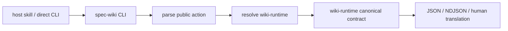

# Agents 设计

## 文档定位

本文是 `packages/spec-wiki` 与 Agents 宿主接入的专题 authority，负责：

- reference / compatible host 角色与兼容顺序；
- `spec-wiki init` 的宿主选择、资产规划、受管写入和报告；
- action skills、trigger guidance、宿主专属 hooks/settings 的边界；
- 一级 CLI 到 `wiki-runtime` 的 forwarding；
- host trigger、host-agent bridge、provider request-local session 的分层。

本文不重新定义 Runtime workflow、query route、ranking、readiness、trust、answer 或 `.wiki/` 生命周期。这些分别以 [01-Runtime设计](./01-Runtime设计.md) 和 [06-Runtime查询合同](./06-Runtime查询合同.md) 为准。

## Authority 与兼容顺序

当前宿主策略是 Codex-first：

| 宿主 | 角色 | 兼容优先级 | 当前真实投影 |
| --- | --- | --- | --- |
| Codex | `reference` | 第一 | repo-local `.codex/skills/wiki-*/SKILL.md` |
| Claude | `compatible` | 第二 | repo-local `.claude/skills/wiki-*/SKILL.md` |
| CodeBuddy | `compatible` | 第三 | repo-local `.codebuddy/skills/wiki-*/SKILL.md`、hooks、settings |

公共合同的设计与验证顺序固定为：

```text
shared kernel
  -> Codex reference projection
  -> Claude compatible projection
  -> CodeBuddy compatible projection
```

Codex 是唯一 reference host。Claude 与 CodeBuddy 必须消费共享 action、trigger taxonomy 和 Runtime canonical DTO，不得维护另一套业务语义。CodeBuddy 的 prompt hook、SessionStart hook 和 settings integration 是次级适配能力；这些机制不能反向决定公共对象语言、trigger policy 或 Runtime 架构。

## 当前职责边界

### `packages/spec-wiki`

TypeScript 主包负责：

- 解析一级 CLI 与宿主选择参数；
- 检测或显式选择 Codex、Claude、CodeBuddy；
- 构建宿主 bootstrap 资产并按 ownership 规则写入；
- 将 lifecycle/governance 请求转发到 Rust 执行面；
- 解析 JSON / NDJSON，翻译 human 输出、错误与退出码；
- 组装 npm 发布产物和平台 runtime。

它不负责：

- 重建 facts、knowledge、compose、assemble 主链；
- 在 TypeScript 或宿主文案中计算 query route、ranking、readiness 或 answer；
- 将 trigger decision 当作 Runtime response 或 provider session；
- 为某个 compatible host 复制独立业务规则。

### `wiki-runtime`

Rust Runtime 负责：

- `Facts -> Knowledge Planning -> Research -> Compose -> Assemble` workflow；
- query、状态、投影与 `.wiki/` 生命周期；
- canonical DTO、typed error、progress/result/error 和恢复动作；
- request-local provider 调用与 Runtime 自身的可靠性边界。

`wiki-runtime` 不负责宿主检测、repo-local skill 路径、hooks/settings 写入或宿主 bootstrap 编排。

### Host assets

宿主 assets 只负责把用户意图路由到公开 action，并解释如何薄消费 Runtime 结果。它们不是 Wiki 业务规则 authority。

```text
init / status / query / update / sync / rebuild
  -> spec-wiki CLI
  -> wiki-runtime canonical contract
```

## 当前代码事实与已采纳目标

设计文档必须区分已经存在的实现与本基线已采纳但尚待实现的目标。

| 维度 | 当前代码事实 | 已采纳设计目标 |
| --- | --- | --- |
| registry | `HostDefinition { id, displayName, detectDir, compatibilityRole, capabilities }`；Codex 唯一 reference | 完整 detect/context/assets HostAdapter 重构另立 change |
| asset planning | `hostAssets.ts` 保留最小宿主 switch，并用公共 asset validator 校验 role/capability/asset 一致性 | 后续仅在完整 HostAdapter 落地时替换 switch |
| action semantics | 三宿主复用共享 renderer | 继续以单一 policy/template 派生，不允许宿主私有语义分叉 |
| Codex | 六个 repo-local action skills | 作为 reference projection，优先验证路径、frontmatter、trigger guidance 与 query canonical fields |
| Claude | 六个 repo-local action skills；旧 commands 被清理 | 作为 compatible projection，从 shared/Codex reference contract 派生 |
| CodeBuddy | 六个 skills + hooks/settings；CodeBuddy 结构化解析 `user_prompt` 并 fail closed | 作为 compatible projection，不扩张为 reference host |
| HostAdapter | 尚未完整落地 | 完整 detect/context/assets adapter 重构另立 change，不在 trigger 合同中伪装已实现 |

当前阶段不要求兼容旧 commands、shared skill 或全局 Codex prompt 路径。受管旧资产可在新主路径成立后删除。

## 真实资产模型

### 公共 action

宿主公开 action 闭集为：

```text
wiki-init
wiki-status
wiki-query
wiki-update
wiki-sync
wiki-rebuild
```

三宿主的 action identity 与执行语义来自同一 `PublicWikiAction` / workflow semantics。宿主不得新增私有同义 action 来绕过共享合同。

### 资产落点

```text
.codex/skills/wiki-<action>/SKILL.md
.claude/skills/wiki-<action>/SKILL.md
.codebuddy/skills/wiki-<action>/SKILL.md
.codebuddy/hooks/spec-wiki/session-start.mjs
.codebuddy/hooks/spec-wiki/user-prompt-submit.mjs
.codebuddy/settings.json
```

Codex 和 Claude 当前没有项目可控的 prompt hook；项目只能验证 repo-local skills、共享 guidance 和显式调用边界，不能声称控制外部模型实际选择 skill 的准确率。

CodeBuddy hooks/settings 仅验证 CodeBuddy 自身可观测机制。它们不得被提升为所有宿主都必须复制的架构形态。

### Ownership 与幂等

`spec-wiki init` 只覆盖 `spec-wiki` 管理的资产。重复执行必须区分 created / updated / unchanged，并保留不属于本项目命名空间的用户资产。旧受管路径不需要兼容 fallback；新资产成功写入后可以按明确清理清单删除。

## Host trigger 合同

稳定 trigger 语义由 [host-trigger-contract capability](../05-规格基线/capabilities/host-trigger-contract/spec.md) 定义，本页只说明架构落点。

### 三态决策

```text
should_trigger
should_not_trigger
ambiguous
```

共享 evaluator 只决定是否建议/选择一个公开 action，并输出稳定 reason/evidence。它不接受 host id，不读文件，不执行 CLI，也不构造 Runtime query response。

### Action policy

| Action | Trigger policy |
| --- | --- |
| `query` | semantic-or-explicit |
| `status` | semantic-or-explicit |
| `init` | explicit-only |
| `update` | explicit-only |
| `sync` | explicit-only |
| `rebuild` | explicit-only |

`should_not_trigger`、`ambiguous` 与 invalid input 均不得直接执行 CLI。query 缺少非空 term 时只能澄清；任何可能改变仓库或 Runtime 状态的 action 必须由用户明确请求。

### 语义 parity 与机制差异

同一版本化 corpus 必须对三个宿主的 decision、target action 与 reason/evidence 得到相同结果。机制 parity 不作要求：

- Codex：验证 reference skills 和 policy projection；
- Claude：验证 compatible skills 与 reference contract 一致；
- CodeBuddy：除 skill projection 外，再验证真实 hook parser 与 context delivery。

CodeBuddy `UserPromptSubmit` 必须先解析已证明的结构化事件包络，再调用共享 evaluator。malformed/未知包络 fail closed；禁止继续扫描 raw serialized JSON。`SessionStart` 只注入固定 orientation context，不代表 action 已选择或执行。

## Query 薄消费边界

宿主 query skill 只收集非空 term、执行公开 CLI，并薄消费 Runtime canonical DTO：

- 先呈现 Runtime readiness、trust、typed error 与 recommended action；
- 按 Runtime 提供的 route groups 和组内 rank 展示结果；
- 使用 Runtime answer，不在宿主层派生另一份结论；
- 精确实现判断继续回到 source refs 和源码核验；
- 禁止消费已移除字段或跨 route 比较 score；
- 禁止用 description、action note 或私有 payload 预先实现 richer query。

## Trigger、Bridge 与 Provider Session

三层正交，不复用 identity、状态或持久化语义：

| 层 | 职责 | 当前边界 |
| --- | --- | --- |
| host trigger | 从用户 prompt 选择/建议公开 action | 无 I/O、无 CLI 执行、无 session 字段 |
| host-agent bridge | 宿主与 Runtime 间的 JSON/NDJSON/stdin-stdout transport | 基础 `llm_request / llm_response / llm_unavailable` forwarding 已实现；production `research_page` 与多轮 agent-session bridge 尚未启用 |
| provider session | 单次 `research_page` 调用内的模型/tool loop | 内部可多轮；request-local；workflow resume 从 `session=None` 开始；禁止 durable session state |

Trigger DTO、corpus、hook output 与 generated context 禁止出现 `session_id`、`session_summary`、`recent_turns`、`tool_artifact_refs`。单次 `research_page` 调用内的临时 turn/tool-call correlation 不得写入 checkpoint、cache、`.wiki/` 或 host trigger state。

当前 provider-backed Runtime 主路径不应在 provider 缺失时暗示 production research bridge 一定可用。基础 forwarding 已存在，但 production `research_page` 选择 bridge 时保持 blocked，完整 agent-session events 也不在 active bridge path；只有独立实现、协商和验证证据齐备后，才可启用该执行路径。

## `spec-wiki init` 主路径



优先级不改变用户显式选择：用户可以只初始化 compatible host；但共享合同设计、默认文档示例和 conformance 顺序仍以 Codex reference 为先。

## 一级 forwarding 主路径



`packages/spec-wiki` 可以翻译输出格式和退出码，但不得重新计算 Runtime 的 outcome、readiness、recommended action 或 answer。

## 源码分层

当前稳定源码落点：

```text
packages/spec-wiki/src/
  cli.ts
  orchestration/
    init/
  agents/
    shared/
    codex/
    claude/
    codebuddy/
  runtime/
```

- `orchestration/init/**`：宿主选择、计划、写入和报告；
- `agents/shared/**`：共享宿主类型、action/trigger semantics 与资产规划；
- `agents/<host>/**`：真实宿主路径、格式和专属机制；
- `runtime/**`：一级命令 forwarding、binary resolution 和结果解析。

## 新增宿主的标准步骤

1. 在 registry 中声明稳定 ID、显示名、检测目录、`compatibilityRole` 和真实 capabilities。
2. 新增 `agents/<host>/**`，只实现该宿主的路径、格式和 delivery 差异。
3. 从共享 action/trigger renderer 生成资产，不复制 taxonomy、query 语义或 Runtime 状态机。
4. 注册资产构建，并通过 role/capability/asset validator。
5. 对全部 semantic corpus 运行 compatible conformance；只对真实存在的机制运行 adapter cases。
6. 验证 ownership、幂等刷新、distribution snapshot 和 obsolete asset 清理。

新增 compatible host 不得修改 `wiki-runtime` query/transport 合同，也不得降低 Codex reference conformance。若未来更换 reference host，必须通过独立设计 change 修改产品基线、总体设计、Agents authority 和 capability，而不能通过 registry 排序隐式发生。

## 参考实现边界

- 来源：历史宿主 conformance changes；目标落点：共享 renderer、受管资产、幂等刷新；采用方式：改写借鉴，不迁移旧 commands、旧 query 字段或 durable session 表述。
- 来源：当前 `packages/spec-wiki/src/agents/**` 源码与测试；目标落点：本页“当前代码事实”和真实资产路径；采用方式：事实核对。
- 本页未直接迁移外部 upstream 实现。
