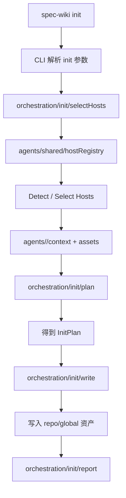
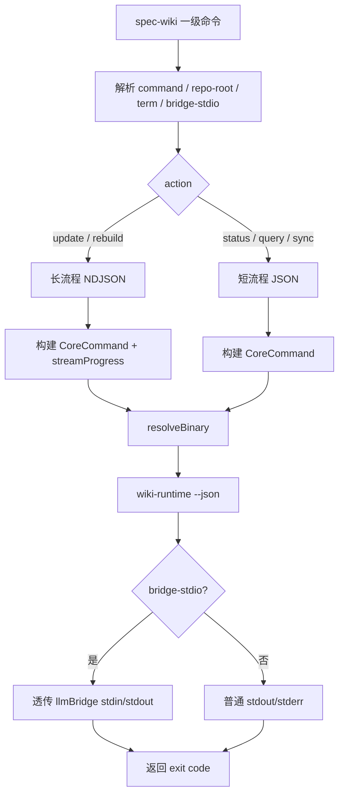
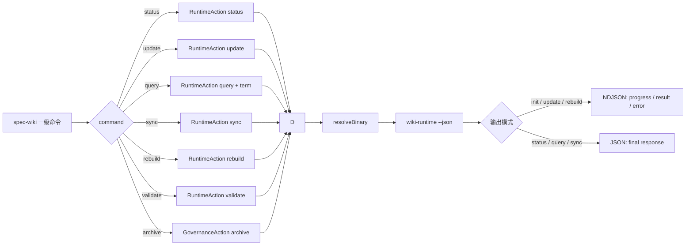

# Repo Wiki Agents Design

## 文档定位

本文档只描述 `spec-wiki` 的宿主接入层、编排层、runtime forwarding 与可扩展适配架构，不覆盖 core 生成主链本身。

它回答三类问题：

- `spec-wiki` 在整体系统里负责什么
- 宿主接入为什么要拆成“宿主适配层 + 编排层 + runtime forwarding”
- 未来新增 IDE / CLI / Agent 宿主时，应该接到哪里
- `spec-wiki init` 和初始化后的 runtime lifecycle 分别怎么走

边界约束：

- crate 主边界仍以 [00-总体设计](./00-总体设计.md) 为准
- runtime 主链仍以 [01-Runtime设计](./01-Runtime设计.md) 为准
- query 的稳定字段、排序、状态与错误以 [06-Runtime查询合同](./06-Runtime查询合同.md) 为准
- 本文不重新定义 `Facts -> Knowledge Planning -> Research -> Compose -> Assemble`
- 本文不把宿主 prompt / command / skill 文案升级成 Wiki 业务真相来源

## 为什么单独拆出 Agents 设计

在 `iteration-11-6` 之前，宿主接入层事实上是“一个给 CodeBuddy 用的 JS 包”，这会把产品边界、分发真相和宿主差异都绑在单宿主实现上。

目标方向已经切到：

```text
spec-wiki 一级 CLI + host bootstrap + runtime forwarding
```

这意味着宿主接入层必须明确分成两部分：

- 编排层：稳定的 CLI 路由、宿主选择、资产规划、统一写入、报告输出
- 宿主差异：各 IDE / CLI / Agent 对 command / prompt / skill / rule / hook / config 的真实落点与格式要求
- runtime forwarding：一级命令对 `wiki-runtime` 与 governance service 的调用、桥接与结果解析

如果不单独把这一层设计抽出来，后面每支持一个新宿主，就会重新改 `init` 主流程，最后又长回“一个宿主一个包”。

## 当前职责边界

### `spec-wiki`

`spec-wiki` 是当前唯一正式主包，负责：

- `spec-wiki init`
  - 统一完成宿主检测或显式选择、宿主 bootstrap、runtime 基线构建和命名空间资产写入
  - 生成 commands / prompts / skills / 未来的 rules/hooks/config
  - 只写 `spec-wiki` 自己管理的命名空间资产
- 一级 lifecycle commands
  - 把 `status / update / query / sync / rebuild / validate / archive` 这些用户意图路由到 runtime 或 governance service
  - 承接 JSON、NDJSON、bridge/session 这类 transport 合同
- 发布主包真相
  - `dist/npm/spec-wiki/**`
  - 平台包命名的主包前缀
  - bootstrap 资产随包发布
- 源码目录真相
  - 对外包名仍然是 `spec-wiki`
  - 仓库内正式源码包应收敛到 `packages/spec-wiki`
  - `Agents` 是体系概念，不再作为 npm 主包根路径真相

### `wiki-runtime`

`wiki-runtime` 仍然是 Wiki 业务执行面，负责：

- facts / knowledge / compose / assemble 主链执行
- `--json` transport 合同
- 长流程 `progress / result / error`
- bridge/session 协议

### Host Assets

宿主目录中的 commands / prompts / skills / rules 只是“引导宿主如何调用 `spec-wiki`”，不是业务逻辑本体。

## 总体架构

```mermaid
flowchart TD
    A[用户 / 宿主] --> B[spec-wiki CLI]
    B --> C{命令类型}

    C -->|spec-wiki init| D[Init Orchestration]
    C -->|一级 lifecycle commands| E[Runtime Forwarding]

    D --> D1[Host Registry]
    D1 --> D2[Detect / Select Hosts]
    D2 --> D3[Host Adapters]
    D3 --> D4[Build AssetSpec[]]
    D4 --> D5[Asset Writer]
    D5 --> D6[写入 repo / global 资产]
    D6 --> D7[返回 bootstrap 报告]

    E --> E1[参数解析]
    E1 --> E2[构建 CoreCommand]
    E2 --> E3[resolveBinary]
    E3 --> E4[wiki-runtime --json]
    E4 --> E5[JSON / NDJSON / bridge]
    E5 --> E6[返回 stdout / stderr / exit code]

    D6 --> F[.claude / .codebuddy / .codex / future hosts]
    E4 --> G[.wiki runtime]
```

## 设计原则

### 1. 公共内核与宿主差异必须分开

`spec-wiki` 的主流程只关心：

- 宿主检测/选择
- 资产规划
- 统一写入
- runtime forwarding

不应该把某个宿主的 frontmatter、目录层级或额外参数散落进主流程。

工程落点上，这意味着：

- 公共内核放在 `packages/spec-wiki/src/agents/shared/**`
- 单宿主差异放在 `packages/spec-wiki/src/agents/<host>/**`
- `orchestration` 是独立的编排层，负责 `spec-wiki init`
- `bootstrap` 仍可作为流程语义存在，但不应继续作为最终源码分层真相

### 2. 宿主扩展以 Adapter 为单位，而不是以 npm 包为单位

未来支持一个新宿主，应该新增一个 adapter，而不是复制一个 `agents/<host>` 包。

### 3. 资产模型必须是通用的

不能只理解 `command + skill`，因为未来宿主可能只认：

- `prompt`
- `rule`
- `hook`
- `config`

### 4. 宿主资产只做路由，不做 Wiki 业务判断

所有宿主资产都必须回到：

```text
spec-wiki init
spec-wiki status
spec-wiki query <term>
spec-wiki update
spec-wiki validate <change-id>
```

而不是在宿主文案或脚本里重写 query/update/rebuild 的业务语义。

### 5. 幂等刷新与 ownership 是一等能力

`spec-wiki init` 必须支持重复执行，且只改自己管理的资产。

## 推荐抽象

### `HostAdapter`

宿主适配器只表达宿主差异：

```ts
export type HostAdapter = {
  id: string;
  displayName: string;
  detect(repoRoot: string, env: NodeJS.ProcessEnv): boolean;
  resolveContext(input: {
    repoRoot: string;
    env: NodeJS.ProcessEnv;
    options: BootstrapOptions;
  }): HostContext;
  buildAssets(input: {
    context: HostContext;
    actions: readonly WikiAction[];
  }): AssetSpec[];
};
```

### `HostContext`

`HostContext` 是单宿主执行 bootstrap 时的上下文：

```ts
export type HostContext = {
  hostId: string;
  repoRoot: string;
  scopeRoots: {
    repo?: string;
    global?: string;
  };
  capabilities: HostCapabilities;
  options: Record<string, unknown>;
};
```

### `HostCapabilities`

这层只描述宿主识别哪些资产类型：

```ts
export type HostCapabilities = {
  supportsCommands: boolean;
  supportsPrompts: boolean;
  supportsSkills: boolean;
  supportsRules: boolean;
  supportsHooks: boolean;
  supportsConfig: boolean;
};
```

### `AssetSpec`

所有宿主产物都统一建模成资产描述，而不是由主流程直接拼路径和写文件：

```ts
export type AssetSpec = {
  owner: "spec-wiki";
  hostId: string;
  kind: "command" | "prompt" | "skill" | "rule" | "hook" | "config";
  scope: "repo" | "global";
  filePath: string;
  content: string;
  overwritePolicy: "overwrite_if_owned" | "create_or_replace";
};
```

### `InitPlan`

主流程先产出 plan，再统一写入：

```ts
export type InitPlan = {
  hosts: string[];
  assets: AssetSpec[];
};
```

### `AssetWriter`

统一负责：

- 目录创建
- created / updated / unchanged 判定
- ownership 保护
- 全局目录写入失败
- 报告输出

## 推荐目录结构

目标结构不应继续停留在 `agents/spec-wiki` 或 `src/bootstrap/*` 这类过渡表述上。

推荐收敛为：

```text
packages/spec-wiki/src/
  cli.ts
  index.ts

  orchestration/
    init/
      command.ts
      selectHosts.ts
      plan.ts
      write.ts
      report.ts
      ownership.ts
    shared/
      types.ts

  agents/
    codex/
      index.ts
      detect.ts
      context.ts
      assets.ts
    claude/
      index.ts
      detect.ts
      context.ts
      assets.ts
    codebuddy/
      index.ts
      detect.ts
      context.ts
      assets.ts
    shared/
      hostTypes.ts
      hostRegistry.ts
      assetTypes.ts
      templateFragments.ts
    prompts/
      searchableMultiSelect.ts

  runtime/
    forwardCore.ts
    invokeCore.ts
    resolveBinary.ts
    parseResult.ts
    runtimeEnv.ts

  templates/
    commands/
    prompts/
    skills/
```

对应职责：

- `orchestration/init/*`
  - `spec-wiki init` 的独立编排层：选择宿主、汇总资产计划、统一写入、输出报告
- `orchestration/shared/*`
  - 编排层自己的通用类型与错误模型，不混入宿主差异
- `agents/<host>/*`
  - 单宿主差异：检测、上下文构建、宿主资产产出
- `agents/shared/*`
  - 宿主层共享抽象：`HostAdapter`、`HostContext`、`AssetSpec`、Registry 等
- `agents/prompts/*`
  - 宿主选择等交互式 CLI prompt
- `runtime/*`
  - 一级命令到 runtime action 的 forwarding
- `templates/*`
  - 发布包内共享模板资产
- `cli.ts`
  - 顶层命令入口与路由，不直接承载完整编排逻辑

当前如果仍存在 `src/bootstrap/**`，应视为过渡实现，而不是目标结构。

## 当前宿主与真实落点

### Claude

- repo commands: `.claude/commands/wiki/*.md`
- repo skills: `.claude/skills/spec-wiki/SKILL.md`

### CodeBuddy

- repo commands: `.codebuddy/commands/wiki/*.md`
- repo skills: `.codebuddy/skills/spec-wiki/SKILL.md`

### Codex

- global prompts: `<CODEX_HOME>/prompts/wiki-*.md`
- repo skills: `.codex/skills/spec-wiki/SKILL.md`

这三类宿主的差异必须留在 `agents/<host>/*` 中，不应该散落在编排层或 CLI 主流程里。

## `spec-wiki init` 流程图



## 一级 lifecycle 流程图



## 宿主消费 query 的边界

宿主不拥有 query 业务语义。它们只负责提取非空 term、调用 Runtime，并薄消费 [06-Runtime查询合同](./06-Runtime查询合同.md) 定义的 canonical 响应。

当前共享资产应先读取 Runtime 状态、恢复建议、分组结果和 answer，使用 Runtime 提供的组内 rank，禁止跨 route 比较 score。宿主不得重建 route 枚举、ranking、readiness/trust 状态机或 answer 结论，也不得继续消费已移除的旧派生视图。精确实现细节仍需回到 source refs 和源码核验。

Richer query 的延期能力与升级条件只在 Runtime 查询合同维护。在它们进入 Runtime transport/DTO 且通过跨入口验收前，任何宿主都不得用 description、action note 或私有 payload 预先承诺。Codex / Claude / CodeBuddy 的统一 trigger 规范和正反例语料仍由后续宿主触发合同处理，不在本页复制 query 字段定义。

## 一级命令分流图



## 新增宿主时的标准步骤

后续新增宿主时，应该只做这些动作：

1. 新增一个 `HostAdapter`
2. 定义检测规则
3. 定义支持的 `AssetKind`
4. 定义各类资产的真实落点与格式化规则
5. 注册进 Host Registry
6. 为该宿主补 adapter 测试

不应该改：

- `wiki-runtime` transport 合同
- 一级命令 forwarding 主流程
- 其他宿主的路径逻辑

## 不属于本文档的内容

这些内容仍然留在 [01-Runtime设计](./01-Runtime设计.md) 或 [00-总体设计](./00-总体设计.md)：

- crate 边界
- knowledge / page / query 主链
- `.wiki/` 内部结构
- runtime 状态流转
- `Facts -> Knowledge Planning -> Research -> Compose -> Assemble`

## 当前阶段结论

当前阶段可以把 `spec-wiki` 视为：

- 一个公共 CLI 内核
- 一个公共 runtime forwarding 内核
- 一个独立的 `init` 编排层
- 一组可扩展宿主 adapter

同时需要明确两条结构收口约束：

- 最终正式源码包应收敛到 `packages/spec-wiki`，而不是继续保留 `agents/spec-wiki` 作为推荐真相
- 包内宿主扩展应收敛到 `src/agents/**`
- `src/orchestration/**` 应作为 `init` 的独立编排层
- `src/bootstrap/**` 只能视为过渡实现，不应继续写成目标结构

后续扩宿主，应该做“加 adapter”，而不是“再造一个宿主包”。
