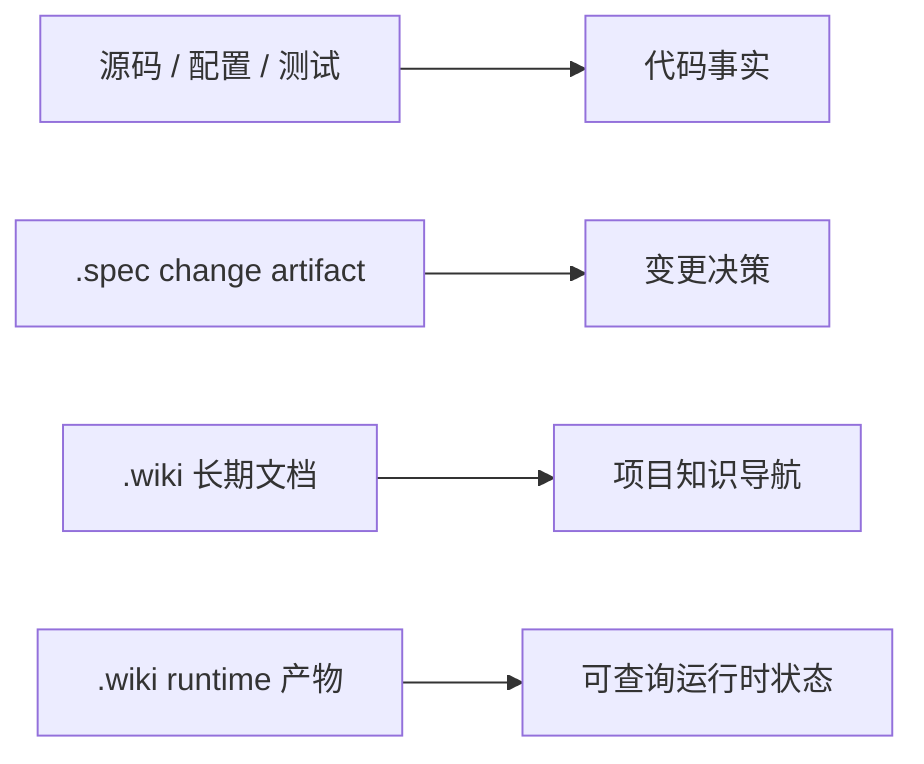

# spec-wiki Wiki

`spec-wiki` 构建 Repo Wiki Core + Agents 体系：扫描代码仓库，生成并持续维护 `.wiki/`，让人和 Agent 共享同一层项目知识。

宿主接入采用 Codex-first：Codex 是唯一 reference host，Claude 与 CodeBuddy 是 compatible hosts。宿主角色、真实资产路径和 trigger/bridge/provider session 边界以 [02-Agents设计](./06-设计文档/02-Agents设计.md) 为准。

本次文档整理只更新长期文档层，不生成或更新 runtime 产物 `.wiki/.knowledge/**`、`.wiki/.cache/**` 或 `wiki.metadata.json`。完整初始化统一通过 `spec-wiki init` 进入；runtime 构建是该入口内部阶段，不再作为另一套用户初始化入口描述。

## 一级目录

| 目录 | 用途 |
| --- | --- |
| [00-文档约定](./00-文档约定/INDEX.md) | Wiki 边界、SSOT、命名规则、页面模板和 UniSpec 开发规范 |
| [01-快速上手](./01-快速上手/INDEX.md) | 新成员或 Agent 首次进入项目的最短路径 |
| [02-开发指南](./02-开发指南/INDEX.md) | 通用开发流程、验证命令、注释规范和文档维护规则 |
| [03-模块指南](./03-模块指南/INDEX.md) | 以 KnowledgeDomain / KnowledgeUnit 解释模块边界、事实来源和输出层 |
| [04-对外方法](./04-对外方法/INDEX.md) | CLI、配置、运行时产物和公开使用方式 |
| [05-规格基线](./05-规格基线/INDEX.md) | 从治理迁移沉淀来的稳定 capability 基线 |
| [06-设计文档](./06-设计文档/INDEX.md) | 当前稳定设计、runtime 设计、Agents 设计和场景边界 |

## SSOT 规则

- 代码、配置和测试是行为事实来源；Wiki 只组织长期知识、入口和维护说明。
- `.spec/changes/**` 与 `.spec/archive/**` 保存 change artifact，不把 proposal、design、review 或测试报告原文复制到 Wiki。
- `.wiki/` 保存稳定项目知识；临时探索、一次性验证和未确认假设不进入长期页。
- runtime 产物 `.wiki/.knowledge/**`、`.wiki/.cache/**` 和 `wiki.metadata.json` 属于运行时分层；正式可见 Wiki 页面树由 `.wiki/INDEX.md`、栏目 `INDEX.md` 和 `NN-主题.md` 组成。
- 同一事实只维护一处；次级页面用摘要和链接回到 SSOT。

## 按任务导航

| 任务 | 阅读入口 |
| --- | --- |
| 第一次理解项目 | [01-快速上手](./01-快速上手/INDEX.md) |
| 准备本地开发环境 | [00-环境准备](./01-快速上手/00-环境准备.md) |
| 运行、构建和测试 | [01-启动项目](./01-快速上手/01-启动项目.md)、[02-构建项目](./01-快速上手/02-构建项目.md) |
| 理解核心分层 | [03-模块指南](./03-模块指南/INDEX.md) |
| 查总体设计和场景边界 | [06-设计文档](./06-设计文档/INDEX.md) |
| 查 Runtime query 稳定合同 | [06-Runtime查询合同](./06-设计文档/06-Runtime查询合同.md) |
| 查 v0.2.0 product-release 合同 | [02-v0.2.0发布合同](./04-对外方法/02-v0.2.0发布合同.md) |
| 查宿主 trigger 稳定合同 | [host-trigger-contract](./05-规格基线/capabilities/host-trigger-contract/spec.md) |
| 使用 CLI 或 runtime 命令 | [00-CLI](./04-对外方法/00-CLI.md) |
| 查配置和运行时产物边界 | [01-配置与运行时产物](./04-对外方法/01-配置与运行时产物.md) |
| 编写或推进 UniSpec change | [02-UniSpec开发规范](./00-文档约定/02-UniSpec开发规范.md) |
| 理解 Agent 协作入口 | [03-Agent协作入口](./00-文档约定/03-Agent协作入口.md) |
| 判断文档是否应沉淀进 Wiki | [04-文档盘点与沉淀规则](./00-文档约定/04-文档盘点与沉淀规则.md) |
| 查测试、脚本和参考实现边界 | [01-测试与验收](./02-开发指南/01-测试与验收.md)、[02-脚本与工作流](./02-开发指南/02-脚本与工作流.md)、[03-参考实现边界](./02-开发指南/03-参考实现边界.md) |

## 按模块或包导航

| 模块或包 | 用途 | 阅读入口 |
| --- | --- | --- |
| `wiki-model` | 共享对象语言、正式状态和跨 crate DTO | [01-wiki-model](./03-模块指南/01-wiki-model.md) |
| `wiki-index` | 代码事实、扫描、符号和索引层 | [02-wiki-index](./03-模块指南/02-wiki-index.md) |
| `wiki-knowledge` | KnowledgeUnit 主线上的 planning / research / compose 合同 | [03-wiki-knowledge](./03-模块指南/03-wiki-knowledge.md) |
| `wiki-runtime` | workflow orchestration、storage、transport、query route 和 `.wiki` 生命周期 | [04-wiki-runtime](./03-模块指南/04-wiki-runtime.md) |
| `packages/spec-wiki` | TS CLI、宿主 bootstrap、runtime forwarding 和发布入口 | [05-spec-wiki-cli](./03-模块指南/05-spec-wiki-cli.md) |

## 文档约定

- 边界与 SSOT 规则：[00-边界与SSOT规则](./00-文档约定/00-边界与SSOT规则.md)
- 页面模板：[01-页面模板](./00-文档约定/01-页面模板.md)
- UniSpec 开发规范：[02-UniSpec开发规范](./00-文档约定/02-UniSpec开发规范.md)
- Agent 协作入口：[03-Agent协作入口](./00-文档约定/03-Agent协作入口.md)
- 文档盘点与沉淀规则：[04-文档盘点与沉淀规则](./00-文档约定/04-文档盘点与沉淀规则.md)
- 默认命名：普通页面使用 `NN-主题.md`；目录型主题使用 `NN-主题/INDEX.md + NN-子页.md`。
- 结构性例外：栏目入口保留 `INDEX.md`；规格基线 capability 保留 `capabilities/<capability>/spec.md`。
