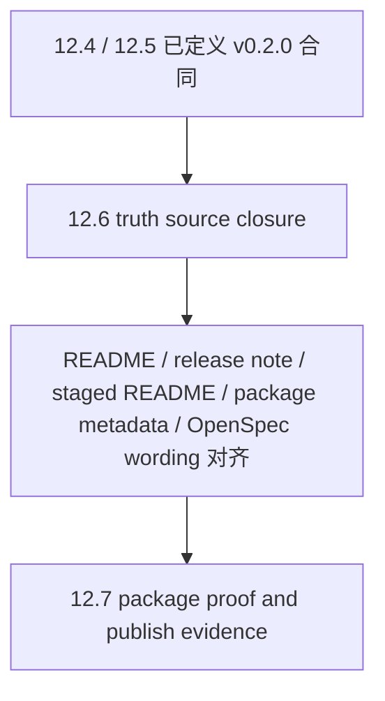

# iteration-12-6 release drift closure verification

## Scope

本轮只做 `release drift closure`，不新增 runtime capability，不补 `publish dry-run`、staged package smoke 或 package proof evidence。

## Checks

- 核对 `README.md`、`README-CN.md`、`RELEASE-v0.2.0.md`、`dist/spec-wiki/README.md` 是否统一描述 `v0.2.0 minimal formal knowledge runtime`
- 核对 source package 与 staged package 的版本号、description 是否统一为 `0.2.0`
- 核对 `repo-wiki-workflow` 与 `adapter-distribution` 的 purpose、requirement 标题、scenario wording 是否清掉旧版本漂移
- 单独检查 README、staged README 与 CLI help 是否统一公开 `init / status / update / query / sync / rebuild`
- 单独检查 `spec-wiki init` 与 `spec-wiki wiki init` 的 bootstrap/runtime 边界是否在 README 与 release note 中明确

## Commenting Check

- 本轮没有新增 TypeScript / Rust 业务逻辑，只修改文档、OpenSpec wording 与 package metadata
- `COMMENTING.md` 约束未新增违背点

## Result

- `v0.1.0` / `index-only` 的旧发布叙事已从本轮 truth sources 中移除，仅保留用于“旧口径已废弃”的对照说明
- README、release note、staged README、source/staged package metadata、主 spec wording 已统一到 `v0.2.0`
- 本轮没有补 staged package proof，也没有把 12.7 的发布证据任务提前并入 12.6
